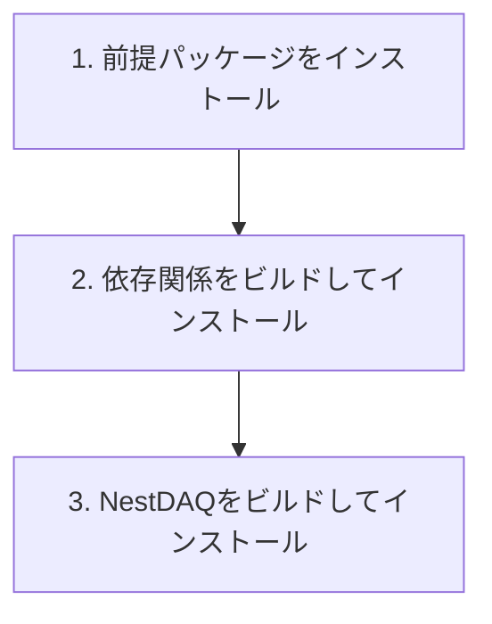

# インストール

[English](INSTALL.md) | [日本語](INSTALL.ja.md)

[トップ: NestDAQ](README.ja.md) | [次へ: サンプル](examples/README.ja.md)

このガイドで**上流リポジトリ**とは、[github.com/spadi-alliance/nestdaq](https://github.com/spadi-alliance/nestdaq)を指します。

<a id="installation-flow"></a>
## インストールの流れ

<a id="installation-flow-figure-ja"></a>


**図1：前提パッケージから任意のドキュメント生成までのNestDAQインストールの流れ。**

NestDAQのメインビルドでは、`NestDAQ_BUILD_EXAMPLES=ON`の場合、デフォルトでサンプルもビルドしてインストールします。
第4節では、NestDAQとFairMQが提供するサンプルを説明します。

<a id="1-install-prerequisites"></a>
## 1. 前提パッケージのインストール

ここでいう前提パッケージとは、NestDAQとその外部依存関係をビルドする前に必要なコンパイラー、ビルドツール、開発用ヘッダー、ライブラリを指します。
各Linuxディストリビューションが提供するパッケージマネージャーを使い、OSパッケージとしてインストールします。
AlmaLinuxでは`dnf`、DebianおよびUbuntuでは`apt`を使用します。
この節のコマンドはこれらのOSパッケージをインストールするものであり、NestDAQ本体はインストールしません。
この文書のシェルコマンド例では、`#`で始まる行は読者向けのコメントであり、シェルでは実行されません。

<a id="almalinux-9-and-10"></a>
### AlmaLinux 9および10

```bash
# パッケージのメタデータを更新し、必要なリポジトリを有効化して、ビルドの前提パッケージをインストール
dnf -y update && \
dnf -y install \
    epel-release \
    dnf-plugins-core && \
dnf config-manager --set-enabled crb && \
dnf -y groupinstall "Development Tools" && \
dnf -y install \
    bash-completion \
    gcc \
    gcc-c++ \
    cmake \
    make \
    ninja-build \
    mold \
    git \
    unzip \
    rsync \
    autoconf \
    automake \
    libtool \
    libcurl-devel \
    openssl-devel \
    gnutls-devel \
    zlib-devel \
    bzip2-devel \
    libzstd-devel \
    libquadmath-devel \
    libstdc++-static \
    python3 \
    python3-devel \
    python3-pip

# 必要に応じてインストールするツール:
# - jq: コマンドラインツールのJSON出力を整形して確認します。
# - doxygen: APIドキュメントを生成します。
# - graphviz: Doxygenの図に使用するdotコマンドを提供します。
# - tmux: 長時間実行するローカル検証セッションを維持します。
# dnf -y install jq doxygen graphviz tmux

# AlmaLinux 9のシステムコンパイラーでは不足する場合にGCC 14ツールセットをインストール
# dnf -y install gcc-toolset-14
```

<a id="almalinux-8"></a>
### AlmaLinux 8

```bash
# パッケージのメタデータを更新し、PowerToolsを有効化して、ビルドの前提パッケージをインストール
dnf -y update && \
dnf -y install \
    epel-release \
    dnf-plugins-core && \
dnf config-manager --set-enabled powertools && \
dnf -y groupinstall "Development Tools" && \
dnf -y install \
    bash-completion \
    gcc \
    gcc-c++ \
    gcc-toolset-14 \
    cmake \
    make \
    ninja-build \
    mold \
    git \
    unzip \
    rsync \
    autoconf \
    automake \
    libtool \
    libcurl-devel \
    openssl-devel \
    gnutls-devel \
    zlib-devel \
    bzip2-devel \
    libzstd-devel \
    libquadmath-devel \
    libstdc++-static \
    python3.11 \
    python3.11-devel \
    python3.11-pip
```

AlmaLinux 8では`crb`の代わりに`powertools`を使用します。
`python3`、`python3-devel`、`python3-pip`の代わりに、上記のPython 3.11パッケージを使用してください。

<a id="debian-1213-and-ubuntu-220424042604"></a>
### Debian 12/13およびUbuntu 22.04/24.04/26.04

```bash
# パッケージのメタデータを更新して、ビルドの前提パッケージをインストール
apt update && \
apt install -y \
    bash-completion \
    build-essential \
    ca-certificates \
    cmake \
    curl \
    make \
    ninja-build \
    mold \
    git \
    unzip \
    rsync \
    pkg-config \
    autoconf \
    automake \
    libtool \
    libc6-dev \
    libcurl4-openssl-dev \
    libssl-dev \
    libgnutls28-dev \
    zlib1g-dev \
    libz2-dev \
    libzstd-dev \
    python3 \
    python3-dev \
    python3-venv \
    python3-pip

# 必要に応じてインストールするツール:
# - jq: コマンドラインツールのJSON出力を整形して確認します。
# - clang-format: DebianおよびUbuntuではclang-toolsとは別パッケージとしてclang-formatを提供します。
# - doxygen: APIドキュメントを生成します。
# - graphviz: Doxygenの図に使用するdotコマンドを提供します。
# - tmux: 長時間実行するローカル検証セッションを維持します。
# apt install -y jq clang-format doxygen graphviz tmux
```

Ubuntu 22.04で依存関係をビルドする際に必要となるため、`pkg-config`をDebianおよびUbuntu共通の一覧に含めています。

<a id="code-quality-tools-for-contributors"></a>
### 上流リポジトリの開発に貢献する人向けのコード品質ツール

上流リポジトリの開発に貢献する人は、ビルドの前提パッケージに加えて`astyle`と`clang-tidy`をインストールしてください。
このリポジトリでは、[`CONTRIBUTING.ja.md`](CONTRIBUTING.ja.md)に記載しているとおり、C/C++ソースのフォーマットに`astyle`、静的解析に`clang-tidy`を使用します。

AlmaLinuxでは、`clang-tools-extra`パッケージが`clang-tidy`コマンドを提供します。

```bash
# NestDAQの開発に必要なフォーマッターと静的解析ツールをインストール
dnf install -y astyle clang-tools-extra
```

DebianおよびUbuntuでは、`clang-tidy`パッケージを直接インストールします。

```bash
# NestDAQの開発に必要なフォーマッターと静的解析ツールをインストール
apt install -y astyle clang-tidy
```

<a id="2-build-and-install-external-dependencies"></a>
## 2. 外部依存関係のビルドとインストール

次の手順では、ZeroMQ、Boost、FairLogger、FairMQ、Catch2、nlohmann/json、hiredis、redis++、[Redis Stack](#redis-server-and-modules)をインストールします。

<a id="21-clone-or-check-out-the-source"></a>
### 2.1 ソースコードのクローンとチェックアウト方法

<a id="211-users-who-do-not-contribute-to-the-upstream-repository"></a>
#### 2.1.1 上流リポジトリの開発に貢献しない利用者

デフォルト手順では、その`main`ブランチにある最新の安定リリース版をビルドします。
これは、上流リポジトリの開発に貢献しない利用者が通常選択する方法です。
`main`はリポジトリのデフォルトブランチであるため、通常のクローンでチェックアウトされます。

```bash
# 最新の安定リリース版のソースコードをダウンロード
git clone https://github.com/spadi-alliance/nestdaq.git
```

特定のリリース版をビルドする場合は、リポジトリのReleasesまたはTagsページにある必要なタグで`<release-tag>`を置き換えます。
NestDAQのバージョンを固定する場合や、ビルドの再現性が必要な場合はリリースタグを指定してください。

```bash
# 指定したリリースタグだけをクローン
git clone --branch <release-tag> --depth 1 \
  https://github.com/spadi-alliance/nestdaq.git
```

または、既存のクローンをリリースタグへ切り替えます。
タグは開発用ブランチではないため、`git switch --detach`を使用してdetached HEAD状態でチェックアウトします。

```bash
# タグを取得し、既存のクローンで指定したリリースをチェックアウト
cd nestdaq
git fetch --tags
git switch --detach <release-tag>
```

<a id="212-contributors-to-the-upstream-repository"></a>
#### 2.1.2 上流リポジトリの開発に貢献する人

上流リポジトリの開発に貢献する人は、最初に`spadi-alliance/nestdaq`を自身のGitHubアカウントへフォークします。
最新開発版をビルドする場合は、自身のフォークをクローンし、上流リポジトリを変更の取得元として使用する`upstream`リモートに登録し、フォークの`origin/develop`を追跡するローカル`develop`ブランチを作成します。
更新は上流からプルしますが、プッシュ先は自身のフォーク (`origin`) にあるブランチだけにします。

```bash
# フォークをクローンし、upstreamリモートとローカル開発ブランチを設定
git clone https://github.com/<your-github-account>/nestdaq.git
cd nestdaq
git remote add upstream https://github.com/spadi-alliance/nestdaq.git
git fetch upstream
git switch --create develop --track origin/develop

# upstream/developに更新がある場合はそれを取り込み、ローカルdevelopブランチのコミットをその上にリベース
git pull --rebase upstream develop

# 更新後のローカルdevelopブランチをフォークのorigin/developへプッシュ
git push origin develop
```

開発用ブランチを上流リポジトリへプッシュしないでください。

ソースコードを変更する前に、自身のフォーク内で作業ブランチを作成してください。
詳細は[`CONTRIBUTING.ja.md`](CONTRIBUTING.ja.md)を参照してください。

<a id="22-build-and-install-the-external-dependencies"></a>
### 2.2 外部依存関係のビルドとインストール方法

以下のコマンドは、`nestdaq/`でチェックアウトされているブランチをビルドします。

```bash
# ./build-externalにソース外の依存関係ビルドを構成
cmake \
  -DCMAKE_INSTALL_PREFIX=./install \
  -DBUILD_PARALLEL_LEVEL=$(nproc) \
  -B ./build-external \
  -S nestdaq/cmake

# 外部依存関係をビルドしてインストール
cmake --build ./build-external
```

- 上記のコマンドでは、CMakeの`ExternalProject`を使用して各依存関係をクローン、ビルド、インストールします。
  `cmake --build`に渡す`--parallel` (または`-j`) オプションでは、内部の`ExternalProject`ビルドを制御できません。
  初回構成時に`-DBUILD_PARALLEL_LEVEL=xxx`を使用して、内部ビルドの並列数を指定してください。
  `nproc`コマンドはシステムで使用可能なCPUコア数を表示するため、メモリー使用量が過大になる場合は、より小さい値を指定してください。
- 依存関係のデフォルトバージョンを以下に示します。
  バージョンを上書きするには、CMakeに`-Dxxxx_VERSION=yyyy`を渡します。
- 外部依存関係の構成時にDoxygenが見つかった場合、ドキュメント表示用の追加ファイルとして`doxygen-awesome-css`を`./install/share/doxygen-awesome-css/`以下にインストールします。
- Makeの代わりにNinjaを使用するには、CMakeオプションに`-G Ninja`を追加します。
- システムの`ld`の代わりに`mold`を使用する場合は、GCCのバージョンに応じたリンカーフラグを追加します。
  - GCC 12.1以降: CMakeオプションに`-DCMAKE_EXE_LINKER_FLAGS="-fuse-ld=mold"`と`-DCMAKE_SHARED_LINKER_FLAGS="-fuse-ld=mold"`を追加します。
  - GCC 12.0以前: CMakeオプションに`-DCMAKE_EXE_LINKER_FLAGS="-B<path-to-mold>"`と`-DCMAKE_SHARED_LINKER_FLAGS="-B<path-to-mold>"`を追加します。

<a id="external-dependency-build-options"></a>
### 2.3 外部依存関係のビルドオプション

<a id="external-dependency-build-options-table-ja"></a>
**表1：外部依存関係のビルドを構成するオプション。**

| オプション | デフォルト | 説明 |
| :-- | :-- | :-- |
| `BUILD_PARALLEL_LEVEL` | 未設定 | 内部の`ExternalProject`ビルドへ渡す並列数です。構成時に設定してください。`cmake --build --parallel`では内部ビルドを制御できません。 |
| `WITH_REDIS_STACK` | `ON` | Redis Stackサーバーとモジュールをビルドしてインストールします。コンテナなどでRedis Stackを別途用意する場合は`OFF`に設定します。 |
| `WITH_REDIS_SERVER_7` | `OFF` | Redis 7.xサーバーとスタンドアロンRedisTimeSeriesをビルドしてインストールします。このオプションは`WITH_REDIS_STACK`と同時に有効にできません。 |
| `REDIS_SERVER_7_SERIES` | `7.4` | `WITH_REDIS_SERVER_7=ON`の場合に使用するRedis 7.x系列です。`7.4`はRedis 7.4.11とRedisTimeSeries 1.12.14、`7.2`はRedis 7.2.16とRedisTimeSeries 1.10.24を選択します。 |
| `REDIS_BUILD_REDISBLOOM` | `ON` | `WITH_REDIS_STACK`が`ON`の場合にRedisBloomモジュールをビルドしてインストールします。 |
| `REDIS_BUILD_REDISEARCH` | `ON` | `WITH_REDIS_STACK`が`ON`の場合にRediSearchモジュールをビルドしてインストールします。コンパイラーがRediSearchをビルドできない場合は無効にしてください。 |
| `REDIS_BUILD_REDISJSON` | `ON` | `WITH_REDIS_STACK`が`ON`の場合にRedisJSONモジュールをビルドしてインストールします。 |
| `REDIS_BUILD_REDISTIMESERIES` | `ON` | `WITH_REDIS_STACK`が`ON`の場合にRedisTimeSeriesモジュールをビルドしてインストールします。 |
| `WITH_SPDLOG` | `ON` | C++用ロギングライブラリであるspdlogをビルドしてインストールします。必要に応じて有効にできるNestDAQ spdlog OpenTelemetryシンクをサポートします。 |
| `WITH_OTEL_CPP` | `ON` | opentelemetry-cppと、gRPCなど選択した機能に応じた転送用依存関係をビルドしてインストールします。 |
| `<package>_VERSION` | パッケージ固有 | 以下に示す依存関係のバージョンを上書きします。例: `-DFairMQ_VERSION=...`。 |
| `Redis7_VERSION` | 系列固有 | `REDIS_SERVER_7_SERIES`で選択したRedis 7.xのバージョンを上書きします。 |
| `RedisTimeSeries7_VERSION` | 系列固有 | `REDIS_SERVER_7_SERIES`で選択したスタンドアロンRedisTimeSeriesのバージョンを上書きします。 |

デフォルトの`FairMQ_VERSION`はGNUコンパイラーのバージョンに依存します。
GCC 9.1以降ではFairMQ 1.10.0を使用し、それより古いGCCではFairMQ 1.9.2を使用します。
この選択を上書きするには`-DFairMQ_VERSION=...`を渡してください。

すべての`REDIS_BUILD_*`モジュールオプションを`OFF`にすると、依存関係ビルドではRedisサーバーツールだけをインストールします。
Redis Stackには、TLS、アロケーター、一時的なRustツールチェーンのパスなどを設定する低レベルのキャッシュ変数もあります。
これらの変数は依存関係ビルドの保守用です。
必要な場合はCMakeキャッシュまたは`cmake/dependencies/redis-stack.cmake`を確認してください。
Redis 7.xの保守用設定については`cmake/dependencies/redis-server-7.cmake`を確認してください。

<a id="versions-of-installed-external-dependencies"></a>
### 2.4 インストールされる外部依存関係のバージョン

<a id="external-dependency-versions-table-ja"></a>
**表2：外部依存関係のデフォルトバージョンとバージョン選択オプション。**

| パッケージ                                                               | バージョン (デフォルト) | バージョン変更用CMakeオプション |
| :--                                                                      | :--                      | :--                              |
| [ZeroMQ (libzmq)](https://github.com/zeromq/libzmq)                      | 4.3.5                    | `ZeroMQ_VERSION`                 |
| [Boost](https://github.com/boostorg/boost)                               | 1.85.0                   | `Boost_VERSION`                  |
| [FairLogger](https://github.com/FairRootGroup/FairLogger)                | 2.3.0                    | `FairLogger_VERSION`             |
| [FairMQ](https://github.com/FairRootGroup/FairMQ)                        | GCC 9.1以降では1.10.0、それより古いGCCでは1.9.2 | `FairMQ_VERSION` |
| [Catch2](https://github.com/catchorg/Catch2)                             | 3.15.2                   | `Catch2_VERSION`                 |
| [nlohmann/json](https://github.com/nlohmann/json)                        | 3.12.0                   | `nlohmann_json_VERSION`          |
| [spdlog](https://github.com/gabime/spdlog)                               | 1.17.0                   | `spdlog_VERSION`                 |
| [hiredis](https://github.com/redis/hiredis)                              | 1.4.1                    | `hiredis_VERSION`                |
| [redis++](https://github.com/sewenew/redis-plus-plus)                    | 1.3.15                   | `redis_plus_plus_VERSION`        |
| [opentelemetry-cpp](https://github.com/open-telemetry/opentelemetry-cpp) | 1.28.0                   | `opentelemetry-cpp_VERSION`      |
| [doxygen-awesome-css](https://github.com/jothepro/doxygen-awesome-css)   | 2.4.2                    | `doxygen-awesome-css_VERSION`    |

<a id="redis-server-and-modules"></a>
#### 2.4.1 Redisサーバー、Redisモジュール、RedisウェブGUI

標準のNestDAQプラグイン構成では、プラグインの動作中にRedisサーバーとRedisTimeSeriesが必要ですが、これらは直接のライブラリ依存関係ではありません。
各プラグインの要件は[`plugins/`のドキュメント](plugins/README.ja.md)を参照してください。
[Redis Stack](https://redis.io/about/redis-stack/)は、RedisにRedisBloom、RediSearch、RedisJSON、RedisTimeSeriesを組み合わせたディストリビューションです。
Redis Stack ServerはRedisとこれらのモジュールを含みます。
Redis 8以降では、[これらのモジュールが従来提供していた機能がRedis Open Sourceへ組み込まれ](https://redis.io/docs/latest/operate/oss_and_stack/stack-with-enterprise/modules-lifecycle/)、個別のRedis Stackディストリビューションを置き換えました。
このリポジトリでは、既存のCMakeオプション、ファイル名、Redis 7コンテナイメージでRedis Stackおよびモジュールという用語を維持しています。

RedisInsightは、Redisへ接続してデータの確認やコマンドの実行を行うための独立したウェブGUIです。

##### 2.4.1.1 インストールされるコンポーネントの対応表

このリポジトリがサポートする各導入方法で何が用意されるかを[表3](#redis-provisioning-methods-table-ja)に示します。

<a id="redis-provisioning-methods-table-ja"></a>
**表3：サポートされる各導入方法が提供するRedis構成要素。**

| インストールされるもの | 機能 | CMake: Redis 8 (デフォルト) | CMake: Redis 7 | コンテナ: Redis Stack | コンテナ: Stack Server | コンテナ: Redis 8 | ホストパッケージ (デフォルト) |
| :-- | :-- | :--: | :--: | :--: | :--: | :--: | :--: |
| Redisサーバー | インメモリーデータストア | あり (8.2.9) | あり (7.4.11または7.2.16) | あり (7.4または7.2イメージ) | あり (7.4または7.2イメージ) | あり (8.2.7) | あり (8.2.7) |
| RedisBloom | 確率的データ構造 | あり | なし | あり | あり | あり | あり |
| RediSearch | 検索とクエリー | あり | なし | あり | あり | あり | あり |
| RedisJSON | JSONデータ | あり | なし | あり | あり | あり | あり |
| RedisTimeSeries | 時系列データ | あり | あり (スタンドアロン1.x) | あり | あり | あり | あり |
| RedisInsight | ウェブGUI | なし | なし | あり | なし | なし | なし |

##### 2.4.1.2 CMakeビルドとインストールされる設定ファイル

CMakeによるRedis 8のビルドは、選択したコンポーネントを`CMAKE_INSTALL_PREFIX`以下にインストールします。
各コンポーネントは対応する`REDIS_BUILD_*`オプションで無効化できます。
CMakeによるRedis 7のビルドでは、Redisサーバーに加えてRedisTimeSeriesのみを提供します。
どちらのCMakeビルドもサービスのインストールやRedisの起動は行いません。

どちらのCMakeビルドでも、デフォルトでは`<install-prefix>/etc/redis/`以下に次の設定ファイルをインストールします。

- `redis.conf`は[Redis GitHubリポジトリ](https://github.com/redis/redis)の
  ソースツリーにあるファイルを変更せずにコピーしたものです。
- `redis-full.conf`は、インストール時に生成するファイルです。
  `redis.conf`を絶対パスで読み込み、インストールした各モジュールの絶対パスを`loadmodule`に設定します。

このため、どの作業ディレクトリからでも、インストールした`redis-full.conf`を`redis-server`へ直接指定できます。
起動例とデータ保存設定については[`examples/README.ja.md`](examples/README.ja.md#3121-start-with-a-configuration-file)を参照してください。

##### 2.4.1.3 コンテナヘルパー

コンテナ列は[`share/redis-stack-container/README.ja.md`](share/redis-stack-container/README.ja.md)のヘルパーを指します。
デフォルトではバインドマウントしたディレクトリを使用し、DockerまたはPodmanが管理するボリュームも選択できます。
Redis StackコンテナはRedisInsightを含むため開発およびローカル確認向けです。
Stack ServerおよびRedis 8コンテナはRedisInsightを含みません。

##### 2.4.1.4 ホストパッケージ

デフォルトのホストパッケージ経路では、Redis 8.2.7をシステム管理領域へインストールしますが、Redisは起動しません。
DebianおよびUbuntuでバージョンを固定する場合は`redis`、`redis-server`、`redis-sentinel`、`redis-tools`をインストールし、RPM系では`redis`パッケージをインストールします。
設定したリポジトリが該当パッケージを提供する場合は、`REDIS_PACKAGE=redis-stack REDIS_VERSION=latest`を指定してRedisInsightを含むRedis Stackパッケージをインストールできます。
パッケージおよびサービスの管理方法は[`share/installers/README.ja.md`](share/installers/README.ja.md)を参照してください。

##### 2.4.1.5 外部で用意したRedisの選択

Redis Stackをコンテナまたはホストパッケージで用意する場合は、外部依存関係の構成コマンドに`-DWITH_REDIS_STACK=OFF`を追加してください。
`cmake/dependencies/`以下にあるRedis Stack用CMakeファイルと補助シェルスクリプトは、Redis 8以降を対象としています。
Redis 7.xではRedisTimeSeries 1.xをRedis 8の`redis/modules/`ツリー経由ではなくスタンドアロンモジュールとしてビルドするため、別のCMake経路を使用します。

パッケージインストーラーは、デフォルトでRedis Stackモジュールを含むRedis 8.2.7をインストールしますが、RedisInsightは含みません。
RedisInsightが必要でリポジトリに該当パッケージがある場合は、Redis Stackコンテナヘルパー、または`REDIS_PACKAGE=redis-stack`と`REDIS_VERSION=latest`を使用してください。

##### 2.4.1.6 ビルド制約とバージョン

RediSearchにはC++20をサポートするコンパイラーが必要です。
AlmaLinux 8のGCC 8.5では、RediSearchが`<ranges>`などのC++20機能を使用するため、`REDIS_BUILD_REDISEARCH=ON`のビルドは失敗します。
AlmaLinux 8でGCC 8.5を使用して依存関係をビルドする場合は、必要なC++20機能をサポートする新しいコンパイラーツールチェーンを使用しない限り、`-DREDIS_BUILD_REDISEARCH=OFF`を渡してください。
デフォルトのRedisモジュールバージョンは、Redis 8.2.9のソースツリーが選択するモジュールのリリースタグに従います。

<a id="redis-dependency-versions-table-ja"></a>
**表4：RedisおよびRedisモジュールのデフォルトバージョンとCMakeオプション。**

| パッケージ                                                               | バージョン (デフォルト) | CMakeオプション |
| :--                                                                      | :--                      | :--             |
| [Redis](https://github.com/redis/redis)                                  | 8.2.9                    | `Redis_VERSION` |
| [RedisBloom](https://github.com/RedisBloom/RedisBloom)                   | 8.2.16                   | `RedisBloom_VERSION`, `REDIS_BUILD_REDISBLOOM` |
| [RediSearch](https://github.com/RediSearch/RediSearch)                   | 8.2.13                   | `RediSearch_VERSION`, `REDIS_BUILD_REDISEARCH` |
| [RedisJSON](https://github.com/RedisJSON/RedisJSON)                      | 8.2.9                    | `RedisJSON_VERSION`, `REDIS_BUILD_REDISJSON` |
| [RedisTimeSeries](https://github.com/RedisTimeSeries/RedisTimeSeries)    | 8.2.10                   | `RedisTimeSeries_VERSION`, `REDIS_BUILD_REDISTIMESERIES` |
| [Redis 7.x](https://github.com/redis/redis)                              | `REDIS_SERVER_7_SERIES=7.4`では7.4.11、`7.2`では7.2.16 | `Redis7_VERSION`, `REDIS_SERVER_7_SERIES` |
| [RedisTimeSeriesスタンドアロン版](https://github.com/RedisTimeSeries/RedisTimeSeries) | Redis 7.4では1.12.14、Redis 7.2では1.10.24 | `RedisTimeSeries7_VERSION`, `REDIS_SERVER_7_SERIES` |

<a id="3-build-and-install-nestdaq-library"></a>
## 3. NestDAQライブラリのビルドとインストール

```bash
# NestDAQライブラリのビルドを構成
cmake \
  -DCMAKE_PREFIX_PATH=./install \
  -DCMAKE_INSTALL_PREFIX=./install \
  -B ./build \
  -S nestdaq

# ライブラリと同梱コンポーネントを並列ビルド
cmake --build ./build --parallel $(nproc)

# 完了したビルドをインストール
cmake --install ./build
```

- 上記の例では、NestDAQメインパッケージと外部依存関係の両方を`./install/`にインストールします。
  外部依存関係を別の場所にインストールした場合は、`-DCMAKE_PREFIX_PATH=xxx`でそのディレクトリを指定してください。
- `doxygen-awesome-css`が利用できる場合は、生成したドキュメントとともに`./install/share/doc/nestdaq/doxygen-awesome-css/`へインストールします。
- `-DNestDAQ_BUILD_DOCS=ON`でDoxygenが利用できる場合は、HTMLドキュメントを`./build/docs/html/`に生成し、`./install/share/doc/nestdaq/html/`へインストールします。

<a id="verbose-cmake-builds"></a>
### CMakeビルドの詳細表示

コンパイラーおよびリンカーのコマンドを表示するには、`cmake --build`に`--verbose`を追加します。
この出力からインクルードパス、コンパイラーオプション、リンカーフラグを確認できます。

```bash
# 外部依存関係ビルドのコマンドを表示
cmake --build ./build-external --verbose

# NestDAQメインビルドのコマンドを表示
cmake --build ./build --parallel $(nproc) --verbose
```

環境変数を使用する形式もサポートしています。

```bash
# ビルドツールの標準的な環境変数で詳細出力を有効化
VERBOSE=1 cmake --build ./build
```

<a id="nestdaq-build-options"></a>
### NestDAQのビルドオプション

<a id="nestdaq-build-options-table-ja"></a>
**表5：NestDAQのビルドを構成するオプション。**

| オプション | デフォルト | 説明 |
| :-- | :-- | :-- |
| `NESTDAQ_ENABLE_CLANG_TIDY` | `OFF` | NestDAQのビルド中に`clang-tidy`を実行します。AlmaLinuxでは`clang-tools-extra`が提供する`clang-tidy`コマンドが必要です。 |
| `NestDAQ_BUILD_DOCS` | `OFF` | Doxygenドキュメントをビルドしてインストールします。`doxygen`とPython 3が必要です。いずれかが見つからない場合はドキュメント生成を省略します。Graphvizの`dot`が利用可能な場合、Doxygenは図の生成に使用できます。 |
| `NestDAQ_BUILD_EXAMPLES` | `ON` | NestDAQのメインビルドとともに`Sampler`、`Sink`、`NullDevice`をビルドしてインストールします。これらを除外するには`OFF`に設定します。 |
| `NESTDAQ_DOXYGEN_AWESOME_DIR` | `CMAKE_PREFIX_PATH`またはインストールプレフィックスから検出 | 生成するドキュメントで使用する`doxygen-awesome-css`ファイルを含むディレクトリです。 |
| `NESTDAQ_DOXYGEN_MERMAID_JS_URL` | jsDelivr上のMermaid 11.16.1 | 生成するDoxygen HTMLが読み込むMermaid JavaScriptのURLです。ドキュメントを開くブラウザーからjsDelivrへ接続できない場合は、接続可能なURLへ変更してください。 |
| `BUILD_TESTING` | `ON` | 有効な場合にNestDAQのテストをビルドします。 |

<a id="run-local-opentelemetry-collector-and-backend-containers"></a>
## ローカルのOpenTelemetry Collectorおよびバックエンドコンテナの実行

NestDAQの構成時にopentelemetry-cppが見つかった場合、NestDAQはOpenTelemetryのログ、メトリクス、トレースをOpenTelemetry Collectorへエクスポートできます。
NestDAQのOpenTelemetryメトリクスおよびトレース計装は実験的であり、本番コードでは使用しないでください。
外部依存関係ビルドでは、デフォルトの`WITH_OTEL_CPP=ON`によりopentelemetry-cppをビルドしてインストールします。
リポジトリには、ローカル検証用のCompose構成を[`share/otel-collector-compose/`](share/otel-collector-compose/README.ja.md)以下に用意しています。
ここで**Compose**とは、`docker compose`または`podman compose`を指します。
この構成では、OpenTelemetry Collector Contrib、OpenSearch、OpenSearch Dashboardsなどをコンテナで実行します。
これらのサービスとツールは、NestDAQのビルドには必要ありません。
提供するCompose構成はローカル検証向けであり、セキュリティー設定が簡略化されている場合があるため、本番環境で使用する前にパスワード、認証、ネットワーク公開範囲、Transport Layer Security (TLS) について検討し、必要に応じて強化してください。

NestDAQアプリケーションの稼働中に必要となる外部サービスは、コンテナまたはホストパッケージで用意できます。

<a id="external-service-provisioning-table-ja"></a>
**表6：実行時に必要な外部サービスの導入方法。**

| 外部サービス | ソースビルド | コンテナヘルパー | ホストパッケージインストーラー |
| :-- | :-- | :-- | :-- |
| Redis Stack | 外部依存関係ビルドの`WITH_REDIS_STACK=ON` | [`share/redis-stack-container/`](share/redis-stack-container/README.ja.md) | [`share/installers/`](share/installers/README.ja.md) |
| OpenTelemetry Collector Contrib | NestDAQではビルドしません | [`share/otel-collector-compose/`](share/otel-collector-compose/README.ja.md) | [`share/installers/`](share/installers/README.ja.md) |
| OpenSearch | NestDAQではビルドしません | [`share/otel-collector-compose/opensearch/`](share/otel-collector-compose/opensearch/README.ja.md) | [`share/installers/`](share/installers/README.ja.md) |
| OpenSearch Dashboards | NestDAQではビルドしません | [`share/otel-collector-compose/opensearch/`](share/otel-collector-compose/opensearch/README.ja.md) | [`share/installers/`](share/installers/README.ja.md) |

NestDAQをインストールした後、インストール済みの構成を作業ディレクトリへコピーし、バックエンドスタックを1つ起動します。

```bash
# インストール済みのCompose構成を書き込み可能な作業ディレクトリへコピー
cp -a <install-prefix>/share/otel-collector-compose ./otel-collector-compose

# OpenSearchの構成ディレクトリへ移動し、サービスを起動
cd ./otel-collector-compose/opensearch
docker compose -f compose-opensearch.yaml up
```

Podmanでは、同じComposeファイルを`podman compose`で使用します。

ローカル検証には、次のバックエンド構成を利用できます。
現時点で検証済みなのはOpenSearch構成だけです。
VictoriaとClickHouseの構成は実験的であり、未検証です。

- [`opensearch/`](share/otel-collector-compose/opensearch/README.ja.md): ログとトレースをOpenSearchへ保存し、OpenSearch Dashboardsで表示します。
- [`victoria/`](share/otel-collector-compose/victoria/README.ja.md): ログ、メトリクス、トレースをVictoriaLogs、VictoriaMetrics、VictoriaTracesへ保存し、Grafanaで表示します。
- [`clickhouse/`](share/otel-collector-compose/clickhouse/README.ja.md): ログ、メトリクス、トレースをClickStack/ClickHouseへ保存し、ClickStackユーザーインターフェース (UI) で表示します。

デフォルトでは、ComposeスタックはOpenTelemetry Protocol (OTLP) gRPCを`localhost:4317`、OTLP HTTPを`localhost:4318`で公開します。
ポート、ボリューム、認証情報、SELinux、ルートレスPodmanに関する注意事項は、[`share/otel-collector-compose/README.ja.md`](share/otel-collector-compose/README.ja.md)およびバックエンド固有のREADMEを参照してください。

ホストパッケージとしてインストールし、systemdで管理する場合は、[`share/installers/README.ja.md`](share/installers/README.ja.md)を使用してください。
これらのスクリプトはDebianおよびUbuntuシステムでは`apt-get`、RHEL系システムでは`dnf`または`yum`を使用します。
ファイルは`/usr/`や`/etc/`などのシステム管理領域へインストールされます。

<a id="4-examples"></a>
## 4. サンプル

このリポジトリには、FairMQデバイスの実装例として`NullDevice`、`Sampler`、`Sink`の3つのサンプルを用意しています。
NestDAQのメインビルドには、これらのサンプルがデフォルトで含まれます。
各サンプルの動作、設定、ビルド、実行方法の詳細は[`examples/README.ja.md`](examples/README.ja.md)を参照してください。

FairMQは`BUILD_EXAMPLES`をデフォルトで有効にするため、FairMQをインストールすると複数のFairMQサンプル実行ファイルと起動スクリプトもインストールされます。
これらの`fairmq-ex-*`および`fairmq-start-ex-*`ファイルはFairMQが提供するものであり、ここで説明する3つのNestDAQサンプルとは別です。
FairMQの`fairmq/devices/`ディレクトリにある汎用デバイス実行ファイルの`fairmq-bsampler`、`fairmq-merger`、`fairmq-multiplier`、`fairmq-proxy`、`fairmq-sink`、`fairmq-splitter`もインストールされます。
