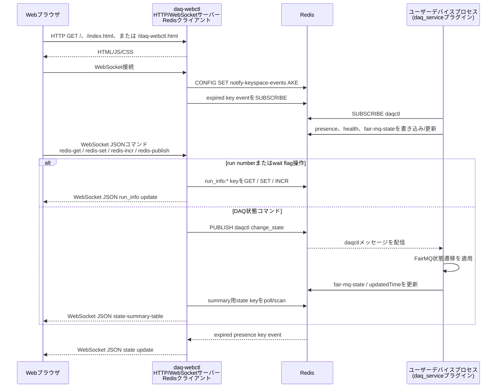

# データ収集 (DAQ) `daq-webctl`実装

[English](README.md) | [日本語](README.ja.md)

[トップ: NestDAQ](../README.ja.md) | [前へ: プラグイン](../plugins/README.ja.md) | [次へ: `daq-webctl`のブラウザUIファイル](../share/controller/README.ja.md)

このディレクトリには、NestDAQのウェブコントローラープロセスである`daq-webctl`の実装があります。
`daq-webctl`は、ブラウザユーザーインターフェース (UI) 用のHTTPサーバー、対話型クライアント用のWebSocketセッション、およびRedisをバックエンドとするDAQデバイス制御操作を提供します。

`daq-webctl`が配信するHTML、JavaScript、CSSファイルについては、[`share/controller/README.ja.md`](../share/controller/README.ja.md)に記載されています。

<a id="1-controller-responsibilities"></a>
## 1. `daq-webctl`の役割

`daq-webctl`はHTTPエンドポイントで接続を待ち受け、設定されたドキュメントルートを配信して、WebSocketクライアントを受け付けます。
ブラウザから受信したコマンドをRedisをバックエンドとするDAQ制御操作へ変換し、接続中のWebSocketクライアントへ状態更新を返します。

`daq-webctl`は起動時にFairLogger出力を設定し、必要に応じてNestDAQ OpenTelemetry実装共有ライブラリを読み込めます。

<a id="2-main-components"></a>
## 2. 主要コンポーネント

<a id="main-components-table-ja"></a>
**表1：`daq-webctl`の主要コンポーネントとその役割。**

| 構成要素 | 用途 |
| :-- | :-- |
| `run_daq-webctl.cxx` | 実行ファイルのエントリーポイント、コマンドライン解析、ロギング、テレメトリー、Redis設定、サーバー起動。 |
| `HttpWebSocketServer` | Boost.AsioのI/Oコンテキスト、シグナル処理、リスナー、ワーカースレッドを所有します。 |
| `Listener` | Transmission Control Protocol (TCP) 接続を受け付け、HTTPセッションを開始します。 |
| `HttpSession` | HTTPリクエストを処理し、WebSocketリクエストをアップグレードします。 |
| `WebSocketSession` | 1つのWebSocketクライアント接続を管理します。 |
| `WebSocketHandle` | WebSocketクライアントから受信したJavaScript Object Notation (JSON) メッセージを振り分けます。 |
| `WebGui` | RedisをバックエンドとするDAQ制御、状態のポーリング、コマンドの発行を実装します。 |
| `beast_tools` | 共通のBoost.Beast HTTPレスポンスヘルパーを提供します。 |
| `DaqWebControlDefaultDocRootPath.h.in` | `--doc-root`で使用する、インストール済み`daq-webctl`の既定ドキュメントルートパスを生成します。 |

<a id="3-typical-usage"></a>
## 3. 一般的な使用方法

シェルコマンド例の中で`#`から始まる行は読者向けのコメントであり、シェルでは実行されません。

```sh
# ローカルのHTTP endpointとRedis endpointを使用してdaq-webctlを起動します。
daq-webctl --http-uri=http://0.0.0.0:8080 --redis-uri=tcp://127.0.0.1:6379
```

`daq-webctl`起動後に、`http://localhost:8080/`、`http://localhost:8080/index.html`、または`http://localhost:8080/daq-webctl.html`を開きます。
インストールされる`index.html`は`daq-webctl.html`へのシンボリックリンクであり、`/`へのリクエストは`index.html`へ解決されます。
Redisサーバーは`daq-webctl`より先に起動してください。
OpenTelemetry Collectorへテレメトリーデータをエクスポートする場合は、Collectorとその保存先も`daq-webctl`より先に起動してください。
全体の起動順は、[ローカル実行シーケンス](../examples/README.ja.md#31-local-run-sequence)を参照してください。
DAQデバイスがRunning状態へ遷移する前に、`daq-webctl`で実行番号を設定してください。

利用可能なHTTP、Redis、FairLogger、OpenTelemetryオプションは`daq-webctl --help`で確認できます。

<a id="4-communication-flow"></a>
## 4. 通信フロー

ブラウザはRedisやユーザーデバイスプロセスへ直接接続しません。
`daq-webctl`はブラウザ向けのHTTP/WebSocketサーバーであり、コマンドの発行、キーへのアクセス、Pub/Subチャネルの購読、および状態のポーリングを行うRedisクライアントでもあります。
ユーザーデバイスプロセスは`daq_service`プラグインを通じてRedisと通信します。

<a id="communication-flow-figure-ja"></a>


**図1：ブラウザ、`daq-webctl`、Redis、ユーザーデバイス間の制御と状態の経路。**

[図1](#communication-flow-figure-ja)は制御と状態の経路を示します。
ユーザーデバイスプロセス間のFairMQデータチャネルトラフィックは別経路であり、`daq-webctl`を経由しません。

<a id="5-command-line-options"></a>
## 5. コマンドラインオプション

`daq-webctl`は以下のオプションを受け付けます。
OpenTelemetryオプションも利用できます。
`--otel-service-instance-id`を指定しない場合、`daq-webctl`は生成したUUIDをOpenTelemetryの`service.instance.id`リソース属性へ記録します。
OpenTelemetryオプションの一覧は[`nestdaq/telemetry/README.ja.md`](../nestdaq/telemetry/README.ja.md)を参照してください。

<a id="command-line-options-table-ja"></a>
**表2：`daq-webctl`の一般的なコマンドラインオプション。**

| オプション | 既定値 | 説明 |
| :-- | :-- | :-- |
| `--help`, `-h` | 未指定（フラグなし） | コマンドラインヘルプを表示して終了します。 |
| `--http-uri` | `http://0.0.0.0:8080` | `daq-webctl`がHTTP接続を待ち受けるエンドポイント。`scheme://address:port`形式で指定します。 |
| `--threads` | `1` | HTTPサーバーのワーカースレッド数。 |
| `--doc-root` | インストール済み`daq-webctl`のドキュメントルート | `daq-webctl`がHTML、JavaScript、CSSファイルを配信するディレクトリ。 |
| `--pre-run` | `echo "pre-run command"` | `RUN`を発行する前に実行するスクリプトのパスまたはコマンドライン。 |
| `--post-run` | `echo "post-run command"` | `RUN`を発行した後に実行するスクリプトのパスまたはコマンドライン。 |
| `--pre-stop` | `echo "pre-stop command"` | `STOP`を発行する前に実行するスクリプトのパスまたはコマンドライン。 |
| `--post-stop` | `echo "post-stop command"` | `STOP`を発行した後に実行するスクリプトのパスまたはコマンドライン。 |
| `--redis-uri` | `tcp://127.0.0.1:6379` | RedisサーバーのURI。URIの末尾に`/N`を追加するとデータベース`N`を選択し、省略するとデータベース`0`を使用します。 |
| `--separator` | `:` | Redisキーパス構成時の区切り文字。 |
| `--poll-interval` | `500` | ミリ秒単位の状態ポーリング間隔。 |
| `--log-to-file` | 空文字列（`""`） | FairLoggerの出力ファイル。空でないパスを指定するとファイルへのロギングを有効にし、コンソールへのロギングを無効にします。 |
| `--file-severity` | `info` | FairLoggerのファイル出力の重大度。 |
| `--severity` | `info` | FairLoggerのコンソール出力の重大度。コンソールへのログ出力を停止するには、`nolog`を指定します。 |
| `--verbosity` | `medium` | FairLoggerの詳細度。 |
| `--color` | `true` | FairLoggerのコンソール出力の色表示を有効にします。 |

<a id="51-opentelemetry-options"></a>
### 5.1. OpenTelemetryオプション

`daq-webctl`のOpenTelemetry `service.name`の既定値は`daq-webctl`です。
`--otel-library`が空でなくライブラリが見つかる場合は、`daq-webctl`がプロセス起動時にテレメトリーライブラリを動的に読み込みます。

`daq-webctl`でよく使用するテレメトリーオプションは次のとおりです。

<a id="telemetry-options-table-ja"></a>
**表3：`daq-webctl`でよく使用するテレメトリーオプション。**

| オプション | 既定値 | 説明 |
| :-- | :-- | :-- |
| `--otel-library` | `libnestdaq_otel.so` | プロセス起動時に動的に読み込むテレメトリー共有ライブラリのパスまたはsoname。 |
| `--otel-log-protocol` | `console` | コンマ区切りのログエクスポーター：`console`、`otlp-http`、`otlp-grpc`。空の場合はログのエクスポートを無効にします。 |
| `--otel-log-endpoint-grpc` | `localhost:4317` | OTLP gRPCログエンドポイント。 |
| `--otel-log-endpoint-http` | `http://localhost:4318/v1/logs` | OTLP HTTPログエンドポイント。 |
| `--otel-log-severity` | `info` | OpenTelemetryログへエクスポートするFairLoggerの最低重大度。 |
| `--otel-log-required` | `false` | テレメトリーライブラリを読み込めないか初期化できない場合、失敗として終了します。 |
| `--otel-service-name` | `daq-webctl` | OpenTelemetryの`service.name`リソース属性。 |
| `--otel-service-namespace` | `nestdaq` | OpenTelemetryの`service.namespace`リソース属性。 |
| `--otel-service-instance-id` | 生成したUUID | OpenTelemetryの`service.instance.id`リソース属性。 |
| `--otel-timeout-ms` | `5000` | ミリ秒単位の強制フラッシュ、シャットダウン、エクスポーターのタイムアウト。 |
| `--otel-metric-protocol` | 空文字列（`""`） | メトリクスエクスポーター。空文字列の場合はメトリクスを無効にします。`console`はデバッグに利用できます。 |
| `--otel-trace-protocol` | 空文字列（`""`） | トレースエクスポーター。空文字列の場合はトレースを無効にします。`console`はデバッグに利用できます。 |

次の例は、ローカルOpenTelemetry CollectorへOTLP gRPCで`daq-webctl`のログを送信します。

```sh
# daq-webctlを起動し、OTLP gRPCでローカルcollectorへlogをexportします。
daq-webctl \
  --http-uri=http://0.0.0.0:8080 \
  --redis-uri=tcp://127.0.0.1:6379 \
  --otel-log-protocol=otlp-grpc \
  --otel-log-endpoint-grpc=localhost:4317 \
  --otel-log-severity=info \
  --otel-service-name=daq-webctl
```

`daq-webctl`の実行場所に応じてOTLPエンドポイントを選択します。

ここでComposeとは、`docker compose`または`podman compose`で管理するコンテナ構成を指します。

- ホストプロセスからOpenSearch Composeで公開されたCollectorポートへ接続：
  `localhost:4317`。
- 同じOpenSearch Composeネットワーク内の`daq-webctl`コンテナ：
  `otel-collector:4317`。

メトリクスとトレースは既定で無効です。
Collectorを使用しないローカルデバッグでは、`--otel-metric-protocol=console`や`--otel-trace-protocol=console`などのコンソールエクスポーターを使用します。
OpenTelemetryオプションの一覧とリソース属性の詳細は[`nestdaq/telemetry/README.ja.md`](../nestdaq/telemetry/README.ja.md)を参照してください。

<a id="6-redis-command-interface"></a>
## 6. Redisコマンドインターフェース

`daq-webctl`は`daq_service`プラグインが実装するRedisコマンドインターフェースを使用します。
DAQコマンドキー、`daqctl` Publish/Subscribe (Pub/Sub) チャネル、メッセージ形式、受け付けるコマンド値、および`RUN`/`STOP`シーケンスについては、[`plugins/README.ja.md`](../plugins/README.ja.md#24-daq-command-publishsubscribe-pubsub)に記載されています。
`daq-webctl`以外のカスタムコントローラーを開発する場合も、この節で説明するRedisキーとPub/Subインターフェースを利用できます。

`daq-webctl`は起動時にRedisの`notify-keyspace-events`を`AKE`に設定し、期限切れキーイベントを含むキーイベント通知を受信できるようにします。
さらに、ブラウザの状態概要を構築するため、`daq_service{sep}*{sep}*{sep}fair-mq-state`と`daq_service{sep}*{sep}*{sep}updatedTime`をポーリングします。

[表4](#redis-keys-channel-table-ja)は、`daq-webctl`が直接操作するRedisキーおよびチャネルを示します。

<a id="redis-keys-channel-table-ja"></a>
**表4：`daq-webctl`が直接操作するRedisキーおよびチャネル。**

| キーパターン | `daq-webctl`が行う操作 | 目的 |
| :-- | :-- | :-- |
| `daq_service{sep}{service}{sep}{id}{sep}fair-mq-state` | 読み取り | 各デバイスインスタンスの現在のFairMQ状態を取得。 |
| `daq_service{sep}{service}{sep}{id}{sep}updatedTime` | 読み取り | 各デバイスインスタンスが最後に状態を更新した時刻を取得。 |
| `daq_service{sep}service-instance-index{sep}{service}` | 対応する存在キーの期限切れ後にインスタンスインデックスフィールドを削除 | 数値インスタンスインデックスを再利用できる状態に戻す。 |
| `run_info{sep}run_number` | 読み取り、設定、インクリメント | 現在または次の実行番号を管理。 |
| `run_info{sep}latest_run_number` | 読み取り/書き込み | `RUN`要求時に複製した実行番号を保存。 |
| `run_info{sep}wait-device-ready` | 読み取り/書き込み | `1`または`true`の場合、選択した全デバイスが`DeviceReady`、`Ready`、`Running`のいずれか1つの同じ状態を報告するまで`CONNECT`後に待機。キーがない場合またはその他の値の場合は待機しません。 |
| `run_info{sep}wait-ready` | 読み取り/書き込み | `1`または`true`の場合、選択した全デバイスが`Ready`または全デバイスが`Running`を報告するまで`INIT TASK`後に待機。キーがない場合またはその他の値の場合は待機しません。 |
| `daqctl` | 発行 | 選択したデバイスインスタンスへDAQ状態遷移要求を送信。 |

`daq-webctl`は`RUN`要求を処理するときに、`run_info{sep}run_number`を`run_info{sep}latest_run_number`へ複製します。
`wait-device-ready`が有効な場合は`CONNECT`を、`wait-ready`が有効な場合は`INIT TASK`を`RUN`より先に送信し、選択したデバイスが所定の状態へ遷移するまで待ちます。
これらの要求には、`RUN`と同じ`services`および`instances`を指定します。
`STOP`要求では、事前の状態遷移を行わずに`STOP`を送信します。
`--pre-run`と`--post-run`は`RUN`送信の前後に、`--pre-stop`と`--post-stop`は`STOP`送信の前後に実行します。

<a id="7-websocket-messages"></a>
## 7. WebSocketメッセージ

ウェブブラウザはWebSocketクライアントとして動作し、`daq-webctl`が提供するWebSocketサーバーエンドポイントへJSONコマンドを送信します。
`daq-webctl`はRedis操作を実行するか、Redis Pub/Subメッセージを発行します。
`redis-publish`のRedis Pub/Subコマンドメッセージ形式、受け付けるコマンド値、および`services` / `instances`の対象選択規則については、[`plugins/README.ja.md`](../plugins/README.ja.md#24-daq-command-publishsubscribe-pubsub)に記載されています。

<a id="client-messages-table-ja"></a>
**表5：`daq-webctl`が受け付けるWebSocketクライアントメッセージ。**

| クライアントメッセージ | 動作 |
| :-- | :-- |
| `{"command":"redis-get","value":"run_number"}` | `run_info{sep}run_number`と`run_info{sep}latest_run_number`を読み取ります。 |
| `{"command":"redis-incr","value":"run_number"}` | `run_info{sep}run_number`をインクリメントします。 |
| `{"command":"redis-set","name":"wait-ready","value":"true"}` | 既知の`run_info`値の1つを設定します。有効な名前は`run_number`、`wait-device-ready`、`wait-ready`です。 |
| `{"command":"redis-publish","value":"RUN","services":["Sampler"],"instances":["Sampler:Sampler-0"]}` | 設定に応じた前提コマンド処理とともにDAQコマンドを`daqctl`へ発行します。 |

`daq-webctl`はブラウザクライアントへJSONメッセージを返します。

<a id="server-messages-table-ja"></a>
**表6：`daq-webctl`がブラウザクライアントへ返すJSONメッセージ。**

| `daq-webctl`のメッセージ | 意味 |
| :-- | :-- |
| `{"type":"set run_number","value":"..."}` | 更新された実行番号。 |
| `{"type":"set latest_run_number","value":"..."}` | 更新された最新実行番号。 |
| `{"type":"error","value":"..."}` | Redisの読み取りまたはコマンド処理のエラー。 |
| `{"type":"state-summary-table", ...}` | サービス/インスタンス状態の概要全体。 |

`state-summary-table`メッセージには次が含まれます。

- `service_list_changed`：サービス集合が変化したとき`true`。
- `instance_list_changed`：インスタンス集合が変化したとき`true`。
- `services`：サービス概要の配列。
- サービスごとの`counts`：FairMQ状態カウンターの配列。
- サービスごとの`instances`：`service`、`instance`、`state`、`date`を
  持つ配列。

<a id="8-state-polling-and-expiration"></a>
## 8. 状態のポーリングと期限切れ

`daq-webctl`は`--poll-interval`ミリ秒ごとに`daq_service{sep}*{sep}*{sep}fair-mq-state`と`daq_service{sep}*{sep}*{sep}updatedTime`をポーリングします。
得られた概要は、接続中のすべてのWebSocketクライアントへブロードキャストされます。

Redisの期限切れキーイベントは別に処理されます。
`presence`キーが期限切れになると、`daq-webctl`はキー名からサービスとインスタンスを導出し、接続中のクライアントを更新します。
この更新により、消失したインスタンスがUIへ反映されます。
