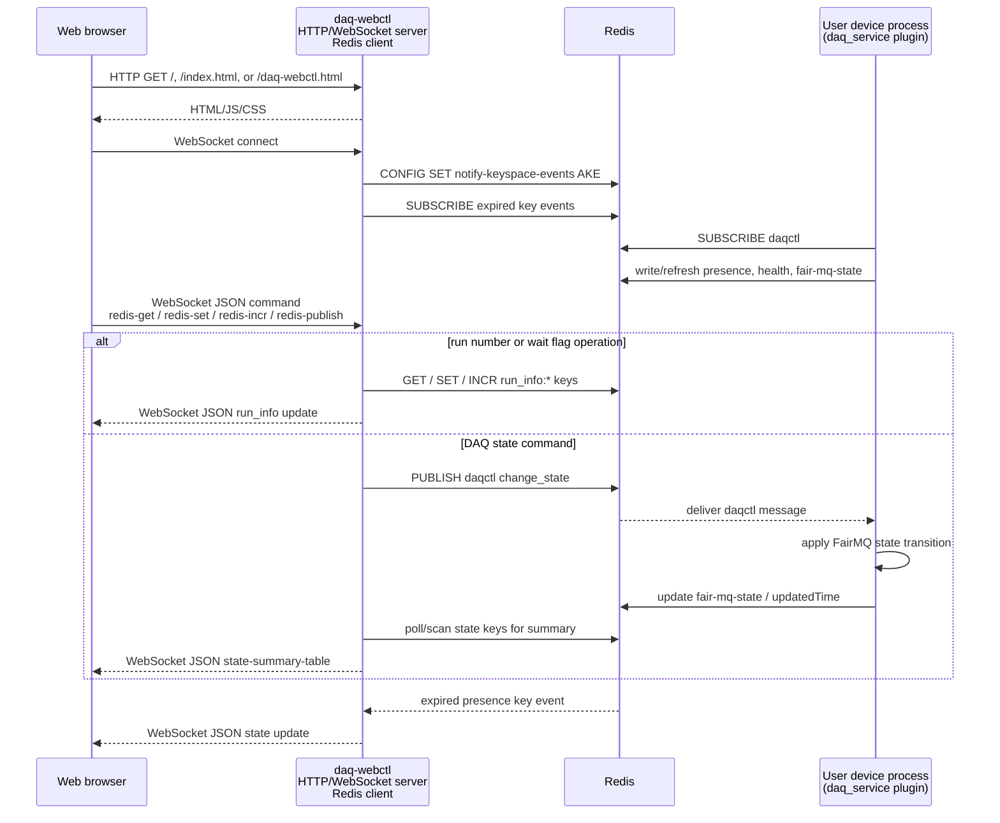

# Data Acquisition (DAQ) `daq-webctl` Implementation

[English](README.md) | [日本語](README.ja.md)

[Top: NestDAQ](../README.md) | [Previous: Plugins](../plugins/README.md) | [Next: `daq-webctl` browser UI files](../share/controller/README.md)

This directory contains the implementation of `daq-webctl`, the NestDAQ web controller process.
It provides an HTTP server for the browser user interface (UI), WebSocket sessions for interactive clients, and Redis-backed control operations for DAQ devices.

The HTML, JavaScript, and CSS files served by `daq-webctl` are documented separately in [`share/controller/README.md`](../share/controller/README.md).

<a id="1-runtime-role"></a>
## 1. `daq-webctl` Responsibilities

`daq-webctl` listens on an HTTP endpoint, serves the configured document root, and accepts WebSocket clients.
It translates browser commands into Redis-backed DAQ control operations and sends state updates to connected WebSocket clients.

At startup, `daq-webctl` configures FairLogger output and can load the optional NestDAQ OpenTelemetry implementation shared library.

## 2. Main Components

<a id="main-components-table-en"></a>
**Table 1: Main `daq-webctl` components and their responsibilities.**

| Component | Purpose |
| :-- | :-- |
| `run_daq-webctl.cxx` | Executable entry point, command-line parsing, logging, telemetry, Redis setup, and server startup. |
| `HttpWebSocketServer` | Owns the Boost.Asio I/O context, signal handling, listener, and worker threads. |
| `Listener` | Accepts Transmission Control Protocol (TCP) connections and starts HTTP sessions. |
| `HttpSession` | Handles HTTP requests and upgrades WebSocket requests. |
| `WebSocketSession` | Manages one WebSocket client connection. |
| `WebSocketHandle` | Dispatches JavaScript Object Notation (JSON) messages received from WebSocket clients. |
| `WebGui` | Implements Redis-backed DAQ control, state polling, and command publication. |
| `beast_tools` | Provides shared Boost.Beast HTTP response helpers. |
| `DaqWebControlDefaultDocRootPath.h.in` | Generates the default installed `daq-webctl` document root path used by `--doc-root`. |

## 3. Typical Usage

Lines beginning with `#` inside shell command examples are comments for the reader and are not executed by the shell.

```sh
# Start daq-webctl with local HTTP and Redis endpoints.
daq-webctl --http-uri=http://0.0.0.0:8080 --redis-uri=tcp://127.0.0.1:6379
```

After `daq-webctl` starts, open `http://localhost:8080/`, `http://localhost:8080/index.html`, or `http://localhost:8080/daq-webctl.html`.
The installed `index.html` is a symbolic link to `daq-webctl.html`, and a request for `/` resolves to `index.html`.
Start the Redis server before `daq-webctl`.
When exporting telemetry through an OpenTelemetry Collector, start the Collector and its telemetry storage before `daq-webctl` as well.
See the [local run sequence](../examples/README.md#31-local-run-sequence) for the complete startup order.
Set the run number with `daq-webctl` before a DAQ device enters the Running state.

Use `daq-webctl --help` to inspect the available HTTP, Redis, FairLogger, and OpenTelemetry options.

## 4. Communication Flow

The browser never connects directly to Redis or user device processes.
`daq-webctl` is the browser-facing HTTP/WebSocket server and the Redis client that publishes commands, accesses keys, subscribes to Pub/Sub channels, and polls state.
User device processes communicate with Redis through the `daq_service` plugin.

<a id="communication-flow-figure-en"></a>


**Figure 1: Control and status path among the browser, `daq-webctl`, Redis, and user devices.**

[Figure 1](#communication-flow-figure-en) shows the control and status path.
FairMQ data-channel traffic between user device processes follows a separate path and is not routed through `daq-webctl`.

## 5. Command-Line Options

`daq-webctl` accepts the following options.
OpenTelemetry options are also available.
When `--otel-service-instance-id` is not specified, `daq-webctl` records a generated UUID in the OpenTelemetry `service.instance.id` resource attribute.
See [`nestdaq/telemetry/README.md`](../nestdaq/telemetry/README.md) for the complete OpenTelemetry option list.

<a id="command-line-options-table-en"></a>
**Table 2: General `daq-webctl` command-line options.**

| Option | Default | Description |
| :-- | :-- | :-- |
| `--help`, `-h` | not specified (flag absent) | Print command-line help and exit. |
| `--http-uri` | `http://0.0.0.0:8080` | Endpoint on which `daq-webctl` listens for HTTP connections, in `scheme://address:port` form. |
| `--threads` | `1` | Number of HTTP server worker threads. |
| `--doc-root` | installed `daq-webctl` document root | Directory from which `daq-webctl` serves HTML, JavaScript, and CSS files. |
| `--pre-run` | `echo "pre-run command"` | Script path or command line executed before publishing `RUN`. |
| `--post-run` | `echo "post-run command"` | Script path or command line executed after publishing `RUN`. |
| `--pre-stop` | `echo "pre-stop command"` | Script path or command line executed before publishing `STOP`. |
| `--post-stop` | `echo "post-stop command"` | Script path or command line executed after publishing `STOP`. |
| `--redis-uri` | `tcp://127.0.0.1:6379` | Redis server URI. Append `/N` to the URI to select database `N`; omitting it selects database `0`. |
| `--separator` | `:` | Separator used when composing Redis key paths. |
| `--poll-interval` | `500` | State polling interval in milliseconds. |
| `--log-to-file` | empty string (`""`) | FairLogger output file. A non-empty path enables file logging and disables console logging. |
| `--file-severity` | `info` | FairLogger file severity. |
| `--severity` | `info` | FairLogger console severity. Set it to `nolog` to stop log output to the console. |
| `--verbosity` | `medium` | FairLogger verbosity. |
| `--color` | `true` | Enable FairLogger console colors. |

### 5.1. OpenTelemetry Options

The default OpenTelemetry `service.name` for `daq-webctl` is `daq-webctl`.
If `--otel-library` is non-empty and the library can be found, `daq-webctl` loads the telemetry library dynamically when the process starts.

Common `daq-webctl` telemetry options are:

<a id="telemetry-options-table-en"></a>
**Table 3: Common `daq-webctl` telemetry options.**

| Option | Default | Description |
| :-- | :-- | :-- |
| `--otel-library` | `libnestdaq_otel.so` | Telemetry shared library path or soname dynamically loaded when the process starts. |
| `--otel-log-protocol` | `console` | Comma-separated log exporters: `console`, `otlp-http`, `otlp-grpc`; empty disables log export. |
| `--otel-log-endpoint-grpc` | `localhost:4317` | OTLP gRPC log endpoint. |
| `--otel-log-endpoint-http` | `http://localhost:4318/v1/logs` | OTLP HTTP log endpoint. |
| `--otel-log-severity` | `info` | Minimum FairLogger severity exported to OpenTelemetry logs. |
| `--otel-log-required` | `false` | Exit with failure if the telemetry library cannot be loaded or initialized. |
| `--otel-service-name` | `daq-webctl` | OpenTelemetry `service.name` resource attribute. |
| `--otel-service-namespace` | `nestdaq` | OpenTelemetry `service.namespace` resource attribute. |
| `--otel-service-instance-id` | generated UUID | OpenTelemetry `service.instance.id` resource attribute. |
| `--otel-timeout-ms` | `5000` | Force-flush, shutdown, and exporter timeout in milliseconds. |
| `--otel-metric-protocol` | empty string (`""`) | Metric exporters; an empty string disables metrics. Useful for `console` debugging. |
| `--otel-trace-protocol` | empty string (`""`) | Trace exporters; an empty string disables traces. Useful for `console` debugging. |

The following example sends `daq-webctl` logs to a local OpenTelemetry Collector by OTLP gRPC:

```sh
# Start daq-webctl and export its logs to the local collector over OTLP gRPC.
daq-webctl \
  --http-uri=http://0.0.0.0:8080 \
  --redis-uri=tcp://127.0.0.1:6379 \
  --otel-log-protocol=otlp-grpc \
  --otel-log-endpoint-grpc=localhost:4317 \
  --otel-log-severity=info \
  --otel-service-name=daq-webctl
```

Choose the OTLP endpoint according to where `daq-webctl` runs.
Here, Compose means a container setup managed with `docker compose` or `podman compose`.

- Host process to the collector port published by the OpenSearch Compose setup: `localhost:4317`.
- `daq-webctl` container in the same OpenSearch Compose network:
  `otel-collector:4317`.

Metrics and traces are disabled by default.
For local debugging without a collector, use console exporters such as `--otel-metric-protocol=console` or `--otel-trace-protocol=console`.
See [`nestdaq/telemetry/README.md`](../nestdaq/telemetry/README.md) for the complete OpenTelemetry option list and resource attribute details.

## 6. Redis Command Interface

`daq-webctl` uses the Redis command interface implemented by the `daq_service` plugin.
DAQ command keys, the `daqctl` Publish/Subscribe (Pub/Sub) channel, message shape, accepted command values, and `RUN`/`STOP` sequencing are documented in [`plugins/README.md`](../plugins/README.md#24-daq-command-publishsubscribe-pubsub).
A custom controller can use the same Redis keys and Pub/Sub interface; this section provides a starting point for implementing one.

At startup, `daq-webctl` sets Redis `notify-keyspace-events` to `AKE` so that it can receive key-event notifications, including expired key events.
It also polls `daq_service{sep}*{sep}*{sep}fair-mq-state` and `daq_service{sep}*{sep}*{sep}updatedTime` to build browser state summaries.

[Table 4](#redis-keys-channel-table-en) lists the Redis keys and channel that `daq-webctl` accesses directly.

<a id="redis-keys-channel-table-en"></a>
**Table 4: Redis keys and channel accessed directly by `daq-webctl`.**

| Key pattern | Operation performed by `daq-webctl` | Purpose |
| :-- | :-- | :-- |
| `daq_service{sep}{service}{sep}{id}{sep}fair-mq-state` | Read | Obtain each device instance's current FairMQ state. |
| `daq_service{sep}{service}{sep}{id}{sep}updatedTime` | Read | Determine when each device instance last updated its state. |
| `daq_service{sep}service-instance-index{sep}{service}` | Delete an instance-index field after the corresponding presence key expires | Release the numeric instance index for reuse. |
| `run_info{sep}run_number` | Read, set, and increment | Manage the current or next run number. |
| `run_info{sep}latest_run_number` | Read and write | Store the run number copied when `RUN` is requested. |
| `run_info{sep}wait-device-ready` | Read and write | When set to `1` or `true`, wait after `CONNECT` until all selected devices report the same accepted state: `DeviceReady`, `Ready`, or `Running`. A missing key or any other value disables the wait. |
| `run_info{sep}wait-ready` | Read and write | When set to `1` or `true`, wait after `INIT TASK` until all selected devices report `Ready` or all report `Running`. A missing key or any other value disables the wait. |
| `daqctl` | Publish | Send DAQ state-transition requests to the selected device instances. |

When `daq-webctl` handles a `RUN` request, it copies `run_info{sep}run_number` to `run_info{sep}latest_run_number`.
Depending on the two wait flags, it sends the prerequisite `CONNECT` and `INIT TASK` requests and waits for the selected devices before sending `RUN`.
The same `services` and `instances` selection applies to the prerequisite waits.
When `daq-webctl` handles a `STOP` request, it sends `STOP` without prerequisite state transitions.
Configured pre/post hooks run around the corresponding `RUN` and `STOP` requests.

## 7. WebSocket Messages

Browser clients send JSON commands to the WebSocket endpoint.
`daq-webctl` executes Redis operations or publishes Redis Pub/Sub messages.
For `redis-publish`, [`plugins/README.md`](../plugins/README.md#24-daq-command-publishsubscribe-pubsub) documents the Redis Pub/Sub command message shape, accepted command values, and `services` / `instances` target selection rules.

<a id="client-messages-table-en"></a>
**Table 5: WebSocket client messages accepted by `daq-webctl`.**

| Client message | Effect |
| :-- | :-- |
| `{"command":"redis-get","value":"run_number"}` | Reads `run_info{sep}run_number` and `run_info{sep}latest_run_number`. |
| `{"command":"redis-incr","value":"run_number"}` | Increments `run_info{sep}run_number`. |
| `{"command":"redis-set","name":"wait-ready","value":"true"}` | Sets one of the known `run_info` values. Valid names are `run_number`, `wait-device-ready`, and `wait-ready`. |
| `{"command":"redis-publish","value":"RUN","services":["Sampler"],"instances":["Sampler:Sampler-0"]}` | Publishes a DAQ command to `daqctl`, with optional prerequisite command handling. |

`daq-webctl` sends JSON messages back to browser clients.

<a id="server-messages-table-en"></a>
**Table 6: JSON messages sent by `daq-webctl` to browser clients.**

| `daq-webctl` message | Meaning |
| :-- | :-- |
| `{"type":"set run_number","value":"..."}` | Updated run number. |
| `{"type":"set latest_run_number","value":"..."}` | Updated latest run number. |
| `{"type":"error","value":"..."}` | Redis read or command handling error. |
| `{"type":"state-summary-table", ...}` | Full service/instance state summary. |

The `state-summary-table` message contains:

- `service_list_changed`: true when the set of services changed.
- `instance_list_changed`: true when the set of instances changed.
- `services`: array of service summaries.
- per-service `counts`: array of FairMQ state counters.
- per-service `instances`: array with `service`, `instance`, `state`, and
  `date`.

## 8. State Polling and Expiration

`daq-webctl` polls `daq_service{sep}*{sep}*{sep}fair-mq-state` and `daq_service{sep}*{sep}*{sep}updatedTime` every `--poll-interval` milliseconds.
The resulting summary is broadcast to all connected WebSocket clients.

Redis expired key events are processed separately.
When a `presence` key expires, `daq-webctl` derives the service and instance from the key name and updates connected clients so that the UI reflects the missing instance.
