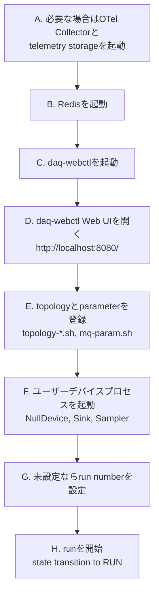
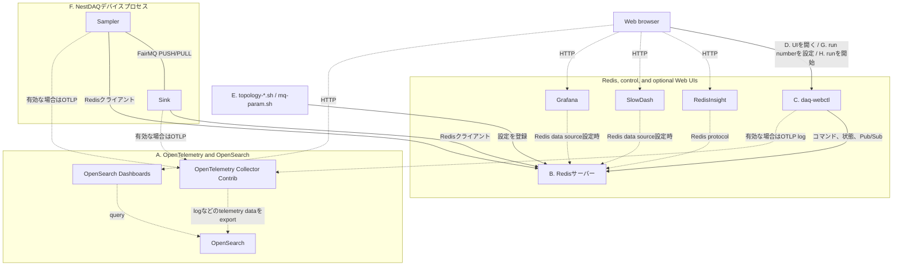
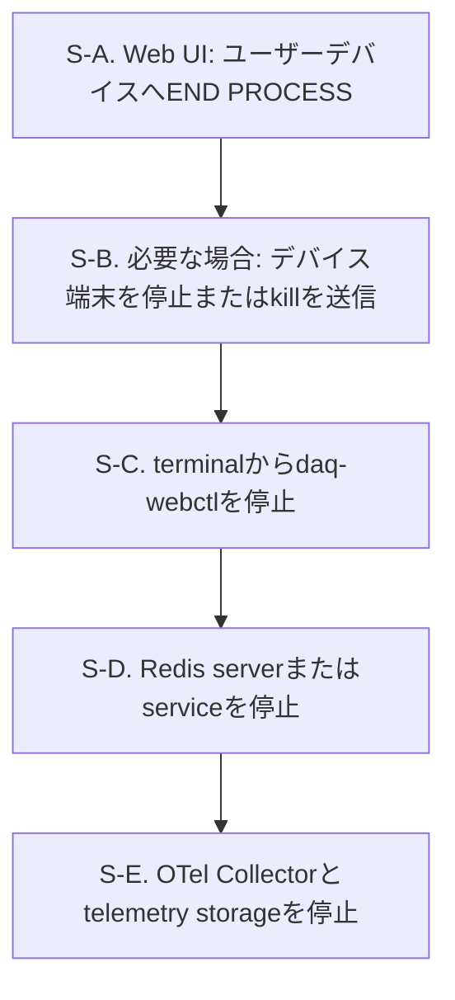

# 使用例

[English](README.md) | [日本語](README.ja.md)

[トップ: NestDAQ](../README.ja.md) | [前へ: インストール](../INSTALL.ja.md) | [次へ: スクリプト](../scripts/README.ja.md)

このディレクトリには、小規模なNestDAQデバイスの例があります。
CMakeオプション`NestDAQ_BUILD_EXAMPLES`は、NestDAQのメインビルドに例を含めるかどうかを制御し、デフォルトは`ON`です。

<a id="1-example-devices"></a>
## 1. デバイス例

<a id="example-devices-table-ja"></a>
**表1：デバイス例の実行ファイルと用途。**

| 実行ファイル | 用途 |
| :-- | :-- |
| `NullDevice` | データチャネルを使用せず、NestDAQ `runDevice.h`エントリーポイントとライフサイクルフックを実行する最小限のFairMQデバイス。 |
| `Sampler` | FairMQ出力チャネルを通じてテキストメッセージを送信します。カスタムコマンドラインオプションの使用例を示します。OpenTelemetryスパンとメトリクスの計装例も示します。 |
| `Sink` | FairMQ入力チャネルを通じて単一パートまたはマルチパートメッセージを受信します。チャネルコールバックの設定例を示します。OpenTelemetryスパンとメトリクスの計装例も示します。 |

**ライフサイクルフック**は、デバイスのライフサイクルにおける所定の段階でFairMQ状態機械が呼び出すメンバー関数です。
例えば、`Init()`と`InitTask()`はデバイスを初期化し、`PreRun()`は実行の準備、`PostRun()`は実行終了後の処理を行います。
デバイスは自身の処理やリソース管理に必要なフックだけをオーバーライドします。
`NullDevice`は、データチャネルを設定せずに呼出順を確認できるよう、これらの呼出しをログへ記録します。

各実行ファイルは`NestDAQ::NestDAQ`へリンクします。
このターゲットは、NestDAQ `runDevice.h`連携、FairMQ/FairLogger依存関係、プラグイン検索パス、および必要に応じて利用できるテレメトリーローダーのサポートを提供します。

`Sampler`と`Sink`は、OpenTelemetryヘッダーを直接インクルードせずにトレーススパンとメトリクスを示すため、NestDAQテレメトリーファサードを使用します。
デバイス起動時に`--otel-metric-protocol=console`と`--otel-trace-protocol=console`などのコマンドラインオプションを指定すると、これらの計装例が有効になります。
NestDAQのOpenTelemetryメトリクスおよびトレース計装は実験的機能であり、
本番コードでは使用しないでください。

<a id="2-build"></a>
## 2. ビルド

NestDAQのメインビルドは既定でこれらのサンプルをビルドしてインストールします。
除外するには、`-DNestDAQ_BUILD_EXAMPLES=OFF`を指定してNestDAQをconfigureします。

サンプルを別にビルドする場合は、先にNestDAQをインストールします。
次に、NestDAQのインストールプレフィックスを`CMAKE_PREFIX_PATH`へ設定してサンプルを構成します。

以下のコマンドでは、`-D`でCMakeキャッシュ変数の`CMAKE_PREFIX_PATH`と`CMAKE_INSTALL_PREFIX`を設定します。
`-S`と`-B`は、ソースディレクトリとビルドディレクトリを選択する`cmake`コマンドラインオプションです。

シェルコマンド例の中で`#`から始まる行は読者向けのコメントであり、シェルでは実行されません。

```sh
# インストール済みNestDAQパッケージを使用するソース外ビルドを構成します。
cmake \
  -DCMAKE_PREFIX_PATH=<nestdaq-install-prefix> \
  -DCMAKE_INSTALL_PREFIX=<examples-install-prefix> \
  -B ./build-examples \
  -S ./examples
# configure済みexampleを並列buildします。
cmake --build ./build-examples --parallel
# 選択したprefix以下へexample executableをinstallします。
cmake --install ./build-examples
```

サンプルをNestDAQと同じプレフィックスへインストールする必要はありません。
ただし、動的リンカーがNestDAQ、FairMQ、Boost、および関連ライブラリを見つけられる必要があります。
サンプルCMakeプロジェクトは、サンプルのインストールプレフィックスからの相対的なインストールRPATHを設定し、`NestDAQ::NestDAQ`を通じて検出したリンクパスを使用します。

<a id="3-running"></a>
## 3. 実行

<a id="31-local-run-sequence"></a>
### 3.1. ローカル実行シーケンス

以下のコマンドは、NestDAQが`<install-prefix>`以下へインストールされていると仮定しています。

<a id="local-run-sequence-figure-ja"></a>


**図1：NestDAQをローカルで実行する一般的な起動シーケンス。**

[図1](#local-run-sequence-figure-ja)は一般的なローカル実行sequenceであり、厳密なdependency graphではありません。
この節におけるテレメトリー保存先は、OpenSearchなど、Collectorから転送された
テレメトリーデータを保存するサービスを指します。
ログ、メトリクス、トレースをエクスポートし、利用可能なCollectorとテレメトリー保存先がまだ
動作していない場合は、最初にOpenTelemetry Collectorと必要なテレメトリー保存先を
起動します。
テレメトリーが無効、コンソール専用テレメトリーを使用、または既存のCollectorが利用可能な場合は、手順Aが完了済みとみなします。

Redisは必須です。
ローカル`redis-server`、コンテナ化したRedis/[Redis Stack](../INSTALL.ja.md#redis-server-and-modules)インスタンス、systemd管理のホストパッケージなど、使用中のローカル配備方法で起動します。
手順EとFは、Redisが利用可能になった後かつ手順Hより前であれば、順序を入れ替えられます。

`daq-webctl`起動後すぐにブラウザを開けますが、トポロジーとパラメーター設定が登録され、ユーザーデバイスが動作するまでデバイスが表示されない場合があります。
手順GとHは`daq-webctl`ウェブUIで行う操作です。
実行開始コマンドの実行には対象デバイスが動作中である必要があるため、手順Hは最後に行います。
`daq-webctl`とユーザーデバイスはRedisを使用し、OpenTelemetryログをCollectorへエクスポートできます。

<a id="311-step-a-start-an-opentelemetry-collector"></a>
#### 3.1.1. 手順A：OpenTelemetry Collectorを起動

ローカルCompose構成のCollector、ホストへインストールした`otelcol-contrib`サービス、
またはNestDAQプロセスから到達可能な別のCollectorを使用できます。
CollectorはサンプルデバイスからOpenTelemetry Protocol (OTLP) データを受信し、
設定されたログ、メトリクス、トレースの保存先へ転送します。

<a id="3111-compose"></a>
##### 3.1.1.1. Compose

以下のローカル検証例ではOpenSearch Compose stackを使用します。
ログとトレースをOpenSearchへ保存し、OpenSearch Dashboardsで利用できるようにします。

```sh
# インストール済みCompose fileをcurrent directoryへcopyします。
cp -a <install-prefix>/share/otel-collector-compose ./otel-collector-compose
# OpenSearch Compose directoryへ移動します。
cd ./otel-collector-compose/opensearch
# Collector、OpenSearch、OpenSearch Dashboards、setup serviceを起動します。
docker compose -f compose-opensearch.yaml up
```

Podmanでは同じファイルを`podman compose`で使用します。
port、rootless Podmanの注意事項、dashboard設定の詳細は
[`share/otel-collector-compose/opensearch/README.ja.md`](../share/otel-collector-compose/opensearch/README.ja.md)を参照してください。
ホストプロセスが使用する既定のOTLP gRPCエンドポイントは`localhost:4317`です。
同じComposeネットワーク内のプロセスは、`otel-collector:4317`などのCollectorサービス名を使用します。

`opensearch-dashboards-setup`サービスは、`docker compose up`または
`podman compose up`の一部として自動的に実行され、ログとトレースの初期Data Viewを作成します。
エクスポートされたログとトレースを確認するには、OpenSearch Dashboardsで
`http://localhost:5601/app/discover`を開きます。

<a id="3112-host-package"></a>
##### 3.1.1.2. ホストパッケージ

ホストパッケージマネージャーで`otelcol-contrib`をインストールした場合は、Collector設定を編集し、
`systemd`でサービスを起動します。
[`share/installers/README.ja.md`](../share/installers/README.ja.md)を参照してください。
このサービスに設定したOTLPエンドポイントを使用します。
同じホスト上のクライアントプロセスは通常`localhost:4317`を使用します。

<a id="312-step-b-start-redis"></a>
#### 3.1.2. 手順B：Redisを起動

   NestDAQの`daq_service`、`metrics`、`parameter_config`という3つのプラグインにはRedisが必要です。
   `metrics`プラグインにはRedisTimeSeriesも必要です。
   各プラグインの要件は[`plugins/README.ja.md`](../plugins/README.ja.md)を参照してください。
   Redisには、ローカルでビルドしたサーバー、`systemd`管理のホストパッケージ、または
   コンテナを使用できます。この手順で起動したRedisのエンドポイントを、`daq-webctl`、
   `start_device.sh`、トポロジー/パラメーター用ヘルパースクリプトで一貫して使用します。
   `daq-webctl`は起動時に、`parameter_config`の動的再読み込みに必要なRedisキースペース
   notificationを有効にします。この起動シーケンスでは、追加のRedis設定は不要です。

<a id="3121-start-with-a-configuration-file"></a>
##### 3.1.2.1. 設定ファイルを使用して起動

   依存関係のインストールは`<install-prefix>/etc/redis/`以下に2つのRedis設定ファイルを
   インストールします。

   - `redis.conf`は[Redis GitHub repository](https://github.com/redis/redis)の
     ソースツリーにあるファイルを変更せずにコピーしたものです。
   - `redis-full.conf`は`redis.conf`を取り込み、依存関係ビルドでインストールした
     各モジュールを絶対パスで読み込みます。

   既定の設定を変更しない場合は、生成された設定ファイルを直接指定して起動します。

   ```sh
   # 生成されたモジュール設定を使用してRedisを起動します。
   <install-prefix>/bin/redis-server \
     <install-prefix>/etc/redis/redis-full.conf
   ```

   モジュールの読み込みまたは永続化設定を変更する場合は、設定ファイルをコピーして
   必要な設定を変更してからRedisを起動します。

   ```sh
   # 編集するためのローカル設定ファイルを作成します。
   cp <install-prefix>/etc/redis/redis-full.conf ./redis-full.conf
   # 必要な設定を変更してからRedisを起動します。
   <install-prefix>/bin/redis-server ./redis-full.conf
   ```

<a id="3122-start-without-a-configuration-file"></a>
##### 3.1.2.2. 設定ファイルを使用せずに起動

   Redisの組み込みデフォルト設定を使用し、モジュールパスをコマンドラインオプションで
   指定して起動することもできます。
   外部依存関係とともにRedis Stackをビルドしてインストールした場合は、次のように
   インストール済みモジュールを指定します。

   ```sh
   # Redis 8を起動し、デフォルトビルドでインストールした全モジュールを読み込みます。
   <install-prefix>/bin/redis-server \
     --loadmodule <install-prefix>/lib/redis/modules/redisbloom.so \
     --loadmodule <install-prefix>/lib/redis/modules/redisearch.so \
     --loadmodule <install-prefix>/lib/redis/modules/rejson.so \
     --loadmodule <install-prefix>/lib/redis/modules/redistimeseries.so
   ```

   ローカル設定で必要なモジュールだけを読み込んでください。依存関係ビルド時に
   Redis Stackモジュールを無効化した場合、対応する`--loadmodule`行を省略します。

   CMakeオプションの`WITH_REDIS_STACK=OFF`と`WITH_REDIS_SERVER_7=ON`を設定して、
   単独のRedisTimeSeriesとともに
   Redis 7.xサーバーをビルドした場合、インストール済みRedisTimeSeriesモジュールだけを
   読み込みます。

   ```sh
   # Redis 7を起動し、スタンドアロンRedisTimeSeriesモジュールを読み込みます。
   <install-prefix>/bin/redis-server \
     --loadmodule <install-prefix>/lib/redis/modules/redistimeseries.so
   ```

<a id="3123-persistence-and-endpoint"></a>
##### 3.1.2.3. データ保存とエンドポイント

   RDBスナップショットは、Redisがメモリー上に保持するデータセットを、ある時点でバイナリーファイルへ
   保存したものです。Redisは再起動後のデータ復元にRDB snapshotを使用できます。
   Redisは既定でRDBスナップショットを`dump.rdb`へ書き込みます。スナップショットディレクトリと
   ファイル名はRedisの`dir`および`dbfilename`設定で変更できます。

   既定のRedisエンドポイントは`localhost:6379`です。

<a id="3124-container-and-host-package-methods"></a>
##### 3.1.2.4. コンテナおよびホストパッケージを使用する方法

   Redis Stackはコンテナでも実行できます。
   以下を参照してください。
   [`share/redis-stack-container/README.ja.md`](../share/redis-stack-container/README.ja.md)
   にはDocker、Podman、ボリューム、RedisInsightオプションが記載されています。
   RedisInsight対応Redis Stackヘルパー (`run-redis-stack.sh`) を使用する場合、
   `http://localhost:8001`でRedisInsightを開きます。Redis Stack Serverのみの
   ヘルパー (`run-redis-stack-server.sh`) にはRedisInsightが含まれません。

   ホストパッケージマネージャーでRedis Stackをインストールした場合、インストール済み
   サービスを`systemd`で起動します。
   [`share/installers/README.ja.md`](../share/installers/README.ja.md)を参照してください。
   Redisユニット名はパッケージやディストリビューションにより異なるため、先に確認します。

<a id="313-step-c-start-daq-webctl"></a>
#### 3.1.3. 手順C：`daq-webctl`を起動

   ```sh
   <install-prefix>/bin/daq-webctl \
     --http-uri=http://0.0.0.0:8080 \
     --redis-uri=tcp://127.0.0.1:6379 \
     --otel-log-protocol=otlp-grpc \
     --otel-log-endpoint-grpc=localhost:4317 \
     --otel-log-severity=info \
     --otel-service-name=daq-webctl
   ```

   `daq-webctl`はサーバープロセスです。
   HTTP/WebSocketエンドポイントを提供し、DAQ状態と設定を読み取ってユーザーデバイス向けコマンドを発行するRedisクライアントとしても動作します。
   `daq-webctl`ウェブUIは、このプロセスがブラウザへ配信するインターフェースであり、別のコントローラーサービスではありません。
   ブラウザは`daq-webctl`と通信し、Redisへ直接接続しません。

   OpenTelemetryオプションは`daq-webctl`のログを上で起動したローカルCollectorへ送信します。
   RedisやCollectorへ例のホストエンドポイントで到達できない場合は、`--redis-uri`と
   `--otel-log-endpoint-grpc`を変更します。`daq-webctl`オプションとRedisコマンドの
   動作は[`controller/README.ja.md`](../controller/README.ja.md)、テレメトリーオプションの
   完全な一覧は
   [`nestdaq/telemetry/README.ja.md`](../nestdaq/telemetry/README.ja.md)を参照してください。

   `daq-webctl`を同じOpenSearch Composeネットワーク内のコンテナとして実行する場合は、
   代わりに`--otel-log-endpoint-grpc=otel-collector:4317`を使用します。

<a id="314-step-d-open-daq-webctl-web-ui"></a>
#### 3.1.4. 手順D：`daq-webctl`ウェブUIを開く

   ブラウザで`http://localhost:8080/`を開きます。この時点ではウェブUIに
   ユーザーデバイスがまだ表示されない場合があります。トポロジーとパラメーターの登録後、
   ユーザーデバイスプロセスが起動すると利用可能になります。

<a id="315-step-e-register-topology-and-parameters"></a>
#### 3.1.5. 手順E：トポロジーとパラメーター設定を登録

   デバイスを起動する前に、トポロジーとパラメーターの例をRedisへ登録します。
   トポロジースクリプトは`daq_service`プラグインが使用するチャネルとリンクの設定を書き込み、
   パラメータースクリプトはデバイスパラメーターを書き込みます。
   デバイスパラメーターは、NestDAQデバイスプロセスが`parameter_config`プラグインを通じて
   取得し、使用するparameterです。

   ```sh
   cd <install-prefix>/scripts
   ./topology-1-1.sh
   ./mq-param.sh
   ```

<a id="316-step-f-start-user-devices"></a>
#### 3.1.6. 手順F：`start_device.sh`でユーザーデバイスを起動

   `<install-prefix>/scripts/start_device.sh`はNestDAQプラグインを読み込み、デフォルトでは
   `127.0.0.1:6379`のRedisを使用して、OTLP gRPCによりOpenTelemetryログを
   `localhost:4317`へエクスポートします。RedisまたはCollectorが別のエンドポイントを使用する
   場合は`NESTDAQ_REDIS_SERVER`と`NESTDAQ_OTLP_GRPC_ENDPOINT`を設定します。
   `start_device.sh`ではメトリクスとトレースが既定で無効です。
   有効化またはテレメトリーをコンソールへ出力する方法は
   [`scripts/README.ja.md`](../scripts/README.ja.md)を参照してください。

   デバイス名より後のオプションは、デバイスまたはNestDAQプラグインが設定するデフォルト値を
   上書きします。Redisへ登録したトポロジーとパラメーター設定が既定値を使用する
   場合、上書きは不要です。登録した設定または使用するサービスのグループ化で
   既定値とは異なるサービス名やチャネル名を使用する場合は、対応する
   `--service-name`や`--in-chan-name`などをコマンドラインで指定します。
   繰り返し実行する場合は、利用者がこれらの上書き指定を付けて`start_device.sh`を
   呼び出すラッパーシェルスクリプトを作成するか、`start_device.sh`自体に上書き指定を
   記述できます。NestDAQを再インストールすると、インストール先のスクリプトへ直接加えた変更が
   置き換わる場合があります。`--service-name`または
   `--id`が空の場合に使用する`daq_service`の既定値については
   [`plugins/README.ja.md#22-daq-service-identity-defaults`](../plugins/README.ja.md#22-daq-service-identity-defaults)
   を参照してください。

   `NullDevice`にはデータチャネルがありませんが、`start_device.sh`とRedisを使用する
   NestDAQプラグインを使用します。

   ```sh
   <install-prefix>/scripts/start_device.sh NullDevice
   ```

   トポロジーの登録後、`Sink`と`Sampler`を別々の端末で起動します。
   このPUSH/PULL例では、初期メッセージを保持するために起動順を固定する必要は
   ありません。既定では、PUSH側の送信はPULL接続相手が利用可能になるまで
   待機します。

   ```sh
   <install-prefix>/scripts/start_device.sh Sink
   ```

   ```sh
   <install-prefix>/scripts/start_device.sh Sampler
   ```

<a id="317-step-g-set-run-number"></a>
#### 3.1.7. 手順G：実行番号がない場合は設定

   Redisに`run_info:run_number`がまだない場合、実行を開始する前に
   `daq-webctl` Web UIで使用する値を入力して`SET`を選択するか、`+1`を
   選択します。`+1`はRedisの`INCR`を使用します。キーがない場合、Redisは
   値が`1`のキーを作成します。現行の`daq-webctl`実装は、`RUN`要求時にキーが
   ないとエラーを通知しますが、`RUN`コマンドの発行は停止しません。Redis
   コマンドインターフェースと実行情報キーについては
   [`controller/README.ja.md`](../controller/README.ja.md#6-redis-command-interface)と
   [`plugins/README.ja.md`](../plugins/README.ja.md#23-redis-keys-written-or-read)を
   参照してください。

<a id="318-step-h-start-run"></a>
#### 3.1.8. 手順H：`daq-webctl`ウェブUIから実行を開始

   `daq-webctl`ウェブUIを使用して選択したユーザーデバイスを必要な状態機械の
   遷移で遷移させ、`RUN`を発行して実行を開始します。`RUN`を要求すると、
   `daq-webctl`プロセスはソースキーがある場合に`run_info:run_number`を
   `run_info:latest_run_number`へコピーし、実行開始コマンドシーケンスを発行します。
   受け付けるDAQコマンドと`RUN`
   sequenceについては
   [`plugins/README.ja.md`](../plugins/README.ja.md#24-daq-command-publishsubscribe-pubsub)
   を参照してください。

<a id="319-component-connection-groups"></a>
#### 3.1.9. 構成要素の接続グループ

[図2](#component-connection-groups-figure-ja)は、ローカル実行例の構成要素を3つのグループに分けて示します。
実線は通常のデータおよび制御経路、破線は省略可能なテレメトリー、確認用ツール、
external toolの経路です。
矢印はクライアントからサーバーへ向けています。
矢印が示すのは接続の向きであり、データを送受信する向きとは限りません。
接続確立後のデータの向きはプロトコルとソケット型によって決まります。
FairMQ PUSH/PULL接続のクライアントとサーバーはバインド/接続設定によって変わるため、
この接続には矢印を付けていません。
[図2](#component-connection-groups-figure-ja)中のアルファベットは、上記の起動sequenceにあるstep AからHに対応します。

<a id="component-connection-groups-figure-ja"></a>


**図2：ローカル実行例の接続グループとデータ、制御、テレメトリー、確認用ツールの経路。**

ウェブブラウザは`daq-webctl`を介してデバイスプロセスを操作し、デバイスまたはRedisへ
直接接続しません。
FairMQデータチャネルは`Sampler`から`Sink`へ直接接続し、Redisまたは`daq-webctl`を
経由しません。

RedisInsightを利用できるのは、選択したRedis deploymentに含まれる場合だけです。
SlowDashとGrafanaは、Redisをデータソースとして設定した場合にRedisへ接続します。

<a id="32-stop-the-local-services"></a>
### 3.2. ローカルサービスの停止

`daq-webctl`プロセスと共通サービスを停止する前に、`daq-webctl`ウェブUIを使用して
ユーザーデバイスプロセスを終了します。

<a id="shutdown-order-figure-ja"></a>


**図3：ユーザーデバイスとローカルサービスの推奨停止順序。**

[図3](#shutdown-order-figure-ja)は推奨する停止順序を示します。`END PROCESS`後にユーザーデバイスがすでに
終了している場合、端末での代替手順は省略します。

S-A. `daq-webctl` Web UIで対象ユーザーデバイスを選択し、`END PROCESS`をクリックします。
   選択したデバイスへDAQ `END`コマンドが発行されます。

S-B. ユーザーデバイスが終了しない場合、たとえばCtrl-Cを使用して実行中の端末から
   停止します。別途signalが必要な場合、最初は通常のtermination signalを
   使用してください。

   ```sh
   kill -TERM <pid>
   ```

   プロセスが通常の終了要求に応答しない場合に限り、最後の手段として
   `kill -KILL <pid>`を使用します。

S-C. `daq-webctl`を停止します。`END PROCESS`ボタンは`daq-webctl`自体を
   停止せず、ユーザーデバイスへ`END`を発行するだけです。たとえばCtrl-Cを使用して、
   実行中の端末から`daq-webctl`を停止します。必要であれば別の端末から
   SIGTERMを送信します。

   ```sh
   kill -TERM <daq-webctl-pid>
   ```

   `daq-webctl`は正常なHTTP/WebSocketサーバー停止のためSIGINTとSIGTERMを
   処理します。

S-D. Redisを停止します。
   Redisの起動方法に合った停止手順を使用してください。
   ローカルにインストールしたRedisサーバーの場合：

   ```sh
   <install-prefix>/bin/redis-cli shutdown
   ```

   コンテナベースのRedis Stackでは、
   [`share/redis-stack-container/README.ja.md`](../share/redis-stack-container/README.ja.md)
   の停止手順を使用します。

   `systemd`管理のホストパッケージではRedisサービスを停止します。ユニット名は
   パッケージやディストリビューションにより異なるため、先に確認します。

   ```sh
   systemctl list-unit-files 'redis*'
   sudo systemctl stop redis-stack-server
   ```

S-E. OpenTelemetry Collectorとテレメトリー保存先を停止します。これらのサービスの
   起動方法に合った停止手順を使用してください。OpenSearch Composeの例の場合：

   ```sh
   cd ./otel-collector-compose/opensearch
   docker compose -f compose-opensearch.yaml down
   ```

   Podmanの場合:

   ```sh
   cd ./otel-collector-compose/opensearch
   podman compose -f compose-opensearch.yaml down
   ```

   ホストにインストールした`otelcol-contrib`サービスの場合、`systemd`で
   サービスを停止します。

   ```sh
   sudo systemctl stop otelcol-contrib
   ```

   Composeの`down`コマンドはローカル検証用コンテナとネットワークを停止して削除します。
   OpenSearchデータディレクトリは削除しません。同じデータディレクトリを指定して同じ
   Composeスタックを再度起動すると、以前のOpenSearchデータが再利用されます。データ
   ディレクトリ名と明示的な破棄コマンドはCompose設定のREADMEを参照してください。

<a id="33-example-specific-options"></a>
### 3.3. サンプル固有オプション

サンプルはFairMQオプション、NestDAQプラグインオプション、NestDAQテレメトリーオプションも受け付けます。
完全なオプション一式は各実行ファイルの`--help`で確認してください。

<a id="example-options-table-ja"></a>
**表2：デバイス例に固有のコマンドラインオプション。**

| 実行ファイル | オプション | 既定値 | 説明 |
| :-- | :-- | :-- | :-- |
| `Sampler` | `--out-chan-name` | `data` | `Sampler`が使用する出力チャネル名。 |
| `Sampler` | `--text` | `Hello` | 各メッセージで送信するテキストペイロードの接頭辞。 |
| `Sampler` | `--max-iterations` | `0` | 実行ループの最大反復回数。`0`は無限を意味します。 |
| `Sink` | `--in-chan-name` | `in` | `Sink`が使用する入力チャネル名。 |
| `Sink` | `--multipart` | `true` | 入力データをマルチパートメッセージとして処理します。 |

スクリプトを使用した起動例は[`scripts/README.ja.md`](../scripts/README.ja.md)を参照してください。

<a id="4-creating-your-own-user-device"></a>
## 4. 独自ユーザーデバイスの作成

NestDAQユーザーデバイスは、データを生成、消費、変換するプロセスです。
C++では`fair::mq::Device`から派生するクラスとして実装します。

主な構成要素は次のとおりです。

- FairMQはデバイス状態機械、メッセージチャネル、基底クラス
  `fair::mq::Device`を提供します。
- FairLoggerはFairMQとこれらのサンプルが`LOG(info)`、`LOG(error)`などの
  マクロを通じて使用するロギングシステムです。
- NestDAQは`nestdaq/runDevice.h`、Redisを使用するプラグイン、DAQコマンド
  連携、プラグイン検索パス、必要に応じて有効にできるテレメトリー設定を提供します。
- RedisはNestDAQプラグインが使用する登録済みプロセス/サービス情報、トポロジー設定、
  パラメーター設定、メトリクスを保存します。DAQコマンドはPub/Subで配送します。

<a id="41-start-from-the-skeleton-generator"></a>
### 4.1. スケルトン生成ツールから始める

スケルトン生成ツールで小さなプロジェクトを生成し、生成されたコードを編集する方法を紹介します。
以下のコマンド例は、既定のスケルトンから`MyDevice`を生成します。

```sh
# default skeletonからdevice projectを生成します。
<install-prefix>/scripts/generate-device-skeleton.py MyDevice \
  --output ./MyDevice
```

これにより`MyDevice.hpp`、`MyDevice.cpp`、`CMakeLists.txt`、`README.md`が作成されます。
`--force`を指定しない限り既存ファイルは上書きされません。
既定のスケルトンには`in`、`out`、`dqm`という名前の入力、出力、
Data Quality Monitoring (DQM、データ品質監視) チャネルが含まれます。

以下のコマンド例は、ソース型デバイス、シンク型デバイス、対話形式で設定するデバイスを
それぞれ生成します。

```sh
# dataの送信だけを行うsource型device。
<install-prefix>/scripts/generate-device-skeleton.py MySource \
  --output ./MySource \
  --no-input-channel \
  --no-dqm-channel

# OnData()で受信dataを処理するsink型device。
<install-prefix>/scripts/generate-device-skeleton.py MySink \
  --output ./MySink \
  --processing-mode on-data \
  --no-output-channel \
  --no-dqm-channel

# interactive modeでは生成内容を質問します。
<install-prefix>/scripts/generate-device-skeleton.py --interactive
```

ジェネレーターオプションは生成するC++コードの内容を指定します。生成されたデバイスの最終的な
コマンドラインオプションではありません。たとえば
`--input-channel source-chan-name:raw`は入力のデフォルトを上書きし、生成される
C++に、デフォルト値が`raw`のデバイスコマンドラインオプション
`source-chan-name`を登録させます。
生成デバイスで既定チャネルのいずれかが不要な場合は、対応する
`--no-*-channel`オプションを使用します。生成後に、関連するオプション、メンバー、
初期化、ポーリング、処理コードをすべて削除することもできます。

ジェネレーターオプションの一覧は
[`scripts/README.ja.md#4-device-skeleton-generation`](../scripts/README.ja.md#4-device-skeleton-generation)
を参照してください。

<a id="42-c-device-structure"></a>
### 4.2. C++デバイスの構造

最小限のNestDAQデバイスは、`fair::mq::Device`のサブクラスを中心に3つのC++
エントリーポイントを持ちます。以下のソースコードは、これらのエントリーポイントを示します。

```cpp
#include <memory>
#include <string>

#include <nestdaq/runDevice.h>

#include "MyDevice.hpp"

namespace bpo = boost::program_options;

auto addCustomOptions(bpo::options_description& options) -> void
{
    options.add_options()
        ("in-chan-name", bpo::value<std::string>()->default_value("in"),
         "Input channel name")
        ("max-iterations,n", bpo::value<std::string>()->default_value("0"),
         "Maximum number of processing iterations");
}

auto getDevice(const fair::mq::ProgOptions& /*config*/) -> std::unique_ptr<fair::mq::Device>
{
    return std::make_unique<nestdaq::MyDevice>();
}
```

`addCustomOptions()`はコマンドラインオプションを追加します。
`getDevice()`はデバイスオブジェクトを作成します。
`nestdaq/runDevice.h`がNestDAQ対応のメインプログラムラッパーを提供するため、生成ソースで`main()`を定義する必要はありません。

`addCustomOptions()`はBoost.Program_optionsの構文を使用します。
`options.add_options()`は、呼び出しチェーンによりオプション記述を受け付ける
オブジェクトを返します。以下の例は複数のオプションを登録します。

```cpp
options.add_options()
    ("option-1", bpo::value<std::string>()->default_value("value1"),
     "Help text for option 1")
    ("option-2,o", bpo::value<std::string>()->default_value("value2"),
     "Help text for option 2")
    ("option-N", bpo::value<std::string>()->default_value("valueN"),
     "Help text for option N");
```

各オプション記述は、直前のものに続けて次の `(...)` を書くことで接続します。
セミコロンは、最後のオプション記述の後に一度だけ書きます。

各オプション記述は3つの部分からなります。

- 第1引数はオプション名の文字列です。`"option-2,o"`はロングオプション
  `--option-2`とショートオプション`-o`を定義します。`"option-1"`のように
  コンマがない場合はロングオプション`--option-1`だけを定義します。
- 第2引数は保存する値と既定値を指定します。
  `ParameterConfigPlugin`はRedis経由で受け取るuser-defined scalar parameterを
  文字列プロパティーとして扱います。プロパティーの型を一致させるため、現在の
  NestDAQサンプルとスケルトンコードでは、数値設定でも
  `bpo::value<std::string>()`を使用し、デバイスクラス内で文字列を変換します。
- 第3引数は`--help`で表示するヘルプテキストです。

以下のクラス宣言では、`MyDevice`を`fair::mq::Device`から派生させます。

```cpp
namespace nestdaq {

class MyDevice : public fair::mq::Device
{
private:
    auto InitTask() -> void override;
    auto ConditionalRun() -> bool override;
    auto PostRun() -> void override;

    std::string fInputChannelName{"in"};
    std::size_t fMaxIterations{0};
    std::size_t fIterations{0};
};

} // namespace nestdaq
```

処理内容に応じたライフサイクル関数をオーバーライドします。
`OnData()`はライフサイクル関数のオーバーライドではなくコールバック登録APIであり、通常は
`InitTask()`から呼び出します。

<a id="lifecycle-functions-table-ja"></a>
**表3：デバイス例で使用するFairMQライフサイクル関数とAPI。**

| FunctionまたはAPI | 使用場面 |
| :-- | :-- |
| `InitTask()` | タスク実行に必要な初期化を行います。必要に応じて`fConfig`からコマンドラインオプションを読み、文字列を型付きメンバーへ変換します。`OnData()`を使用する場合はコールバックを登録し、テレメトリー計装が必要な場合は作成します。 |
| `PreRun()` | デバイスがRUNNINGへ入る直前にリソースを準備します。 |
| `OnData()` | 入力FairMQメッセージを起点に処理する場合、`InitTask()`で入力コールバックを登録します。FairMQがメッセージを受信してコールバックへ渡します。 |
| `ConditionalRun()` | 単純な能動処理ループの既定の選択肢です。続行する場合は`true`、RUNNINGを抜ける場合は`false`を返します。 |
| `Run()` | デバイスが実行ループ全体を所有する場合だけ使用します。通常、意味のある`ConditionalRun()`処理と組み合わせません。 |
| `PostRun()` | RUNNING終了後に実行時リソースをフラッシュ、排出、解放します。 |

<a id="43-command-line-options-and-type-conversion"></a>
### 4.3. コマンドラインオプションと型変換

FairMQはプログラムオプションを`fair::mq::ProgOptions`で管理します。
プロパティコレクションは`std::map<std::string, boost::any>`として定義されていますが、ユーザーデバイスコードからこのマップを直接操作しません。
基底クラスの`fair::mq::Device`は、保護されたポインターメンバーとして`fConfig`を宣言しています。
`fair::mq::Device`の派生クラスであるユーザーデバイスは、`fConfig->GetProperty<T>(name)`などを呼び出して個別のオプションを読み取ります。

現在のNestDAQサンプルとスケルトンコードでは、論理的な値が数値の場合でも、カスタム
オプションを通常`std::string`として登録します。以下の`InitTask()`実装では、数値オプションを
デバイスクラス内で変換します。

```cpp
auto MyDevice::InitTask() -> void
{
    fInputChannelName = fConfig->GetProperty<std::string>("in-chan-name");

    const auto maxIterations = fConfig->GetProperty<std::string>("max-iterations");
    fMaxIterations = std::stoull(maxIterations);
}
```

コマンドラインとRedisのどちらから値を設定した場合も、デバイスクラスは同じ文字列
プロパティーを受け取り、同じ変換処理を使用できます。
ユーザー定義の数値オプションの変換と検証は、デバイスクラス開発者の責任です。
NestDAQはカスタム文字列オプションの数値形式や許容範囲を自動検証しません。
通常は`InitTask()`で変換します。変換exceptionをそのまま伝播させて初期化を
失敗させるか、例外を捕捉し、オプション名と不正な値をログへ記録してから
再送出する処理をデバイスクラスに実装します。スケルトンジェネレーターは、ジェネレーター自身が
生成する数値オプションの変換コードだけを出力します。

<a id="44-choosing-ondata-conditionalrun-or-run"></a>
### 4.4. OnData()、ConditionalRun()、Run()の選択

FairMQは状態機械ラッパーからユーザーフックを呼び出します。次の疑似コードは
FairMQの`Device.cxx`の関連部分を要約したものです。

```cpp
auto Device::InitTaskWrapper() -> void
{
    InitTask();
}

auto Device::RunWrapper() -> void
{
    PreRun();

    // InitTask()でOnData(...)を登録するとfDataCallbacksが設定されます。
    // callbackが登録されている場合、このpathがConditionalRun()とRun()より
    // 優先されます。
    if (fDataCallbacks) {
        if (fInputChannelKeys.size() == 1 && GetChannels().at(fInputChannelKeys.at(0)).size() == 1) {
            HandleSingleChannelInput();
        } else {
            HandleMultipleChannelInput();
        }
    } else {
        tools::RateLimiter rateLimiter(fRate);

        // このpathはOnData(...) callbackが登録されていない場合だけ実行されます。
        // state transition commandがpendingになるとNewStatePending()はtrueになります。
        while (!NewStatePending() && ConditionalRun()) {
            if (fRate > 0.001) {
                rateLimiter.maybe_sleep();
            }
        }

        // ConditionalRun() loopの終了後にRun()が呼び出されます。
        Run();
    }

    if (!NewStatePending()) {
        ChangeStateOrThrow(Transition::Stop);
    }

    PostRun();
}
```

`OnData()`、`ConditionalRun()`、`Run()`のいずれか1つをデバイスの主要な処理
方式として使用します。1つのデバイスに3つすべてを実装する必要はありません。

<a id="441-ondata"></a>
#### 4.4.1. OnData()

入力データ到着時だけ処理する受信側には`OnData()`を使用します。
`InitTask()`でコールバックを登録します。FairMQの入力処理経路が`Receive()`を
実行し、受信した単一パートメッセージまたはマルチパートメッセージをコールバックへ渡す唯一の
方式です。コールバックには受信メッセージに対する操作を書き、`Receive()`を再度
呼び出さないでください。

`OnData()`コールバックは`ConditionalRun()`と`Run()`より優先されます。コールバックを登録すると、
FairMQはコールバック経路を使用し、`ConditionalRun()` / `Run()`経路へ入りません。
FairMQの入力処理経路は`NewStatePending()`を確認しますが、デバイスが状態
遷移コマンドへ応答できるよう、コールバック内で無期限にブロックせず制御を
戻す必要があります。

以下のコールバック方式のシンクは、FairMQから渡されたメッセージを処理します。

```cpp
auto MySink::InitTask() -> void
{
    fInputChannelName = fConfig->GetProperty<std::string>("in-chan-name");
    OnData(fInputChannelName, &MySink::HandleData);
}

auto MySink::HandleData(fair::mq::MessagePtr& msg, int index) -> bool
{
    LOG(info) << "received " << msg->GetSize() << " bytes on subchannel " << index;
    return true;
}
```

<a id="442-conditionalrun"></a>
#### 4.4.2. ConditionalRun()

ソースデバイス、ポーリング受信機、単純なプロセッサーには`ConditionalRun()`を使用します。
最もdebugしやすいstyleです。FairMQは各iteration前に`NewStatePending()`を
確認するloopからこのfunctionを呼び出します。そのため、`STOP`や`END`などの
状態遷移が保留になると、次の呼出しの前にループを終了します。

戻り値はloopの継続を制御するものであり、成功または失敗を表しません。`true`を返すと、
次のiterationを要求します。次のcallの前にFairMQが`NewStatePending()`を確認します。
`false`を返すと`ConditionalRun()` loopを抜け、FairMQが`Run()`を呼び出します。
デバイスが`Run()`をオーバーライドしていない場合、既定の実装はすぐに戻ります。他の状態
遷移が保留でなければ、FairMQはRUNNINGからREADYへ遷移します。

`ConditionalRun()`はメッセージを自動的に受信しません。入力を消費する場合は、
デバイスクラス開発者が`Receive()`、ポーリング、タイムアウト処理を実装します。また、
1回のcall内で無期限にwaitせず、FairMQ loopが`NewStatePending()`を確認できるよう、
FairMQ loopへ制御を戻す必要があります。

以下のループ方式のソースは、`ConditionalRun()`の呼出しごとにメッセージを1つ送信します。

```cpp
auto MySource::ConditionalRun() -> bool
{
    auto msg = NewSimpleMessage("payload");
    if (Send(msg, fOutputChannelName) < 0) {
        LOG(error) << "failed to send";
    }

    ++fIterations;
    return fMaxIterations == 0 || fIterations < fMaxIterations;
}
```

この例では、`fMaxIterations == 0`の場合、状態遷移が要求されるまで
`true`を返し続けます。正の上限値では、指定したiteration数の実行後に
`false`を返します。

<a id="443-run"></a>
#### 4.4.3. Run()

`ConditionalRun()`モデルに合わないカスタムループが必要な場合は`Run()`を使用します。
`OnData()`コールバックが登録されていない場合、FairMQは`ConditionalRun()`ループの
終了後、同じRUNNING遷移から`Run()`を呼び出します。

デバイスクラス開発者は、`Run()`で必要な`Receive()`、ポーリング、タイムアウト処理を
実装します。カスタムループ、再試行、待機では`NewStatePending()`も確認する必要があります。
状態遷移コマンドが保留の場合はループを終了し、`Run()`から制御を戻す
必要があります。

<a id="45-cmake-project"></a>
### 4.5. CMakeプロジェクト

生成される`CMakeLists.txt`は意図的に小さくしています。以下のCMakeファイルはNestDAQを
検索し、単独のデバイスを`NestDAQ::NestDAQ`へリンクします。

```cmake
cmake_minimum_required(VERSION 3.22)

project(MyDevice LANGUAGES CXX)

include(GNUInstallDirs)

set(CMAKE_CXX_STANDARD_REQUIRED ON)
set(CMAKE_CXX_STANDARD 17)
set(CMAKE_CXX_EXTENSIONS OFF)

find_package(NestDAQ REQUIRED CONFIG)

add_executable(MyDevice
  MyDevice.cpp
)

target_link_libraries(MyDevice PUBLIC
  NestDAQ::NestDAQ
)

install(TARGETS MyDevice
  RUNTIME DESTINATION ${CMAKE_INSTALL_BINDIR}
)
```

`find_package(NestDAQ REQUIRED CONFIG)`はインストール済みNestDAQ CMake
パッケージを検索します。`NestDAQ::NestDAQ`はNestDAQ、FairMQ、FairLogger、
関連依存関係の実行に必要なインクルードディレクトリ、リンクライブラリ、リンク設定、
ライブラリ検索設定を伝播します。

以下のコマンド例は、生成プロジェクトをソース外で構成、ビルド、インストールします。

```sh
# 生成したデバイスをソース外ビルドとして構成します。
cmake -S ./MyDevice -B ./build-MyDevice \
  -DCMAKE_PREFIX_PATH=<nestdaq-install-prefix> \
  -DCMAKE_INSTALL_PREFIX=<device-install-prefix>

# configure済みdeviceを並列buildします。
cmake --build ./build-MyDevice --parallel
# 選択したprefix以下へdevice executableをinstallします。
cmake --install ./build-MyDevice
```

`CMAKE_PREFIX_PATH`と`CMAKE_INSTALL_PREFIX`はCMake cache variableです。
`CMAKE_PREFIX_PATH`には、CMakeが`NestDAQConfig.cmake`を検出できるようにNestDAQのインストールプレフィックスを指定します。
`CMAKE_INSTALL_PREFIX`には、新しいデバイスのインストール先を指定します。NestDAQと同じプレフィックスでも、別のプレフィックスでも構いません。
