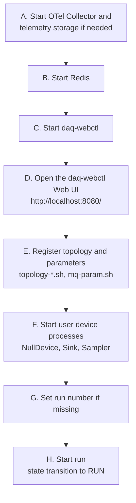
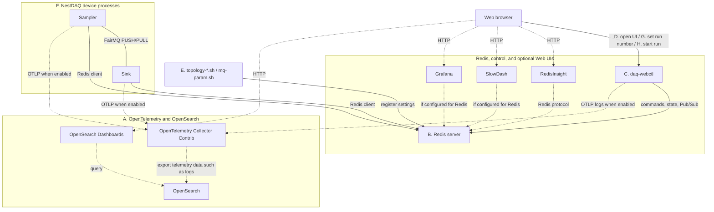
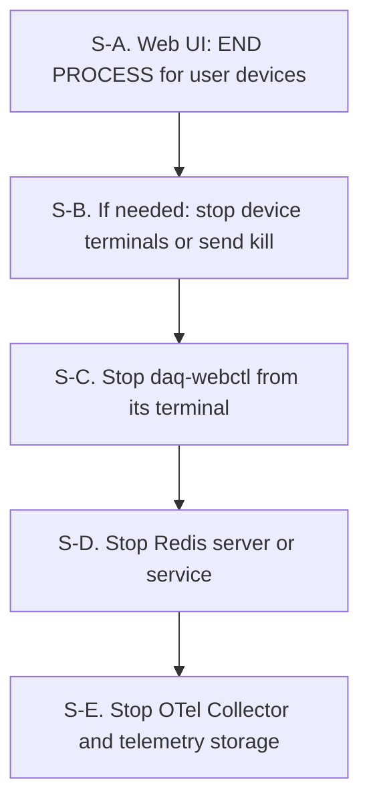

# Examples

[English](README.md) | [日本語](README.ja.md)

[Top: NestDAQ](../README.md) | [Previous: Installation](../INSTALL.md) | [Next: Scripts](../scripts/README.md)

This directory contains small NestDAQ device examples.
The CMake option `NestDAQ_BUILD_EXAMPLES` controls whether the main NestDAQ build includes them and defaults to `ON`.

## 1. Example Devices

<a id="example-devices-table-en"></a>
**Table 1: Example device executables and their purposes.**

| Executable | Purpose |
| :-- | :-- |
| `NullDevice` | Minimal FairMQ device that exercises the NestDAQ `runDevice.h` entry point and lifecycle hooks without data channels. |
| `Sampler` | Sends text messages through a FairMQ output channel and demonstrates custom command-line options. It also demonstrates OpenTelemetry spans and metrics. |
| `Sink` | Receives single-part or multipart messages through a FairMQ input channel and demonstrates channel callback setup. It also demonstrates OpenTelemetry spans and metrics. |

A **lifecycle hook** is a member function that the FairMQ state machine calls at a defined stage of a device's lifecycle.
For example, `Init()` and `InitTask()` initialize the device, `PreRun()` prepares it for a run, and `PostRun()` performs post-run work.
A device overrides only the hooks needed for its processing and resource management.
`NullDevice` logs these calls so that their order can be observed without setting up data channels.

Each executable links to `NestDAQ::NestDAQ`.
This target provides the NestDAQ `runDevice.h` integration, FairMQ/FairLogger dependencies, plugin search paths, and optional telemetry loader support.

`Sampler` and `Sink` use the NestDAQ telemetry facade to demonstrate trace spans and metrics without directly including OpenTelemetry headers.
Enable the telemetry examples with command-line options such as `--otel-metric-protocol=console` and `--otel-trace-protocol=console` when starting the device.
NestDAQ's OpenTelemetry metrics and trace instrumentation is experimental and
should not be used in production code.

## 2. Build

The main NestDAQ build builds and installs these examples by default.
To skip them, configure NestDAQ with `-DNestDAQ_BUILD_EXAMPLES=OFF`.

To build the examples separately, install NestDAQ first and then configure the examples with the NestDAQ install prefix in `CMAKE_PREFIX_PATH`.

In the command below, `-D` sets the CMake cache variables `CMAKE_PREFIX_PATH` and `CMAKE_INSTALL_PREFIX`.
The `-S` and `-B` arguments are `cmake` command-line options that select the source and build directories.

Lines beginning with `#` inside shell command examples are comments for the reader and are not executed by the shell.

```sh
# Configure an out-of-source build against the installed NestDAQ package.
cmake \
  -DCMAKE_PREFIX_PATH=<nestdaq-install-prefix> \
  -DCMAKE_INSTALL_PREFIX=<examples-install-prefix> \
  -B ./build-examples \
  -S ./examples
# Compile the configured examples in parallel.
cmake --build ./build-examples --parallel
# Install the example executables under the selected prefix.
cmake --install ./build-examples
```

The examples do not need to use the same install prefix as NestDAQ.
However, the dynamic linker must be able to find NestDAQ, FairMQ, Boost, and related libraries.
The example CMake project sets an install RPATH relative to the example install prefix and uses link paths discovered through `NestDAQ::NestDAQ`.

## 3. Running

### 3.1. Local Run Sequence

The commands below assume that NestDAQ was installed under `<install-prefix>`.

<a id="local-run-sequence-figure-en"></a>


**Figure 1: Typical startup sequence for a local NestDAQ run.**

[Figure 1](#local-run-sequence-figure-en) shows a typical local run sequence, not a strict dependency graph.
In this section, telemetry storage means a service such as OpenSearch that
stores telemetry data forwarded by the Collector.
Start the OpenTelemetry Collector and required telemetry storage first when
logs, metrics, or traces should be exported and suitable services are not
already running.
If telemetry is disabled, console-only telemetry is used, or an existing Collector is available, treat step A as complete.

Redis is required.
Start it with the deployment method used by the local environment, such as a local `redis-server`, a containerized Redis/[Redis Stack](../INSTALL.md#external-runtime-components) instance, or a host package managed by systemd.
Steps E and F may be reordered as long as both occur after Redis is available and before step H.

The browser can be opened as soon as `daq-webctl` starts, but devices may not appear until the topology and parameter settings are registered and the user devices are running.
Steps G and H are operations in the `daq-webctl` Web UI.
Run-start commands require the target devices to be running, so perform step H last.
`daq-webctl` and the user devices use Redis and can export OpenTelemetry logs to the Collector.

#### 3.1.1. Step A: Start an OpenTelemetry Collector

Use the Collector in the local Compose setup, a host-installed
`otelcol-contrib` service, or another Collector reachable from the NestDAQ
processes. The Collector receives OpenTelemetry Protocol (OTLP) data from the
example devices and forwards it to the configured log, metric, or trace storage.

##### 3.1.1.1. Compose

The local validation example below uses the OpenSearch Compose stack. It stores
logs and traces in OpenSearch and makes them available in OpenSearch Dashboards.

```sh
# Copy the installed Compose files into the current directory.
cp -a <install-prefix>/share/otel-collector-compose ./otel-collector-compose
# Enter the OpenSearch Compose directory.
cd ./otel-collector-compose/opensearch
# Start the Collector, OpenSearch, OpenSearch Dashboards, and setup service.
docker compose -f compose-opensearch.yaml up
```

For Podman, use the same file with `podman compose`. See
[`share/otel-collector-compose/opensearch/README.md`](../share/otel-collector-compose/opensearch/README.md)
for ports, rootless Podman notes, and dashboard setup details. The default OTLP
gRPC endpoint for host processes is `localhost:4317`. A process in the same
Compose network uses the Collector service name, such as `otel-collector:4317`.

The `opensearch-dashboards-setup` service runs automatically as part of
`docker compose up` or `podman compose up`. It creates the initial logs and
traces Data Views. Open `http://localhost:5601/app/discover` in OpenSearch
Dashboards to inspect exported logs and traces.

##### 3.1.1.2. Host Package

If `otelcol-contrib` was installed with the host package manager, edit the
Collector configuration and start the service with `systemd`; see
[`share/installers/README.md`](../share/installers/README.md). Use the OTLP
endpoint configured for that service. A client process on the same host usually
uses `localhost:4317`.

#### 3.1.2. Step B: Start Redis

   Three NestDAQ plugins require Redis: `daq_service`, `metrics`, and
   `parameter_config`.
   The `metrics` plugin also requires RedisTimeSeries.
   See [`plugins/README.md`](../plugins/README.md) for the requirement of each plugin.
   Redis can be a locally built server, a host package managed by `systemd`, or
   a container. Use the endpoint of the Redis server started in
   this step consistently in `daq-webctl`, `start_device.sh`, and the
   topology/parameter helper scripts.
   When `daq-webctl` starts, it enables the Redis keyspace notifications
   required by `parameter_config` live reload. No additional Redis setting is
   needed in this startup sequence.

<a id="3121-start-with-a-configuration-file"></a>
##### 3.1.2.1. Start with a configuration file

   The dependency install provides two Redis configuration files under
   `<install-prefix>/etc/redis/`:

   - `redis.conf` is copied without modification from the source tree in the
     [Redis GitHub repository](https://github.com/redis/redis).
   - `redis-full.conf` includes `redis.conf` and loads each module installed by
     the dependency build using absolute paths.

   Start Redis directly with the generated configuration when its default
   settings are suitable:

   ```sh
   # Start Redis with the generated module configuration.
   <install-prefix>/bin/redis-server \
     <install-prefix>/etc/redis/redis-full.conf
   ```

   Copy the file before starting Redis when module loading or persistence must
   be changed:

   ```sh
   # Create a local configuration that can be edited.
   cp <install-prefix>/etc/redis/redis-full.conf ./redis-full.conf
   # Edit ./redis-full.conf before starting Redis when required.
   <install-prefix>/bin/redis-server ./redis-full.conf
   ```

<a id="3122-start-without-a-configuration-file"></a>
##### 3.1.2.2. Start without a configuration file

   Redis can also be started with built-in defaults while module paths are
   supplied as command-line options.
   If Redis Stack was built and installed with the external dependencies, start
   Redis with the installed modules as follows:

   ```sh
   # Start Redis 8 and load all modules installed by the default build.
   <install-prefix>/bin/redis-server \
     --loadmodule <install-prefix>/lib/redis/modules/redisbloom.so \
     --loadmodule <install-prefix>/lib/redis/modules/redisearch.so \
     --loadmodule <install-prefix>/lib/redis/modules/rejson.so \
     --loadmodule <install-prefix>/lib/redis/modules/redistimeseries.so
   ```

   Load only the modules required by your local setup. If a Redis Stack module
   was disabled at dependency build time, omit the corresponding `--loadmodule`
   line.

   If Redis 7.x server was built with standalone RedisTimeSeries by setting the
   CMake options `WITH_REDIS_STACK=OFF` and `WITH_REDIS_SERVER_7=ON`, load only
   the installed RedisTimeSeries module:

   ```sh
   # Start Redis 7 and load the standalone RedisTimeSeries module.
   <install-prefix>/bin/redis-server \
     --loadmodule <install-prefix>/lib/redis/modules/redistimeseries.so
   ```

<a id="3123-persistence-and-endpoint"></a>
##### 3.1.2.3. Persistence and endpoint

   An RDB snapshot is a point-in-time binary copy of the dataset held in Redis
   memory. Redis can use it to restore data after a restart.
   Redis writes RDB snapshots to `dump.rdb` by default. The snapshot directory
   and file name can be changed with the Redis `dir` and `dbfilename`
   configuration settings.

   The default Redis endpoint is `localhost:6379`.

<a id="3124-container-and-host-package-methods"></a>
##### 3.1.2.4. Container and host-package methods

   Redis Stack can also be run in a container. See
   [`share/redis-stack-container/README.md`](../share/redis-stack-container/README.md)
   for Docker, Podman, volume, and RedisInsight options. If you use the
   RedisInsight-enabled Redis Stack helper (`run-redis-stack.sh`), open
   RedisInsight at `http://localhost:8001`. The Redis Stack Server only helper
   (`run-redis-stack-server.sh`) does not include RedisInsight.

   If Redis Stack was installed with the host package manager, start the
   installed service with `systemd`; see
   [`share/installers/README.md`](../share/installers/README.md). Confirm the
   Redis unit name first because it can differ between packages and
   distributions.

#### 3.1.3. Step C: Start `daq-webctl`

   ```sh
   <install-prefix>/bin/daq-webctl \
     --http-uri=http://0.0.0.0:8080 \
     --redis-uri=tcp://127.0.0.1:6379 \
     --otel-log-protocol=otlp-grpc \
     --otel-log-endpoint-grpc=localhost:4317 \
     --otel-log-severity=info \
     --otel-service-name=daq-webctl
   ```

   `daq-webctl` is the server process.
   It provides an HTTP/WebSocket endpoint and acts as a Redis client that reads DAQ state and configuration and publishes commands for user devices.
   The `daq-webctl` Web UI is the browser interface served by this process, not a separate controller service.
   The browser communicates with `daq-webctl`; it does not connect directly to Redis.

   The OpenTelemetry options send `daq-webctl` logs to the local Collector
   started above. Replace `--redis-uri` and `--otel-log-endpoint-grpc` when
   Redis or the Collector are not reachable at the example host endpoints. See
   [`controller/README.md`](../controller/README.md) for `daq-webctl` options
   and Redis command behavior, and
   [`nestdaq/telemetry/README.md`](../nestdaq/telemetry/README.md) for the full
   telemetry option list.

   If `daq-webctl` runs as a container in the same OpenSearch Compose network,
   use `--otel-log-endpoint-grpc=otel-collector:4317` instead.

#### 3.1.4. Step D: Open the `daq-webctl` Web UI

   Open `http://localhost:8080/` in a browser. At this point the Web UI may not
   show user devices yet. They become available after topology and
   parameter registration and after the user device processes start.

#### 3.1.5. Step E: Register topology and parameter settings

   Before starting devices, register the topology and parameter examples in
   Redis. The topology script writes channel and link settings used by the
   `daq_service` plugin. The parameter script writes device parameters, which
   are parameters that NestDAQ device processes obtain through the
   `parameter_config` plugin.

   ```sh
   cd <install-prefix>/scripts
   ./topology-1-1.sh
   ./mq-param.sh
   ```

#### 3.1.6. Step F: Start the user devices with `start_device.sh`

   `<install-prefix>/scripts/start_device.sh` loads the NestDAQ plugins and uses
   Redis at
   `127.0.0.1:6379` by default, and exports OpenTelemetry logs to
   `localhost:4317` by OTLP gRPC by default. Set `NESTDAQ_REDIS_SERVER` and
   `NESTDAQ_OTLP_GRPC_ENDPOINT` when Redis or the Collector use different
   endpoints. Metrics and traces are disabled by default in `start_device.sh`;
   see
   [`scripts/README.md`](../scripts/README.md) to enable them or to print
   telemetry to the console.

   Options after the device name override defaults set by the device or NestDAQ
   plugins. No override is needed when the topology and parameter settings
   registered in Redis use those defaults. If the registered settings or the
   intended service grouping uses a different service name or channel name,
   pass the corresponding option, such as `--service-name` or `--in-chan-name`,
   to override the default. For repeated runs, users can create a wrapper shell
   script that invokes `start_device.sh` with those overrides, or edit
   `start_device.sh` itself to include them. Reinstalling NestDAQ may replace
   edits made directly to the installed script.
   See
   [`plugins/README.md#22-daq-service-identity-defaults`](../plugins/README.md#22-daq-service-identity-defaults)
   for the `daq_service` defaults used when `--service-name` or `--id` is
   empty.

   `NullDevice` has no data channel, but it still uses `start_device.sh` and
   Redis-backed NestDAQ plugins:

   ```sh
   <install-prefix>/scripts/start_device.sh NullDevice
   ```

   Start `Sink` and `Sampler` in separate terminals after registering the
   topology. This PUSH/PULL example does not require a specific startup order
   to retain initial messages. By default, the PUSH send waits until a PULL
   peer becomes available.

   ```sh
   <install-prefix>/scripts/start_device.sh Sink
   ```

   ```sh
   <install-prefix>/scripts/start_device.sh Sampler
   ```

#### 3.1.7. Step G: Set the run number if it is missing

   If Redis does not already contain `run_info:run_number`, enter the intended
   value and select `SET`, or select `+1`, in the `daq-webctl` Web UI before
   starting a run. The `+1` operation uses Redis `INCR`; when the key is
   missing, Redis creates it with the value `1`. The current `daq-webctl`
   implementation reports an error if the key is still missing when `RUN` is
   requested, but it does not prevent the `RUN` command from being published.
   See [`controller/README.md`](../controller/README.md#6-redis-command-interface)
   and [`plugins/README.md`](../plugins/README.md#23-redis-keys-written-or-read)
   for the Redis command interface and run information keys.

#### 3.1.8. Step H: Start the run from the `daq-webctl` Web UI

   Use the `daq-webctl` Web UI to move the selected user devices through the
   required state-machine transitions and publish `RUN` to start the run. When
   `RUN` is requested, the `daq-webctl` process copies `run_info:run_number` to
   `run_info:latest_run_number` if the source key exists, then publishes the
   run-start command sequence.
   See [`plugins/README.md`](../plugins/README.md#24-daq-command-publishsubscribe-pubsub)
   for the accepted DAQ commands and `RUN` sequencing.

#### 3.1.9. Component Connection Groups

[Figure 2](#component-connection-groups-figure-en) separates the local example into three groups.
Solid lines show the normal data and control paths.
Dashed lines show optional telemetry, inspection, and external-tool paths.
Directed arrows point from a client to a server.
An arrow shows the connection direction, not necessarily the direction in which
data is sent or received.
After a connection is established, the data direction depends on the protocol
and socket type.
The FairMQ PUSH/PULL connection has no arrow because its client and server
roles depend on the bind/connect configuration.
The letters in [Figure 2](#component-connection-groups-figure-en) correspond to steps A through H in the startup sequence above.

<a id="component-connection-groups-figure-en"></a>


**Figure 2: Connection groups and data, control, telemetry, and inspection paths in the local example.**

The browser reaches device processes through `daq-webctl`; it does not connect
directly to a device or Redis.
The FairMQ data channel connects `Sampler` directly to `Sink` and does not pass
through Redis or `daq-webctl`.

RedisInsight is available only with a Redis deployment that includes it.
SlowDash and Grafana connect to Redis when configured with a Redis data source.

### 3.2. Stop the Local Services

Use the `daq-webctl` Web UI to end the user device processes before stopping the
`daq-webctl` process and shared services.

<a id="shutdown-order-figure-en"></a>


**Figure 3: Recommended shutdown order for user devices and local services.**

[Figure 3](#shutdown-order-figure-en) shows the recommended shutdown order. If the user devices have
already exited after `END PROCESS`, skip the terminal fallback step.

S-A. Select the target user devices in the `daq-webctl` Web UI and click
   `END PROCESS`. This publishes the DAQ `END` command to the selected devices.

S-B. If a user device does not exit, stop it from the terminal where it is
   running, for example with Ctrl-C. If a separate signal is needed, prefer a
   normal termination signal first:

   ```sh
   kill -TERM <pid>
   ```

   Use `kill -KILL <pid>` only as a last resort when the process does not
   respond to normal termination.

S-C. Stop `daq-webctl`. The `END PROCESS` button does not stop `daq-webctl`
   itself; it only publishes `END` to user devices. Stop `daq-webctl` from the
   terminal where it is running, for example with Ctrl-C. From another terminal,
   send SIGTERM if needed:

   ```sh
   kill -TERM <daq-webctl-pid>
   ```

   `daq-webctl` handles SIGINT and SIGTERM for clean HTTP/WebSocket server
   shutdown.

S-D. Stop Redis. Use the stop procedure that matches how Redis was started. For
   a locally installed Redis server:

   ```sh
   <install-prefix>/bin/redis-cli shutdown
   ```

   For container-based Redis Stack, use the stop procedure in
   [`share/redis-stack-container/README.md`](../share/redis-stack-container/README.md).

   For a host package managed by `systemd`, stop the Redis service. Confirm the
   unit name first because it can differ between packages and distributions.

   ```sh
   systemctl list-unit-files 'redis*'
   sudo systemctl stop redis-stack-server
   ```

S-E. Stop the OpenTelemetry Collector and telemetry storage. Use the stop
   procedure that matches how these services were started. For the OpenSearch
   Compose example:

   ```sh
   cd ./otel-collector-compose/opensearch
   docker compose -f compose-opensearch.yaml down
   ```

   For Podman:

   ```sh
   cd ./otel-collector-compose/opensearch
   podman compose -f compose-opensearch.yaml down
   ```

   For a host-installed `otelcol-contrib` service, stop the service with
   `systemd`:

   ```sh
   sudo systemctl stop otelcol-contrib
   ```

   The Compose `down` command stops and removes the local validation containers
   and network. It does not delete the OpenSearch data directory. If you start
   the same Compose stack again with the same data directory, the previous
   OpenSearch data is reused. See the Compose configuration README for data
   directory names and explicit discard commands.

### 3.3. Example-Specific Options

The examples also accept FairMQ options, NestDAQ plugin options, and NestDAQ
telemetry options. Use `--help` on each executable for the complete option set.

<a id="example-options-table-en"></a>
**Table 2: Command-line options specific to the example devices.**

| Executable | Option | Default | Description |
| :-- | :-- | :-- | :-- |
| `Sampler` | `--out-chan-name` | `data` | Output channel name used by `Sampler`. |
| `Sampler` | `--text` | `Hello` | Text payload prefix sent in each message. |
| `Sampler` | `--max-iterations` | `0` | Maximum number of run-loop iterations. `0` means infinite. |
| `Sink` | `--in-chan-name` | `in` | Input channel name used by `Sink`. |
| `Sink` | `--multipart` | `true` | Handle incoming data as multipart messages. |

For script-based launch examples, see [`scripts/README.md`](../scripts/README.md).

## 4. Creating Your Own User Device

A NestDAQ user device is a process that produces, consumes, or transforms data.
In C++, it is implemented as a class derived from `fair::mq::Device`.

The main pieces are:

- FairMQ provides the device state machine, message channels, and the base
  `fair::mq::Device` class.
- FairLogger is the logging system used by FairMQ and by these examples
  through `LOG(info)`, `LOG(error)`, and similar macros.
- NestDAQ provides `nestdaq/runDevice.h`, Redis-backed plugins, DAQ command
  integration, plugin search paths, and optional telemetry setup.
- Redis stores registered process and service information, topology settings,
  parameter settings, and metrics used by the NestDAQ plugins. It also
  transports DAQ commands through Pub/Sub.

### 4.1. Start From the Skeleton Generator

This section shows how to generate a small project with the skeleton generator
and edit the generated code. The following command generates `MyDevice` with
the default skeleton:

```sh
# Generate a device project from the default skeleton.
<install-prefix>/scripts/generate-device-skeleton.py MyDevice \
  --output ./MyDevice
```

This creates `MyDevice.hpp`, `MyDevice.cpp`, `CMakeLists.txt`, and `README.md`.
Existing files are not overwritten unless `--force` is specified. The default
skeleton includes input, output, and Data Quality Monitoring (DQM) channels
named `in`, `out`, and `dqm`.

The following command examples generate a source-like device, a sink-like
device, and an interactively configured device:

```sh
# A source-like device that only sends data.
<install-prefix>/scripts/generate-device-skeleton.py MySource \
  --output ./MySource \
  --no-input-channel \
  --no-dqm-channel

# A sink-like device that handles received data through OnData().
<install-prefix>/scripts/generate-device-skeleton.py MySink \
  --output ./MySink \
  --processing-mode on-data \
  --no-output-channel \
  --no-dqm-channel

# Interactive mode asks for the generation choices.
<install-prefix>/scripts/generate-device-skeleton.py --interactive
```

The generator options describe what C++ code to generate. They are not the
final command-line options of the generated device. For example,
`--input-channel source-chan-name:raw` overrides the input defaults and makes
the generated C++ register a device command-line option named
`source-chan-name` with default value `raw`. Use the corresponding
`--no-*-channel` option when the generated device does not need one of the
default channels. After generation, you can delete all related option, member,
initialization, polling, and processing code.

See [`scripts/README.md#4-device-skeleton-generation`](../scripts/README.md#4-device-skeleton-generation)
for all generator options.

### 4.2. C++ Device Structure

A minimal NestDAQ device has three C++ entry points around a
`fair::mq::Device` subclass. The following source shows these entry points:

```cpp
#include <memory>
#include <string>

#include <nestdaq/runDevice.h>

#include "MyDevice.hpp"

namespace bpo = boost::program_options;

auto addCustomOptions(bpo::options_description& options) -> void
{
    options.add_options()
        ("in-chan-name", bpo::value<std::string>()->default_value("in"),
         "Input channel name")
        ("max-iterations,n", bpo::value<std::string>()->default_value("0"),
         "Maximum number of processing iterations");
}

auto getDevice(const fair::mq::ProgOptions& /*config*/) -> std::unique_ptr<fair::mq::Device>
{
    return std::make_unique<nestdaq::MyDevice>();
}
```

`addCustomOptions()` adds command-line options.
`getDevice()` creates the device object.
`nestdaq/runDevice.h` supplies the NestDAQ-aware main program wrapper, so the generated source does not need to define `main()`.

`addCustomOptions()` uses Boost.Program_options syntax. `options.add_options()`
returns an object that accepts option descriptions by chaining calls. The
following example registers multiple options:

```cpp
options.add_options()
    ("option-1", bpo::value<std::string>()->default_value("value1"),
     "Help text for option 1")
    ("option-2,o", bpo::value<std::string>()->default_value("value2"),
     "Help text for option 2")
    ("option-N", bpo::value<std::string>()->default_value("valueN"),
     "Help text for option N");
```

Chain the option descriptions by writing each `(...)` immediately after the previous one.
Write the semicolon once, after the final option description.

Each option description has three parts:

- The first argument is the option name string. `"option-2,o"` defines the
  long option `--option-2` and the short option `-o`. Without the comma, for
  example `"option-1"`, only the long option `--option-1` is defined.
- The second argument describes the stored value and default.
  `ParameterConfigPlugin` applies user-defined scalar parameters received
  through Redis as string properties. To keep the property type consistent,
  the current NestDAQ examples and skeleton code use
  `bpo::value<std::string>()` even for numeric settings, then convert the
  string inside the device class.
- The third argument is the help text shown by `--help`.

The following class declaration derives `MyDevice` from `fair::mq::Device`:

```cpp
namespace nestdaq {

class MyDevice : public fair::mq::Device
{
private:
    auto InitTask() -> void override;
    auto ConditionalRun() -> bool override;
    auto PostRun() -> void override;

    std::string fInputChannelName{"in"};
    std::size_t fMaxIterations{0};
    std::size_t fIterations{0};
};

} // namespace nestdaq
```

Override the appropriate lifecycle function for each kind of work.
`OnData()` is a callback-registration API rather than a lifecycle override and
is normally called from `InitTask()`.

<a id="lifecycle-functions-table-en"></a>
**Table 3: FairMQ lifecycle functions and APIs used by example devices.**

| Function or API | When to use it |
| :-- | :-- |
| `InitTask()` | Initialize the state required for the task. Read command-line options from `fConfig` and convert strings to typed members as needed. Register callbacks when using `OnData()`, and create telemetry instruments when required. |
| `PreRun()` | Prepare resources immediately before the device enters RUNNING. |
| `OnData()` | Register input callbacks in `InitTask()` when processing should be driven by incoming FairMQ messages. FairMQ receives the message and passes it to the callback. |
| `ConditionalRun()` | Default choice for simple active processing loops. Return `true` to continue and `false` to leave RUNNING. |
| `Run()` | Use only when the device owns the full run loop. Do not normally combine it with meaningful `ConditionalRun()` work. |
| `PostRun()` | Flush, drain, or release run-time resources after RUNNING ends. |

### 4.3. Command-Line Options and Type Conversion

FairMQ stores program options in `fair::mq::ProgOptions`.
The property collection is defined as `std::map<std::string, boost::any>`, but user device code does not access this map directly.
`fair::mq::Device` declares `fConfig` as a protected pointer member.
A derived user device reads an individual option through this member with calls such as `fConfig->GetProperty<T>(name)`.

In current NestDAQ examples and skeleton code, custom options are normally
registered as `std::string`, even when the logical value is numeric. The
following `InitTask()` implementation converts a numeric option in the device
class:

```cpp
auto MyDevice::InitTask() -> void
{
    fInputChannelName = fConfig->GetProperty<std::string>("in-chan-name");

    const auto maxIterations = fConfig->GetProperty<std::string>("max-iterations");
    fMaxIterations = std::stoull(maxIterations);
}
```

Whether a value is set from the command line or Redis, the device class
receives the same string property and can use the same conversion logic.
The device-class developer is responsible for converting and validating
user-defined numeric options. NestDAQ does not automatically validate the
numeric syntax or accepted range of custom string options. Perform the
conversion during initialization, normally in `InitTask()`. Either allow the
conversion exception to propagate and fail initialization, or catch it, log
the option name and invalid value, and rethrow it. The skeleton generator emits
conversion code only for the numeric options that it generates.

### 4.4. Choosing OnData(), ConditionalRun(), or Run()

FairMQ calls the user hooks from its state-machine wrappers. The following
pseudo-code summarizes the relevant part of FairMQ's `Device.cxx`:

```cpp
auto Device::InitTaskWrapper() -> void
{
    InitTask();
}

auto Device::RunWrapper() -> void
{
    PreRun();

    // OnData(...) registration in InitTask() sets fDataCallbacks.
    // When callbacks are registered, this path has priority over
    // ConditionalRun() and Run().
    if (fDataCallbacks) {
        if (fInputChannelKeys.size() == 1 && GetChannels().at(fInputChannelKeys.at(0)).size() == 1) {
            HandleSingleChannelInput();
        } else {
            HandleMultipleChannelInput();
        }
    } else {
        tools::RateLimiter rateLimiter(fRate);

        // This path runs only when no OnData(...) callbacks were registered.
        // NewStatePending() becomes true when a state transition command is pending.
        while (!NewStatePending() && ConditionalRun()) {
            if (fRate > 0.001) {
                rateLimiter.maybe_sleep();
            }
        }

        // Run() is called after the ConditionalRun() loop exits.
        Run();
    }

    if (!NewStatePending()) {
        ChangeStateOrThrow(Transition::Stop);
    }

    PostRun();
}
```

Use one of `OnData()`, `ConditionalRun()`, or `Run()` as the main processing
style. One device does not need to implement all three.

#### 4.4.1. OnData()

Use `OnData()` for a receiver whose work should happen only when input data
arrives. Register the callback in `InitTask()`. This is the only style where
FairMQ's input-handling path performs `Receive()` and passes the received
single-part message or multipart message to the callback. Write the operation
on the received message in the callback; do not call `Receive()` again.

An `OnData()` callback takes priority over `ConditionalRun()` and `Run()`.
When a callback is registered, FairMQ uses the callback path and does not enter
the `ConditionalRun()` / `Run()` path. The FairMQ input-handling path checks
`NewStatePending()`, but the callback must return control instead of blocking
indefinitely so that the device can respond to state transition commands.

The following callback-based sink processes each message passed by FairMQ:

```cpp
auto MySink::InitTask() -> void
{
    fInputChannelName = fConfig->GetProperty<std::string>("in-chan-name");
    OnData(fInputChannelName, &MySink::HandleData);
}

auto MySink::HandleData(fair::mq::MessagePtr& msg, int index) -> bool
{
    LOG(info) << "received " << msg->GetSize() << " bytes on subchannel " << index;
    return true;
}
```

#### 4.4.2. ConditionalRun()

Use `ConditionalRun()` for a source device, polling receiver, or simple
processor. This is the easiest style to debug. FairMQ calls it from a loop that
checks `NewStatePending()` before each iteration. A pending state transition
such as `STOP` or `END` therefore stops the loop before the next call.

The return value controls the loop; it is not a success or failure status.
Return `true` to request another iteration. Before the next call, FairMQ checks
`NewStatePending()`. Return `false` to leave the `ConditionalRun()` loop.
FairMQ then calls `Run()`. If the device does not override `Run()`, its default
implementation returns immediately, and FairMQ transitions from RUNNING to
READY when no other state transition is pending.

`ConditionalRun()` does not receive messages automatically. When it consumes
input, the device-class developer must implement `Receive()`, polling, and
timeout handling. The implementation must not wait indefinitely inside one
call and must return control so that the FairMQ loop can check
`NewStatePending()`.

The following loop-based source sends one message per `ConditionalRun()` call:

```cpp
auto MySource::ConditionalRun() -> bool
{
    auto msg = NewSimpleMessage("payload");
    if (Send(msg, fOutputChannelName) < 0) {
        LOG(error) << "failed to send";
    }

    ++fIterations;
    return fMaxIterations == 0 || fIterations < fMaxIterations;
}
```

In this example, `fMaxIterations == 0` keeps returning `true` until a state
transition is requested. A positive limit makes the function return `false`
after the configured number of iterations.

#### 4.4.3. Run()

Use `Run()` when the device needs a custom loop that does not fit the
`ConditionalRun()` model. When no `OnData()` callback is registered, FairMQ
calls `Run()` from the same RUNNING transition after the `ConditionalRun()`
loop exits.

The device-class developer must implement any required `Receive()`, polling,
and timeout handling in `Run()`. The developer must also check
`NewStatePending()` in each custom loop, retry, or wait. When a state transition
command is pending, the implementation must exit the loop and return control
from `Run()`.

### 4.5. CMake Project

The generated `CMakeLists.txt` is intentionally small. The following CMake file
finds NestDAQ and links a standalone device to `NestDAQ::NestDAQ`:

```cmake
cmake_minimum_required(VERSION 3.22)

project(MyDevice LANGUAGES CXX)

include(GNUInstallDirs)

set(CMAKE_CXX_STANDARD_REQUIRED ON)
set(CMAKE_CXX_STANDARD 17)
set(CMAKE_CXX_EXTENSIONS OFF)

find_package(NestDAQ REQUIRED CONFIG)

add_executable(MyDevice
  MyDevice.cpp
)

target_link_libraries(MyDevice PUBLIC
  NestDAQ::NestDAQ
)

install(TARGETS MyDevice
  RUNTIME DESTINATION ${CMAKE_INSTALL_BINDIR}
)
```

`find_package(NestDAQ REQUIRED CONFIG)` locates the installed NestDAQ CMake
package. `NestDAQ::NestDAQ` carries the include directories, link libraries,
and link and library-search settings needed to execute a device with NestDAQ,
FairMQ, FairLogger, and related dependencies.

The following commands configure, build, and install the generated project out
of source:

```sh
# Configure the generated device as an out-of-source build.
cmake -S ./MyDevice -B ./build-MyDevice \
  -DCMAKE_PREFIX_PATH=<nestdaq-install-prefix> \
  -DCMAKE_INSTALL_PREFIX=<device-install-prefix>

# Compile the configured device in parallel.
cmake --build ./build-MyDevice --parallel
# Install the device executable under the selected prefix.
cmake --install ./build-MyDevice
```

`CMAKE_PREFIX_PATH` and `CMAKE_INSTALL_PREFIX` are CMake cache variables.
`CMAKE_PREFIX_PATH` must point to the NestDAQ install prefix so CMake can find
`NestDAQConfig.cmake`. `CMAKE_INSTALL_PREFIX` selects where the new device is
installed and may use the NestDAQ prefix or a separate prefix.
