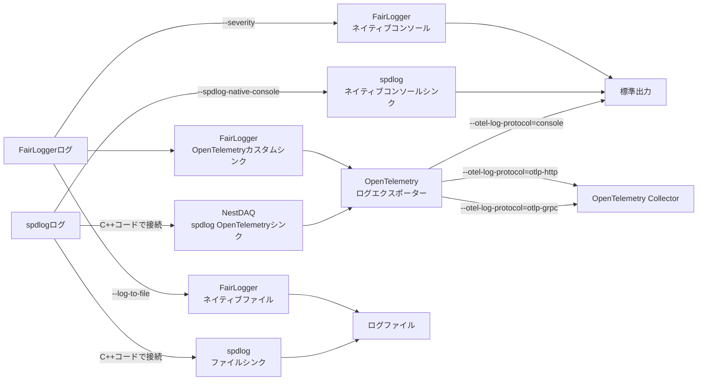

# テレメトリー

[English](README.md) | [日本語](README.ja.md)

[トップ: NestDAQ](../../README.ja.md) | [前へ: ウェブコントローラー用ブラウザーファイル](../../share/controller/README.ja.md) | [次へ: Redisコンテナ](../../share/redis-stack-container/README.ja.md)

NestDAQテレメトリーは、FairMQベースのデバイス向け、およびコントローラープロセスである`daq-webctl`向けに、必要に応じて有効にできるOpenTelemetry統合です。
アプリケーションの実行ファイルはビルド時に`opentelemetry-cpp`へリンクしません。
代わりに、NestDAQはOpenTelemetry実装共有ライブラリ`libnestdaq_otel.so`を`dlopen()`で動的に読み込みます。
このライブラリはFairMQプラグインではありません。FairMQの`-P`で指定するプラグイン一覧には含めず、`-S`で指定するプラグイン検索パスも使用しません。
NestDAQは、`--otel-library`で指定したパスまたはsonameを`dlopen()`へ直接渡します。

この実装共有ライブラリは[表1](#table-1-telemetry-signals-ja)に示す3種類のOpenTelemetryシグナルをエクスポートできます。
[表1](#table-1-telemetry-signals-ja)の既定値の列は、対応するプロトコルオプションまたは環境変数で設定を変更しなかった場合のエクスポーター選択を示します。

<a id="table-1-telemetry-signals-ja"></a>
**表1：OpenTelemetryシグナルと既定値。**

| シグナル | 既定値 | NestDAQ内のソース |
| --- | --- | --- |
| ログ | `console`エクスポーター | プロセス全体のFairLoggerカスタムシンク、およびロガーへ明示的に接続したNestDAQ spdlogシンク |
| メトリクス | 無効 | プロセスのCPU時間/使用率、メモリー使用量、FairMQチャネルのスループット、FairMQ状態の自動計装、およびユーザーカウンター/ヒストグラム/ゲージAPI |
| トレース | 無効 | `Telemetry::startSpan()`とRAII `TelemetrySpan`でユーザーコードが明示的に作成するスパン。フレームワークによる自動生成はありません |

> **注意:** **NestDAQのOpenTelemetryメトリクスおよびトレース計装は実験的機能です。**
> 本番コードでは使用しないでください。spdlogログシンクも実験的機能であり、
> 詳細は後述します。

`libnestdaq_otel.so`は、CMake構成時に`opentelemetry-cpp`が見つかった場合にのみビルドおよびインストールされます。

<a id="1-telemetry-plugin-loading-model"></a>
<a id="1-opentelemetry-shared-library-loading-model"></a>
## 1. OpenTelemetry共有ライブラリの読み込みモデル

NestDAQは、OpenTelemetry実装共有ライブラリ内にプロセス全体で共有するOpenTelemetryプロバイダーを導入します。
ログの取得方法は、ロギングライブラリーによって異なります。

- FairLogger：プロセス全体で共有するカスタムシンクがログを取得します。
- spdlog：NestDAQ spdlogシンクを明示的に接続したロガーだけがログをエクスポートします。

メトリクスとトレースは、OpenTelemetry C++ヘッダーを直接公開しないNestDAQの薄いラッパーAPIを通じて記録されます。

動的に読み込まれるOpenTelemetry実装共有ライブラリは、公開C ABIを`OpenTelemetryInitializer.cxx`で定義します。
内部実装はログ、メトリクス、トレース、共通テレメトリーヘルパーというシグナル領域別に構成されています。
アプリケーションは内部実装ファイルへ依存せず、`nestdaq::telemetry`名前空間の`TelemetryLibrary`、`Telemetry`、`Counter`、`Histogram`、`Gauge`、`TelemetrySpan`、`getTelemetry()`を使用してください。

ログ、メトリクス、トレースの各シグナルでは、対応するコマンドラインオプションまたは環境変数にプロトコル一覧をコンマ区切りで指定します。
オプション名と環境変数名は、第6節「コマンドラインオプション」を参照してください。
対応プロトコルは`console`、`otlp-http`、`otlp-grpc`です。
OTLPはOpenTelemetry Protocol、gRPCはGoogle remote procedure callの略です。
この実装共有ライブラリは別名の`http`、`otlp_http`、`grpc`、`otlp_grpc`も受け付けます。
空のプロトコルはシグナルを無効にします。

### 1.1. ログの出力先と切り替え方法

FairLoggerとspdlogのネイティブ出力、およびOpenTelemetryログエクスポーターでは、出力先ごとに異なるオプションを使用します。

[図1](#figure-1-log-data-flow-ja)の矢印は、ログデータが流れる方向を示します。



<a id="figure-1-log-data-flow-ja"></a>
**図1：ネイティブ出力とOpenTelemetry出力を通るログデータの流れ。**

[表2](#table-2-log-output-paths-ja)は、[図1](#figure-1-log-data-flow-ja)の各経路に対する制御方法と出力先を示します。

<a id="table-2-log-output-paths-ja"></a>
**表2：ログ出力経路と制御。**

| ログ経路 | 対象 | 出力先 | 切り替え方法 | 既定 |
| --- | --- | --- | --- | --- |
| FairLoggerネイティブコンソール | FairLoggerログ | 標準出力 | `--severity=<重大度>`。`nolog`は`fatal`以外を抑止 | `info`相当で有効 |
| FairLoggerネイティブファイル | FairLoggerログ | `PREFIX_YYYY-MM-DD_HH_MM_SS.log` | `--log-to-file=PREFIX`で有効化し、`--file-severity`で最低重大度を指定 | 無効 |
| spdlogネイティブコンソール | `createSpdlogLogger()`で作成したロガー | 標準出力 | `--spdlog-native-console=true`または`false`。書式は`--spdlog-console-pattern`で指定 | 有効 |
| spdlogネイティブファイル | ファイルシンクを接続したspdlogロガー | アプリケーションが指定したファイル | spdlogのファイルシンクをC++コードで接続。NestDAQのコマンドラインオプションはありません | 未接続 |
| OpenTelemetry `console`エクスポーター | FairLoggerカスタムシンクと、NestDAQ spdlogシンクを接続したロガー | 構造化したログを標準出力へ出力 | `--otel-log-protocol=console` | 既定で選択。実装共有ライブラリの初期化成功後に有効 |
| OpenTelemetry OTLP HTTPエクスポーター | 同上 | `--otel-log-endpoint-http`で指定したCollector | `--otel-log-protocol=otlp-http` | 未選択 |
| OpenTelemetry OTLP gRPCエクスポーター | 同上 | `--otel-log-endpoint-grpc`で指定したCollector | `--otel-log-protocol=otlp-grpc` | 未選択 |
| OpenTelemetryログエクスポートなし | 同上 | 出力なし | `--otel-log-protocol=` | 未選択 |

`--otel-log-protocol`には`console,otlp-grpc`のように複数の出力先を指定できます。
FairLoggerで`--log-to-file`を起動時に指定すると、FairLoggerのネイティブコンソール出力は`fatal`を除いて抑止されます。
`--severity=nolog`もFairLoggerのネイティブコンソール出力を`fatal`以外について抑止しますが、FairLoggerカスタムシンクからOpenTelemetryへのエクスポートは停止しません。
同様に、`--spdlog-native-console`はspdlogのネイティブコンソール出力だけを切り替えます。
ネイティブコンソールとOpenTelemetryの`console`エクスポーターを同時に有効にすると、同じログが異なる書式で標準出力へ2回出力される場合があります。
NestDAQテレメトリーとspdlogのオプション、および対応する環境変数は、第6節「コマンドラインオプション」を参照してください。

<a id="2-resource-attributes"></a>
## 2. リソース属性

ログ、メトリクス、トレースは1つのOpenTelemetryリソースを共有します。
NestDAQは値を利用できる場合に、[表3](#table-3-resource-attributes-ja)のリソース属性を設定します。
`service.*`と`host.*`はOpenTelemetryのセマンティック規約属性です。
以下ではOpenTelemetryの一般的な略称として`OTel`を使用します。
`nestdaq.*`と`fairmq.*`はNestDAQ固有の属性です。

<a id="table-3-resource-attributes-ja"></a>
**表3：NestDAQリソース属性。**

| 属性 | 由来 | 値 |
| --- | --- | --- |
| `service.name` | OTelセマンティック規約 | 設定されたテレメトリーサービス名。未設定時は`nestdaq`。 |
| `service.version` | OTelセマンティック規約 | `NESTDAQ_VERSION`。 |
| `service.namespace` | OTelセマンティック規約 | 設定されたテレメトリーサービス名前空間。 |
| `service.instance.id` | OTelセマンティック規約 | 設定されたテレメトリーサービスインスタンスID。 |
| `host.name` | OTelセマンティック規約 | テレメトリーオプションの解析時に検出したホスト名。 |
| `nestdaq.instance.id` | NestDAQカスタム | 判明後のFairMQデバイスID。 |
| `nestdaq.instance.id.status` | NestDAQカスタム | FairMQデバイスID判明前は`unresolved`、判明後は`resolved`。 |
| `fairmq.id` | NestDAQ/FairMQカスタム | FairMQデバイスID。 |
| `fairmq.device` | NestDAQ/FairMQカスタム | FairMQデバイス名。 |
| `fairmq.session` | NestDAQ/FairMQカスタム | FairMQセッション。 |
| `fairmq.transport` | NestDAQ/FairMQカスタム | FairMQトランスポート。 |

詳細なNestDAQおよびFairMQのビルド情報とGitメタデータは、リソース属性ではなく構造化した起動ログ本文として出力されます。
OpenTelemetryソフトウェア開発キット (SDK) は、独自のリソース属性を別途追加する場合があります。
[表3](#table-3-resource-attributes-ja)は、NestDAQが明示的に設定する属性だけを示します。

<a id="3-fairlogger-log-records"></a>
## 3. FairLoggerログレコード

FairLoggerカスタムシンクは、FairLoggerの重大度 (ログレベル) が`--otel-log-severity`以上の場合、出力された各FairLoggerメッセージをOpenTelemetry LogRecordへ変換します。
[表4](#table-4-fairlogger-logrecord-fields-ja)は、この変換で生成するフィールドと属性を示します。

<a id="table-4-fairlogger-logrecord-fields-ja"></a>
**表4：FairLogger OpenTelemetry LogRecordのフィールドと属性。**

| LogRecordのフィールドまたは属性 | 由来 | ソース |
| --- | --- | --- |
| Body | OTel LogRecordフィールド | FairLoggerメッセージの本文。 |
| Timestamp | OTel LogRecordフィールド | FairLoggerの`metadata.timestamp + metadata.us`。 |
| Observed timestamp | OTel LogRecordフィールド | カスタムシンクがLogRecordを作成した時刻。 |
| SeverityNumber | OTel LogRecordフィールド | FairLoggerの重大度から対応付けたOpenTelemetryの重大度。 |
| SeverityText | OTel LogRecordフィールド | 対応付けた重大度に対するOpenTelemetry定義の文字列。 |
| `code.file.path` | OTelセマンティック規約 | FairLoggerのソースファイルメタデータ。 |
| `code.line.number` | OTelセマンティック規約 | FairLoggerのソース行メタデータ。 |
| `code.function.name` | OTelセマンティック規約 | FairLoggerの関数メタデータ。 |
| `thread.id` | OTelセマンティック規約 | LinuxのネイティブスレッドID。他のプラットフォームではハッシュ化したC++スレッドID。 |
| `fairlogger.severity.number` | NestDAQ/FairLoggerカスタム | 元のFairLogger重大度番号。 |
| `fairlogger.severity.text` | NestDAQ/FairLoggerカスタム | 元のFairLogger重大度名。 |
| `nestdaq.instance.id` | NestDAQカスタム | FairMQデバイスID判明後にテレメトリーローダー経由で設定するレコード単位のインスタンスID。 |
| `nestdaq.instance.name` | NestDAQカスタム | `-<number>`で終わるインスタンスIDから解析した接頭辞。 |
| `nestdaq.instance.index` | NestDAQカスタム | `-<number>`で終わるインスタンスIDから解析した数値接尾辞。 |
| `process.name` | NestDAQ/FairLoggerカスタム | FairLoggerのプロセス名メタデータ。OTelの`process.executable.name`リソース属性ではありません。 |

計装スコープはロガー名およびライブラリ名に`FairLogger`を使用し、ライブラリのバージョンに`FAIRLOGGER_VERSION`を使用します。

FairMQのスループットログ行は、ログ重大度フィルターを適用する前にフレームワークメトリクス用に解析されます。
そのため、元のログメッセージがエクスポート対象の重大度未満でも、スループットサンプルがフレームワークメトリクスを更新する場合があります。
メトリクスとトレースはリソースへ`nestdaq.instance.id`を含めるため、FairMQデバイスID判明後にのみ初期化されます。
ログはプロセス起動時に`nestdaq.instance.id.status=unresolved`で初期化され、IDを利用可能になると`nestdaq.instance.id.status=resolved`で再初期化されます。

<a id="4-spdlog-log-records"></a>
## 4. spdlogログレコード

spdlog OpenTelemetryシンクは実験的機能であり、まだ十分に検証されていません。

NestDAQのビルド時に`opentelemetry-cpp`とspdlogの両方を利用できる場合、`nestdaq/telemetry/SpdlogOpenTelemetrySink.h`がインストールされます。
spdlog計装はFairLogger計装から独立しています。

### 4.1. 明示的に作成するロガー

アプリケーションは、OpenTelemetryレコードをエクスポートする各spdlogロガーへ返されたシンクを接続します。

```cpp
#include <nestdaq/telemetry/SpdlogOpenTelemetrySink.h>

#include <spdlog/spdlog.h>

auto logger = spdlog::logger{
    "sampler",
    {nestdaq::telemetry::createSpdlogOpenTelemetrySink()},
};
logger.info("event accepted");
```

上の`logger`はspdlogの既定ロガーとは別のオブジェクトです。
`logger.info(...)`や`logger.warn(...)`などの通常のspdlogメンバー関数でも、`Body`、タイムスタンプ、重大度、ロガー名、ログレベル、スレッドIDを記録します。
ここでいうソース位置メタデータは、ログを呼び出したファイルのパス、行番号、関数名です。
OTel spdlogシンクは、これらを`code.file.path`、`code.line.number`、`code.function.name`属性として記録します。
通常のspdlogメンバー関数は、このソース位置メタデータを自動では付加しません。
ソース位置を付加する場合は、標準spdlogマクロを使用します。

```cpp
SPDLOG_LOGGER_INFO(&logger, "accepted event {}", event_id);
SPDLOG_LOGGER_WARN(&logger, "queue depth is {}", depth);
```

マクロを使わず、`spdlog::source_loc`を`logger.log(...)`へ明示的に渡すこともできます。

```cpp
logger.log(
    spdlog::source_loc{__FILE__, __LINE__, SPDLOG_FUNCTION},
    spdlog::level::info,
    "accepted event {}",
    event_id);
```

標準spdlogマクロは、同様のソース位置を自動で構築して`logger.log(...)`へ渡します。

### 4.2. 既定ロガー

NestDAQはspdlogの既定ロガー、レジストリー、ログレベルを変更しません。
NestDAQ OpenTelemetryシンクを接続したロガーを既定ロガーにする場合は、ロガーを共有所有し、`spdlog::set_default_logger()`へ渡します。

```cpp
#include <memory>

auto default_logger = std::make_shared<spdlog::logger>(
    "sampler",
    spdlog::sinks_init_list{
        nestdaq::telemetry::createSpdlogOpenTelemetrySink(),
    });
spdlog::set_default_logger(default_logger);

spdlog::info("event accepted");
```

設定後は、`spdlog::info(...)`などのフリー関数と既定ロガー用マクロがこのロガーを使用します。
`spdlog::info(...)`などのフリー関数でも、4.1節のメンバー関数と同じメタデータを記録しますが、ソース位置メタデータは付加しません。
ソース位置メタデータを付加する場合は、既定ロガー用マクロを使用するか、4.1節と同様に既定ロガーへ`spdlog::source_loc`を明示して渡します。

```cpp
SPDLOG_INFO("accepted event {}", event_id);
SPDLOG_WARN("queue depth is {}", depth);
```

### 4.3. エクスポートするフィールドと属性

spdlogシンクは[表5](#table-5-spdlog-logrecord-fields-ja)のOpenTelemetryフィールドと属性を記録します。

<a id="table-5-spdlog-logrecord-fields-ja"></a>
**表5：spdlog OpenTelemetry LogRecordのフィールドと属性。**

| LogRecordのフィールドまたは属性 | 由来 | ソース |
| --- | --- | --- |
| Body | OTel LogRecordフィールド | spdlogメッセージのペイロード。 |
| Timestamp | OTel LogRecordフィールド | spdlogメッセージのタイムスタンプ。 |
| Observed timestamp | OTel LogRecordフィールド | シンクがLogRecordを作成した時刻。 |
| SeverityNumber | OTel LogRecordフィールド | spdlogレベルから対応付けたOpenTelemetryの重大度。 |
| SeverityText | OTel LogRecordフィールド | 対応付けた重大度に対するOpenTelemetry定義の文字列。 |
| `code.file.path` | OTelセマンティック規約 | 存在する場合のspdlogソースファイルメタデータ。 |
| `code.line.number` | OTelセマンティック規約 | 存在する場合のspdlogソース行メタデータ。 |
| `code.function.name` | OTelセマンティック規約 | 存在する場合のspdlog関数メタデータ。 |
| `thread.id` | OTelセマンティック規約 | spdlogスレッドIDのメタデータ。 |
| `spdlog.logger.name` | NestDAQ/spdlogカスタム | spdlogロガー名。 |
| `spdlog.level` | NestDAQ/spdlogカスタム | 元のspdlogレベル文字列。 |

<a id="5-log-severity-mapping"></a>
## 5. ログ重大度 (ログレベル) の対応

OpenTelemetryは正規化したログレベルをLogRecordの`SeverityNumber`および`SeverityText`フィールドへ保存します。
元のロギングライブラリレベルは、FairLoggerレコードでは`fairlogger.severity.*`、spdlogレコードでは`spdlog.level`として別に保持されます。
ロギングライブラリの列挙型整数はOpenTelemetryの`SeverityNumber`値ではありません。
正規化した重大度の問い合わせにはOpenTelemetryフィールドを使用してください。

`--otel-log-severity`はFairLoggerシンクのフィルターです。
OpenTelemetryログへエクスポートするFairLoggerの最低重大度を制御します。
有効化したspdlogシンクから出力されるレコードはフィルター処理しません。
spdlogのフィルター処理は、引き続きspdlogロガーおよびシンクレベルで制御します。

<a id="51-fairlogger-severity-mapping"></a>
### 5.1. FairLogger重大度の対応

[表6](#table-6-fairlogger-severity-mapping-ja)は、FairLoggerレベルとOpenTelemetry重大度値の対応を示します。

<a id="table-6-fairlogger-severity-mapping-ja"></a>
**表6：FairLogger重大度の対応。**

| FairLoggerレベル | `fair::Severity`整数 | OTel SeverityNumber | OTel SeverityText | 元のレベル属性 |
| --- | --- | --- | --- | --- |
| `nolog` | `0` | `0` | invalid / unspecified | `fairlogger.severity.*` |
| `trace` | `1` | `1` | `TRACE` | `fairlogger.severity.*` |
| `debug4` | `2` | `2` | `TRACE2` | `fairlogger.severity.*` |
| `debug3` | `3` | `2` | `TRACE2` | `fairlogger.severity.*` |
| `debug2` | `4` | `3` | `TRACE3` | `fairlogger.severity.*` |
| `debug1` | `5` | `4` | `TRACE4` | `fairlogger.severity.*` |
| `debug` | `6` | `5` | `DEBUG` | `fairlogger.severity.*` |
| `detail` | `7` | `6` | `DEBUG2` | `fairlogger.severity.*` |
| `info` | `8` | `9` | `INFO` | `fairlogger.severity.*` |
| `state` | `9` | `10` | `INFO2` | `fairlogger.severity.*` |
| `warn` | `10` | `13` | `WARN` | `fairlogger.severity.*` |
| `important` | `11` | `14` | `WARN2` | `fairlogger.severity.*` |
| `alarm` | `12` | `15` | `WARN3` | `fairlogger.severity.*` |
| `error` | `13` | `17` | `ERROR` | `fairlogger.severity.*` |
| `critical` | `14` | `18` | `ERROR2` | `fairlogger.severity.*` |
| `fatal` | `15` | `21` | `FATAL` | `fairlogger.severity.*` |

`warning`は`warn`の`--otel-log-severity`別名として使用できますが、FairLoggerレコード自体はFairLoggerレベル名を使用します。
このaliasの`fair::Severity`値は`warn`と同じ`10`です。

<a id="52-spdlog-severity-mapping"></a>
### 5.2. spdlog重大度の対応

[表7](#table-7-spdlog-severity-mapping-ja)は、spdlogレベルとOpenTelemetry重大度値の対応を示します。

<a id="table-7-spdlog-severity-mapping-ja"></a>
**表7：spdlog重大度の対応。**

| spdlogレベル | `spdlog::level::level_enum`整数 | OTel SeverityNumber | OTel SeverityText | 元のレベル属性 |
| --- | --- | --- | --- | --- |
| `trace` | `0` | `1` | `TRACE` | `spdlog.level` |
| `debug` | `1` | `5` | `DEBUG` | `spdlog.level` |
| `info` | `2` | `9` | `INFO` | `spdlog.level` |
| `warn` | `3` | `13` | `WARN` | `spdlog.level` |
| `err` | `4` | `17` | `ERROR` | `spdlog.level` |
| `critical` | `5` | `21` | `FATAL` | `spdlog.level` |
| `off` | `6` | `0` | invalid / unspecified | `spdlog.level` |
| `n_levels` | `7` | `0` | invalid / unspecified | `spdlog.level` |

<a id="6-command-line-options"></a>
## 6. コマンドラインオプション

[表8](#table-8-command-line-options-ja)は、コマンドラインオプションと対応する環境変数を示します。

<a id="table-8-command-line-options-ja"></a>
**表8：テレメトリーのコマンドラインオプション。**

| オプション | 環境変数 | デフォルト | 意味 |
| --- | --- | --- | --- |
| `--otel-library` | `NESTDAQ_OTEL_LIBRARY` | `libnestdaq_otel.so` | `dlopen()`で読み込む共有ライブラリのパスまたはsoname。 |
| `--otel-log-protocol` | `NESTDAQ_OTEL_LOG_PROTOCOL` | `console` | コンマ区切りのログエクスポーター。空ならログを無効化。 |
| `--otel-metric-protocol` | `NESTDAQ_OTEL_METRIC_PROTOCOL` | 空文字列（`""`） | コンマ区切りのメトリクスエクスポーター。空文字列ならメトリクスを無効化。 |
| `--otel-trace-protocol` | `NESTDAQ_OTEL_TRACE_PROTOCOL` | 空文字列（`""`） | コンマ区切りのトレースエクスポーター。空文字列ならトレースを無効化。 |
| `--otel-log-endpoint-http` | `NESTDAQ_OTEL_LOG_ENDPOINT_HTTP` | `http://localhost:4318/v1/logs` | OTLP HTTPログエンドポイント。 |
| `--otel-log-endpoint-grpc` | `NESTDAQ_OTEL_LOG_ENDPOINT_GRPC` | `localhost:4317` | OTLP gRPCログエンドポイント。 |
| `--otel-metric-endpoint-http` | `NESTDAQ_OTEL_METRIC_ENDPOINT_HTTP` | `http://localhost:4318/v1/metrics` | OTLP HTTPメトリクスエンドポイント。 |
| `--otel-metric-endpoint-grpc` | `NESTDAQ_OTEL_METRIC_ENDPOINT_GRPC` | `localhost:4317` | OTLP gRPCメトリクスエンドポイント。 |
| `--otel-trace-endpoint-http` | `NESTDAQ_OTEL_TRACE_ENDPOINT_HTTP` | `http://localhost:4318/v1/traces` | OTLP HTTPトレースエンドポイント。 |
| `--otel-trace-endpoint-grpc` | `NESTDAQ_OTEL_TRACE_ENDPOINT_GRPC` | `localhost:4317` | OTLP gRPCトレースエンドポイント。 |
| `--otel-log-headers` | `NESTDAQ_OTEL_LOG_HEADERS` | 空文字列（`""`） | コンマ区切りの`key=value`ログエクスポーターヘッダー。 |
| `--otel-metric-headers` | `NESTDAQ_OTEL_METRIC_HEADERS` | 空文字列（`""`） | コンマ区切りの`key=value`メトリクスエクスポーターヘッダー。 |
| `--otel-trace-headers` | `NESTDAQ_OTEL_TRACE_HEADERS` | 空文字列（`""`） | コンマ区切りの`key=value`トレースエクスポーターヘッダー。 |
| `--otel-log-severity` | `NESTDAQ_OTEL_LOG_SEVERITY` | `info` | エクスポートするFairLoggerの最低重大度。 |
| `--otel-log-required` | `NESTDAQ_OTEL_LOG_REQUIRED` | `false` | テレメトリーを読み込めないか初期化できない場合に起動失敗とする。 |
| `--otel-timeout-ms` | — | `5000` | 強制フラッシュ、シャットダウン、エクスポーターのタイムアウト (ミリ秒)。 |
| `--spdlog-console-pattern` | `NESTDAQ_SPDLOG_CONSOLE_PATTERN` | `[%Y-%m-%d %H:%M:%S.%e] [%n] [%l] %v` | spdlogネイティブコンソールシンクのパターン。 |
| `--spdlog-native-console` | `NESTDAQ_SPDLOG_NATIVE_CONSOLE` | `true` | OTel spdlogシンクとは独立してspdlogネイティブコンソール出力を有効化。 |
| `--spdlog-async` | `NESTDAQ_SPDLOG_ASYNC` | `false` | NestDAQヘルパーロガーに`spdlog::async_logger`を使用。 |
| `--spdlog-async-queue-size` | `NESTDAQ_SPDLOG_ASYNC_QUEUE_SIZE` | `8192` | 非同期spdlogヘルパーロガーのキューへ保持できる項目数。バイト数ではありません。 |
| `--spdlog-async-thread-count` | `NESTDAQ_SPDLOG_ASYNC_THREAD_COUNT` | `1` | 非同期spdlogヘルパーロガーのワーカースレッド数。 |
| `--spdlog-async-overflow-policy` | `NESTDAQ_SPDLOG_ASYNC_OVERFLOW_POLICY` | `block` | キューのオーバーフローポリシー。各値の動作は7.7節を参照してください。 |
| `--otel-metric-export-interval-ms` | — | `1000` | 定期的なメトリクスのエクスポート間隔 (ミリ秒)。 |
| `--otel-log-http-json` | — | `true` | OTLP HTTPログでJavaScript Object Notation (JSON) コンテントタイプを使用。 |
| `--otel-metric-http-json` | — | `true` | OTLP HTTPメトリクスでJSONコンテントタイプを使用。 |
| `--otel-trace-http-json` | — | `true` | OTLP HTTPトレースでJSONコンテントタイプを使用。 |
| `--otel-service-name` | — | 呼び出し側の既定値 | `service.name`リソース属性。FairMQデバイスラッパーは`--service-name`を既定値とし、`--service-name`未設定時は実行ファイルのベース名を使用します。コレクターパイプラインがOpenSearchのインデックス名にこの値を使用する場合があるため、NestDAQはASCII大文字を小文字へ変換します。 |
| `--otel-service-namespace` | — | `nestdaq` | `service.namespace`リソース属性。 |
| `--otel-service-instance-id` | — | 生成した汎用一意識別子 (UUID) | `service.instance.id`リソース属性。FairMQデバイスラッパーは、このオプション未設定時に`--uuid`を使用し、それ以外の場合はUUIDを生成します。 |
| `--otel-fairmq-id` | — | 空文字列（`""`） | `fairmq.id`リソース属性。 |
| `--otel-fairmq-device` | — | 空文字列（`""`） | `fairmq.device`リソース属性。 |
| `--otel-fairmq-session` | — | 空文字列（`""`） | `fairmq.session`リソース属性。 |
| `--otel-fairmq-transport` | — | 空文字列（`""`） | `fairmq.transport`リソース属性。 |

`—`は対応する環境変数がないことを示します。

重大度名は`nolog`、`trace`、`debug4`、`debug3`、`debug2`、`debug1`、`debug`、`detail`、`info`、`state`、`warn`、`warning`、`important`、`alarm`、`error`、`critical`、`fatal`です。

<a id="7-examples"></a>
## 7. 使用例

### 7.1. コマンド例の共通事項

シェルコマンド例の中で`#`から始まる行は読者向けのコメントであり、シェルでは実行されません。
以下のコマンド実行例ではテレメトリー設定に焦点を当てるため、NestDAQ FairMQプラグインの読み込みと設定に必要なオプションを省略しています。

### 7.2. 既定のエクスポーター

既定の動作ではログをコンソールエクスポーターへエクスポートし、メトリクスとトレースは無効です。

```sh
# defaultのtelemetry exporterを使用してdeviceを起動します。
my-device
```

### 7.3. OTLP gRPCによるエクスポート

ログ、メトリクス、トレースをOTLP gRPCでCollectorへ送信します。

```sh
# deviceのlogs、metrics、tracesをOTLP gRPCでcollectorへexportします。
my-device \
  --otel-log-protocol=otlp-grpc \
  --otel-metric-protocol=otlp-grpc \
  --otel-trace-protocol=otlp-grpc \
  --otel-log-endpoint-grpc=collector:4317 \
  --otel-metric-endpoint-grpc=collector:4317 \
  --otel-trace-endpoint-grpc=collector:4317
```

### 7.4. ログエクスポートの無効化

プロトコルオプションを値なしで渡してログを明示的に無効化します。

```sh
# log exportを明示的に無効化してdeviceを起動します。
my-device --otel-log-protocol
```

### 7.5. spdlogネイティブコンソールの書式

spdlogパターンを設定し、カスタムパターンのspdlogネイティブコンソールシンクを使用します。
ネイティブコンソールシンクは既定で有効で、OTel spdlogシンクと同時に動作できます。
`--spdlog-console-pattern`は、`createSpdlogLogger()`が接続するネイティブコンソールシンクだけに適用されます。
アプリケーションが接続したファイルシンクや、OTel spdlogシンクの出力には影響しません。
OTel spdlogシンクは、パターン適用前のメッセージをLogRecordの`Body`へ保存し、タイムスタンプ、重大度、ロガー名、スレッドID、存在する場合はソース位置を個別のフィールドまたは属性として記録します。
そのため、OTelへメタデータを記録するためにspdlogパターンを設定する必要はありません。
使用できるパターンフラグの一覧は、spdlog公式Wikiの[Custom formatting](https://github.com/gabime/spdlog/wiki/3.-Custom-formatting)を参照してください。
以下の例では、`%n`がロガー名、`%l`がログレベル、`%v`がログメッセージ本文を表します。

```sh
# OTLP gRPCでlogをexportし、native console formatを変更します。
my-device \
  --otel-log-protocol=otlp-grpc \
  --spdlog-console-pattern '[%n] [%l] %v'
```

### 7.6. spdlogネイティブコンソールの無効化

OTel spdlogエクスポートを有効に保ったまま、ネイティブspdlogコンソール出力だけを無効化します。

```sh
# OTLP gRPC log exportを維持し、native console outputを無効化します。
my-device \
  --otel-log-protocol=otlp-grpc \
  --spdlog-native-console=false
```

### 7.7. spdlogヘルパーロガーの非同期化

NestDAQヘルパーロガーは既定で同期動作し、spdlogのスレッドセーフなシンクを使用します。
ロギング頻度が高く、呼び出し元スレッドからバックグラウンドワーカーへレコードを渡したい場合は非同期モードを有効にします。

```sh
# helper loggerの処理を、上限付きqueueを使用する2つのbackground workerへ移します。
my-device \
  --spdlog-async=true \
  --spdlog-async-queue-size=16384 \
  --spdlog-async-thread-count=2 \
  --spdlog-async-overflow-policy=block
```

`block`オーバーフローポリシーはログレコードの消失を防ぎますが、キュー満杯時に呼び出し元スレッドを待たせることがあります。
`overrun_oldest`はキュー内の古いレコードを破棄し、`discard_new`はキュー満杯時に新しく送信されたレコードを破棄します。
`--spdlog-async-queue-size`はキューへ保持できる項目数を指定します。
通常、1つのログレコードが1項目を使用し、フラッシュ要求も1項目を使用します。バイト単位の上限ではありません。
非同期キューサイズとワーカー数は非同期ヘルパーロガー作成時に適用されます。
後から設定を変更しても、既存ロガーは変更されません。

### 7.8. C++の属性ラッパーAPI

7.8節と7.9節は、C++コードからOpenTelemetryのメトリクスまたはトレースを記録する開発者向けです。
ログだけをOpenTelemetryへエクスポートするアプリケーションでは、この2節を読み飛ばせます。

アプリケーションがテレメトリーを初期化し、メトリクスまたはトレースを直接記録する場合は、NestDAQのC++ APIを使用します。

```cpp
auto library = nestdaq::telemetry::TelemetryLibrary{};
if (!library.Load("libnestdaq_otel.so")) {
    std::cerr << library.GetLastError() << '\n';
}

auto options = nestdaq::telemetry::TelemetryOptions{};
options.log_protocol = "console";
options.metric_protocol = "otlp-http";
options.trace_protocol = "otlp-http";

const auto config = nestdaq::telemetry::MakeConfig(options);
if (!library.InitializeWith(config)) {
    std::cerr << library.GetLastError() << '\n';
}

auto telemetry = nestdaq::telemetry::Telemetry{library};
telemetry.AddCounter("events.total", 1, "1", "Total processed events");
telemetry.RecordHistogram("event.size", 4096, "By", "Input event size");
telemetry.RecordGauge("queue.depth", 12, "{message}", "Latest queue depth");

auto events = telemetry.Counter("events.total", "1", "Total processed events");
events.Add(1, {{"channel", "data"}});

auto queueDepth = telemetry.Gauge("queue.depth", "{message}", "Latest queue depth");
queueDepth.Record(12, {{"channel", "data"}});

auto span = telemetry.StartSpan("process-event");
span.SetAttribute({
    .key = "component",
    .type = NESTDAQ_OTEL_ATTRIBUTE_STRING,
    .string_value = "sampler",
    .int_value = 0,
    .uint_value = 0,
    .double_value = 0.0,
    .bool_value = 0,
});
```

この例の`std::cerr`は標準エラー出力へ直接書き込みます。
NestDAQテレメトリーは、その出力を収集またはエクスポートしません。

アプリケーション向けに推奨する形式は、`events.Add(...)`、`queueDepth.Record(...)`、`StartSpan(..., { ... })`で使用する`Attribute`ラッパーです。
このラッパーは、NestDAQが属性をC ABI形式へ変換する間、文字列の記憶領域を有効に保ちます。
通常はサンプルでもこの形式を使用してください。

### 7.9. 低水準のC ABI属性

あらかじめ構築したC ABI属性を直接渡すこともできます。
一時的な`Attribute`ラッパー変換を避けられるため、ホットパスや、すでに`nestdaq_otel_attribute`バッファーを所有するコードで有用です。

```cpp
std::array<nestdaq_otel_attribute, 2> attributes{{
    {
        .key = "channel",
        .type = NESTDAQ_OTEL_ATTRIBUTE_STRING,
        .string_value = "data",
        .int_value = 0,
        .uint_value = 0,
        .double_value = 0.0,
        .bool_value = 0,
    },
    {
        .key = "slot",
        .type = NESTDAQ_OTEL_ATTRIBUTE_UINT64,
        .string_value = "",
        .int_value = 0,
        .uint_value = 2,
        .double_value = 0.0,
        .bool_value = 0,
    },
}};

telemetry.AddCounter(
    "events.total", 1, "1", "Total processed events", attributes.data(), attributes.size());
```

低水準の属性配列とその文字列記憶領域は呼び出し元が所有します。
NestDAQはtelemetry call中にのみarrayを読み取ります。
C++20ビルドでは、同等のオーバーロードが`std::span<const nestdaq_otel_attribute>`も受け取り、同じ低水準実装へ転送します。

<a id="8-collector-compose-setup"></a>
## 8. Collector Compose構成 (`docker compose`または`podman compose`)

OpenTelemetry Collector、OpenSearch、OpenSearch Dashboardsを使用するローカル環境については、[OpenTelemetry Collector Composeの設定](../../share/otel-collector-compose/README.ja.md)を参照してください。

<a id="9-troubleshooting"></a>
## 9. トラブルシューティング

- `--otel-library`を読み込めない場合は、`LD_LIBRARY_PATH`を確認するか、rpathを設定するか、絶対パスを指定してください。
- ライブラリを読み込めても初期化に失敗する場合は、`TelemetryLibrary::GetLastError()`を確認してください。
- 未対応のプロトコル名、不正な設定サイズ、不正な重大度値、空のメトリクス名/スパン名は実装共有ライブラリの最終エラー文字列を通じて報告されます。
- メトリクスシグナルが無効の場合、メトリクス記録APIはデータを記録またはエクスポートせず、成功を返します。
- トレースシグナルが無効の場合、スパン作成APIは記録を行わない非アクティブなスパンを返します。
