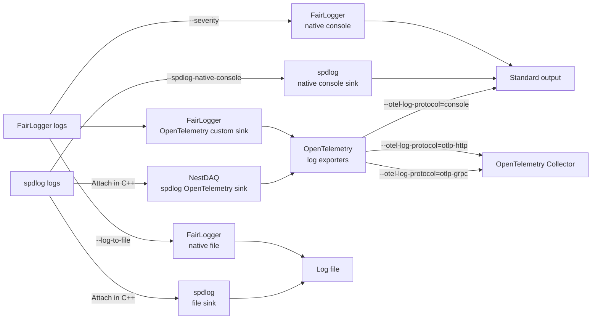

# Telemetry

[English](README.md) | [日本語](README.ja.md)

[Top: NestDAQ](../../README.md) | [Previous: Web controller browser files](../../share/controller/README.md) | [Next: Redis containers](../../share/redis-stack-container/README.md)

NestDAQ telemetry provides optional OpenTelemetry integration for FairMQ-based devices and for the `daq-webctl` controller process.
Application executables do not link `opentelemetry-cpp` at build time.
Instead, NestDAQ loads the OpenTelemetry implementation shared library `libnestdaq_otel.so` dynamically with `dlopen()`.
This library is not a FairMQ plugin: FairMQ's `-P` plugin list does not select it, and the `-S` plugin search path does not locate it.
NestDAQ instead passes the path or soname from `--otel-library` directly to `dlopen()`.

The implementation library can export the three OpenTelemetry signals listed in [Table 1](#table-1-telemetry-signals-en).
The Default column in [Table 1](#table-1-telemetry-signals-en) shows the exporter selection when neither the corresponding protocol option nor its environment variable overrides the setting.

<a id="table-1-telemetry-signals-en"></a>
**Table 1: OpenTelemetry signals and defaults.**

| Signal  | Default            | Source in NestDAQ |
| ------- | ------------------ | ----------------- |
| Logs    | `console` exporter | Process-wide FairLogger custom sink; NestDAQ spdlog sink explicitly attached to a logger |
| Metrics | disabled           | Automatic process CPU time/utilization, process memory usage, FairMQ channel-throughput, and FairMQ state metrics; user counter/histogram/gauge APIs |
| Traces  | disabled           | User spans created explicitly through `Telemetry::startSpan()` and RAII `TelemetrySpan`; no automatic framework spans |

> **Warning:** **NestDAQ's OpenTelemetry metrics and trace instrumentation is experimental.**
> It should not be used in production code. The spdlog log sink
> is also experimental, as noted separately below.

`libnestdaq_otel.so` is built and installed only when CMake finds `opentelemetry-cpp` during configuration.

<a id="1-runtime-model"></a>
## 1. OpenTelemetry Shared-Library Loading Model

NestDAQ installs process-wide OpenTelemetry providers inside the implementation library.
Log capture differs by logging library:

- FairLogger: A process-wide custom sink captures logs.
- spdlog: Only loggers that explicitly attach the NestDAQ spdlog sink export logs.

The NestDAQ thin wrapper API records metrics and traces without exposing OpenTelemetry C++ headers.

The dynamically loaded OpenTelemetry implementation library defines the public C ABI in `OpenTelemetryInitializer.cxx`.
Internally, it organizes the implementation into logs, metrics, traces, and shared telemetry helpers.
Applications should use `TelemetryLibrary`, `Telemetry`, `Counter`, `Histogram`, `Gauge`, `TelemetrySpan`, and `getTelemetry()` from the `nestdaq::telemetry` namespace instead of depending on the internal implementation files.

For each signal, specify a comma-separated protocol list through the corresponding command-line option or environment variable.
See Section 6, "Command-Line Options," for the option and environment variable names.
The supported protocols are `console`, `otlp-http`, and `otlp-grpc`.
OTLP means OpenTelemetry Protocol, and gRPC means Google remote procedure call.
The implementation library also accepts the aliases `http`, `otlp_http`, `grpc`, and `otlp_grpc`.
An empty protocol disables the signal.

### 1.1. Log Output Destinations and Controls

FairLogger and spdlog native outputs and the OpenTelemetry log exporters use separate controls for each destination.

The arrows in [Figure 1](#figure-1-log-data-flow-en) show the direction of log-data flow.



<a id="figure-1-log-data-flow-en"></a>
**Figure 1: Log-data flow through native and OpenTelemetry outputs.**

[Table 2](#table-2-log-output-paths-en) identifies the controls and destinations for each path in [Figure 1](#figure-1-log-data-flow-en).

<a id="table-2-log-output-paths-en"></a>
**Table 2: Log output paths and controls.**

| Log path | Applies to | Destination | How to select it | Default |
| --- | --- | --- | --- | --- |
| FairLogger native console | FairLogger logs | Standard output | `--severity=<level>`; `nolog` suppresses records other than `fatal` | Enabled at an effective `info` level |
| FairLogger native file | FairLogger logs | `PREFIX_YYYY-MM-DD_HH_MM_SS.log` | Set `--log-to-file=PREFIX`; set the minimum severity with `--file-severity` | Disabled |
| spdlog native console | Loggers created by `createSpdlogLogger()` | Standard output | `--spdlog-native-console=true` or `false`; set the format with `--spdlog-console-pattern` | Enabled |
| spdlog native file | spdlog loggers with an attached file sink | File selected by the application | Attach a spdlog file sink in C++; NestDAQ provides no command-line option | Not attached |
| OpenTelemetry `console` exporter | FairLogger custom sink and loggers with the NestDAQ spdlog sink | Structured logs on standard output | `--otel-log-protocol=console` | Selected by default; active after successful implementation-library initialization |
| OpenTelemetry OTLP HTTP exporter | Same as above | Collector selected by `--otel-log-endpoint-http` | `--otel-log-protocol=otlp-http` | Not selected |
| OpenTelemetry OTLP gRPC exporter | Same as above | Collector selected by `--otel-log-endpoint-grpc` | `--otel-log-protocol=otlp-grpc` | Not selected |
| No OpenTelemetry log export | Same as above | No output | `--otel-log-protocol=` | Not selected |

`--otel-log-protocol` accepts multiple destinations, such as `console,otlp-grpc`.
Supplying `--log-to-file` at startup suppresses FairLogger native console records other than `fatal`.
`--severity=nolog` also suppresses non-`fatal` FairLogger native console records, but it does not stop the FairLogger custom sink from exporting to OpenTelemetry.
Similarly, `--spdlog-native-console` controls only the spdlog native console output.
Enabling both a native console and the OpenTelemetry `console` exporter can write the same log to standard output twice with different formats.
See Section 6, "Command-Line Options," for the NestDAQ telemetry and spdlog options and their corresponding environment variables.

## 2. Resource Attributes

Logs, metrics, and traces share one OpenTelemetry resource.
NestDAQ sets the resource attributes in [Table 3](#table-3-resource-attributes-en) when their values are available.
The `service.*` and `host.*` keys are OpenTelemetry semantic convention attributes.
This document uses `OTel` as the common abbreviation for OpenTelemetry.
The `nestdaq.*` and `fairmq.*` keys are NestDAQ-specific attributes.

<a id="table-3-resource-attributes-en"></a>
**Table 3: NestDAQ resource attributes.**

| Attribute | Origin | Value |
| --------- | ------ | ----- |
| `service.name` | OTel semantic convention | Configured telemetry service name, or `nestdaq` when unset. |
| `service.version` | OTel semantic convention | `NESTDAQ_VERSION`. |
| `service.namespace` | OTel semantic convention | Configured telemetry service namespace. |
| `service.instance.id` | OTel semantic convention | Configured telemetry service instance id. |
| `host.name` | OTel semantic convention | Host name detected at telemetry option parsing time. |
| `nestdaq.instance.id` | NestDAQ custom | FairMQ device id after it is known. |
| `nestdaq.instance.id.status` | NestDAQ custom | `unresolved` before the FairMQ device id is known, otherwise `resolved`. |
| `fairmq.id` | NestDAQ/FairMQ custom | FairMQ device id. |
| `fairmq.device` | NestDAQ/FairMQ custom | FairMQ device name. |
| `fairmq.session` | NestDAQ/FairMQ custom | FairMQ session. |
| `fairmq.transport` | NestDAQ/FairMQ custom | FairMQ transport. |

Detailed NestDAQ and FairMQ build and Git metadata is emitted in structured startup log bodies rather than as resource attributes.
The OpenTelemetry software development kit (SDK) may add its own resource attributes independently.
[Table 3](#table-3-resource-attributes-en) lists only attributes that NestDAQ sets explicitly.

## 3. FairLogger Log Records

The FairLogger custom sink converts each emitted FairLogger message into an OpenTelemetry LogRecord when its severity is at or above `--otel-log-severity`.
[Table 4](#table-4-fairlogger-logrecord-fields-en) lists the fields and attributes produced by this conversion.

<a id="table-4-fairlogger-logrecord-fields-en"></a>
**Table 4: FairLogger OpenTelemetry LogRecord fields and attributes.**

| LogRecord field or attribute | Origin | Source |
| ---------------------------- | ------ | ------ |
| Body | OTel LogRecord field | FairLogger message text. |
| Timestamp | OTel LogRecord field | FairLogger `metadata.timestamp + metadata.us`. |
| Observed timestamp | OTel LogRecord field | Time when the custom sink creates the LogRecord. |
| SeverityNumber | OTel LogRecord field | OpenTelemetry severity mapped from FairLogger severity. |
| SeverityText | OTel LogRecord field | OpenTelemetry-defined text for the mapped severity. |
| `code.file.path` | OTel semantic convention | FairLogger source file metadata. |
| `code.line.number` | OTel semantic convention | FairLogger source line metadata. |
| `code.function.name` | OTel semantic convention | FairLogger function metadata. |
| `thread.id` | OTel semantic convention | Native Linux thread id, or a hashed C++ thread id on other platforms. |
| `fairlogger.severity.number` | NestDAQ/FairLogger custom | Original FairLogger severity number. |
| `fairlogger.severity.text` | NestDAQ/FairLogger custom | Original FairLogger severity name. |
| `nestdaq.instance.id` | NestDAQ custom | Per-record instance id set through the telemetry loader after the FairMQ device id is known. |
| `nestdaq.instance.name` | NestDAQ custom | Prefix parsed from an instance id ending in `-<number>`. |
| `nestdaq.instance.index` | NestDAQ custom | Numeric suffix parsed from an instance id ending in `-<number>`. |
| `process.name` | NestDAQ/FairLogger custom | FairLogger process name metadata. This is not the OTel `process.executable.name` resource attribute. |

The instrumentation scope uses `FairLogger` as the logger and library name and `FAIRLOGGER_VERSION` as the library version.

FairMQ throughput log lines are parsed for framework metrics before the log severity filter is applied.
Therefore, a throughput sample can update framework metrics even when the original log message is below the exported log severity.
Metrics and traces are initialized only after the FairMQ device id is known so that their resource contains `nestdaq.instance.id`.
Logs are initialized at process startup with `nestdaq.instance.id.status=unresolved` and reinitialized with `nestdaq.instance.id.status=resolved` when the id becomes available.

## 4. spdlog Log Records

The spdlog OpenTelemetry sink is experimental and not yet fully verified.

When both `opentelemetry-cpp` and spdlog are available during the NestDAQ build, NestDAQ installs `nestdaq/telemetry/SpdlogOpenTelemetrySink.h`.
The spdlog instrumentation is independent of the FairLogger instrumentation.

### 4.1. Explicitly Created Loggers

Applications attach the returned sink to each spdlog logger that should export OpenTelemetry records.

```cpp
#include <nestdaq/telemetry/SpdlogOpenTelemetrySink.h>

#include <spdlog/spdlog.h>

auto logger = spdlog::logger{
    "sampler",
    {nestdaq::telemetry::createSpdlogOpenTelemetrySink()},
};
logger.info("event accepted");
```

The `logger` above is a different object from the spdlog default logger.
The usual spdlog member functions, such as `logger.info(...)` and `logger.warn(...)`, still record the body, timestamps, severity, logger name, log level, and thread ID.
Source-location metadata identifies the file path, line number, and function that issued the log call.
The OTel spdlog sink records these values as the `code.file.path`, `code.line.number`, and `code.function.name` attributes.
The usual spdlog member functions do not attach this source-location metadata automatically.
Use the standard spdlog macros to attach the source location:

```cpp
SPDLOG_LOGGER_INFO(&logger, "accepted event {}", event_id);
SPDLOG_LOGGER_WARN(&logger, "queue depth is {}", depth);
```

Code can also pass a `spdlog::source_loc` explicitly to `logger.log(...)` without using a macro:

```cpp
logger.log(
    spdlog::source_loc{__FILE__, __LINE__, SPDLOG_FUNCTION},
    spdlog::level::info,
    "accepted event {}",
    event_id);
```

The standard spdlog macros construct an equivalent source location and pass it to `logger.log(...)`.

### 4.2. Default Logger

NestDAQ does not change spdlog's default logger, registry, or log level.
To make a logger with the NestDAQ OpenTelemetry sink the default logger, create it with shared ownership and pass it to `spdlog::set_default_logger()`:

```cpp
#include <memory>

auto default_logger = std::make_shared<spdlog::logger>(
    "sampler",
    spdlog::sinks_init_list{
        nestdaq::telemetry::createSpdlogOpenTelemetrySink(),
    });
spdlog::set_default_logger(default_logger);

spdlog::info("event accepted");
```

After this call, free functions such as `spdlog::info(...)` and the default-logger macros use this logger.
Free functions such as `spdlog::info(...)` record the same metadata as the member functions in Section 4.1, but do not attach source-location metadata.
Use the default-logger macros, or pass a `spdlog::source_loc` explicitly to the default logger as described in Section 4.1, to attach source-location metadata:

```cpp
SPDLOG_INFO("accepted event {}", event_id);
SPDLOG_WARN("queue depth is {}", depth);
```

### 4.3. Exported Fields and Attributes

The spdlog sink records the OpenTelemetry fields and attributes in [Table 5](#table-5-spdlog-logrecord-fields-en).

<a id="table-5-spdlog-logrecord-fields-en"></a>
**Table 5: spdlog OpenTelemetry LogRecord fields and attributes.**

| LogRecord field or attribute | Origin | Source |
| ---------------------------- | ------ | ------ |
| Body | OTel LogRecord field | spdlog message payload. |
| Timestamp | OTel LogRecord field | spdlog message timestamp. |
| Observed timestamp | OTel LogRecord field | Time when the sink creates the LogRecord. |
| SeverityNumber | OTel LogRecord field | OpenTelemetry severity mapped from spdlog level. |
| SeverityText | OTel LogRecord field | OpenTelemetry-defined text for the mapped severity. |
| `code.file.path` | OTel semantic convention | spdlog source file metadata, when present. |
| `code.line.number` | OTel semantic convention | spdlog source line metadata, when present. |
| `code.function.name` | OTel semantic convention | spdlog function metadata, when present. |
| `thread.id` | OTel semantic convention | spdlog thread id metadata. |
| `spdlog.logger.name` | NestDAQ/spdlog custom | spdlog logger name. |
| `spdlog.level` | NestDAQ/spdlog custom | Original spdlog level text. |

## 5. Log Severity Mapping

OpenTelemetry stores the normalized log level in the LogRecord `SeverityNumber` and `SeverityText` fields.
The original logging-library level is stored separately as `fairlogger.severity.*` for FairLogger records and `spdlog.level` for spdlog records.
The logging-library enum integers are not OpenTelemetry `SeverityNumber` values.
Use the OpenTelemetry fields for normalized severity queries.

`--otel-log-severity` is a FairLogger sink filter.
It controls the minimum FairLogger severity exported to OpenTelemetry logs.
It does not filter records emitted through the optional spdlog sink.
The spdlog logger and sink levels continue to control spdlog filtering.

### 5.1. FairLogger Severity Mapping

[Table 6](#table-6-fairlogger-severity-mapping-en) maps FairLogger levels to OpenTelemetry severity values.

<a id="table-6-fairlogger-severity-mapping-en"></a>
**Table 6: FairLogger severity mapping.**

| FairLogger level | `fair::Severity` int | OTel SeverityNumber | OTel SeverityText | Original level attributes |
| ---------------- | -------------------- | ------------------- | ----------------- | ------------------------- |
| `nolog` | `0` | `0` | invalid / unspecified | `fairlogger.severity.*` |
| `trace` | `1` | `1` | `TRACE` | `fairlogger.severity.*` |
| `debug4` | `2` | `2` | `TRACE2` | `fairlogger.severity.*` |
| `debug3` | `3` | `2` | `TRACE2` | `fairlogger.severity.*` |
| `debug2` | `4` | `3` | `TRACE3` | `fairlogger.severity.*` |
| `debug1` | `5` | `4` | `TRACE4` | `fairlogger.severity.*` |
| `debug` | `6` | `5` | `DEBUG` | `fairlogger.severity.*` |
| `detail` | `7` | `6` | `DEBUG2` | `fairlogger.severity.*` |
| `info` | `8` | `9` | `INFO` | `fairlogger.severity.*` |
| `state` | `9` | `10` | `INFO2` | `fairlogger.severity.*` |
| `warn` | `10` | `13` | `WARN` | `fairlogger.severity.*` |
| `important` | `11` | `14` | `WARN2` | `fairlogger.severity.*` |
| `alarm` | `12` | `15` | `WARN3` | `fairlogger.severity.*` |
| `error` | `13` | `17` | `ERROR` | `fairlogger.severity.*` |
| `critical` | `14` | `18` | `ERROR2` | `fairlogger.severity.*` |
| `fatal` | `15` | `21` | `FATAL` | `fairlogger.severity.*` |

`warning` is accepted as a `--otel-log-severity` alias for `warn`, while FairLogger records use the FairLogger level names.
The alias has the same `fair::Severity` value as `warn`, `10`.

### 5.2. spdlog Severity Mapping

[Table 7](#table-7-spdlog-severity-mapping-en) maps spdlog levels to OpenTelemetry severity values.

<a id="table-7-spdlog-severity-mapping-en"></a>
**Table 7: spdlog severity mapping.**

| spdlog level | `spdlog::level::level_enum` int | OTel SeverityNumber | OTel SeverityText | Original level attribute |
| ------------ | -------------------------------- | ------------------- | ----------------- | ------------------------ |
| `trace` | `0` | `1` | `TRACE` | `spdlog.level` |
| `debug` | `1` | `5` | `DEBUG` | `spdlog.level` |
| `info` | `2` | `9` | `INFO` | `spdlog.level` |
| `warn` | `3` | `13` | `WARN` | `spdlog.level` |
| `err` | `4` | `17` | `ERROR` | `spdlog.level` |
| `critical` | `5` | `21` | `FATAL` | `spdlog.level` |
| `off` | `6` | `0` | invalid / unspecified | `spdlog.level` |
| `n_levels` | `7` | `0` | invalid / unspecified | `spdlog.level` |

## 6. Command-Line Options

[Table 8](#table-8-command-line-options-en) lists the command-line options and their corresponding environment variables.

<a id="table-8-command-line-options-en"></a>
**Table 8: Telemetry command-line options.**

| Option | Env var | Default | Meaning |
| ------ | ------- | ------- | ------- |
| `--otel-library` | `NESTDAQ_OTEL_LIBRARY` | `libnestdaq_otel.so` | Shared library path or soname loaded with `dlopen()`. |
| `--otel-log-protocol` | `NESTDAQ_OTEL_LOG_PROTOCOL` | `console` | Comma-separated log exporters; empty disables logs. |
| `--otel-metric-protocol` | `NESTDAQ_OTEL_METRIC_PROTOCOL` | empty string (`""`) | Comma-separated metric exporters; an empty string disables metrics. |
| `--otel-trace-protocol` | `NESTDAQ_OTEL_TRACE_PROTOCOL` | empty string (`""`) | Comma-separated trace exporters; an empty string disables traces. |
| `--otel-log-endpoint-http` | `NESTDAQ_OTEL_LOG_ENDPOINT_HTTP` | `http://localhost:4318/v1/logs` | OTLP HTTP logs endpoint. |
| `--otel-log-endpoint-grpc` | `NESTDAQ_OTEL_LOG_ENDPOINT_GRPC` | `localhost:4317` | OTLP gRPC logs endpoint. |
| `--otel-metric-endpoint-http` | `NESTDAQ_OTEL_METRIC_ENDPOINT_HTTP` | `http://localhost:4318/v1/metrics` | OTLP HTTP metrics endpoint. |
| `--otel-metric-endpoint-grpc` | `NESTDAQ_OTEL_METRIC_ENDPOINT_GRPC` | `localhost:4317` | OTLP gRPC metrics endpoint. |
| `--otel-trace-endpoint-http` | `NESTDAQ_OTEL_TRACE_ENDPOINT_HTTP` | `http://localhost:4318/v1/traces` | OTLP HTTP traces endpoint. |
| `--otel-trace-endpoint-grpc` | `NESTDAQ_OTEL_TRACE_ENDPOINT_GRPC` | `localhost:4317` | OTLP gRPC traces endpoint. |
| `--otel-log-headers` | `NESTDAQ_OTEL_LOG_HEADERS` | empty string (`""`) | Comma-separated `key=value` log exporter headers. |
| `--otel-metric-headers` | `NESTDAQ_OTEL_METRIC_HEADERS` | empty string (`""`) | Comma-separated `key=value` metric exporter headers. |
| `--otel-trace-headers` | `NESTDAQ_OTEL_TRACE_HEADERS` | empty string (`""`) | Comma-separated `key=value` trace exporter headers. |
| `--otel-log-severity` | `NESTDAQ_OTEL_LOG_SEVERITY` | `info` | Minimum FairLogger severity exported. |
| `--otel-log-required` | `NESTDAQ_OTEL_LOG_REQUIRED` | `false` | Fail startup if telemetry cannot load or initialize. |
| `--otel-timeout-ms` | — | `5000` | Force-flush, shutdown, and exporter timeout in milliseconds. |
| `--spdlog-console-pattern` | `NESTDAQ_SPDLOG_CONSOLE_PATTERN` | `[%Y-%m-%d %H:%M:%S.%e] [%n] [%l] %v` | spdlog native console sink pattern. |
| `--spdlog-native-console` | `NESTDAQ_SPDLOG_NATIVE_CONSOLE` | `true` | Enable spdlog native console output independently from the OTel spdlog sink. |
| `--spdlog-async` | `NESTDAQ_SPDLOG_ASYNC` | `false` | Use `spdlog::async_logger` for NestDAQ helper loggers. |
| `--spdlog-async-queue-size` | `NESTDAQ_SPDLOG_ASYNC_QUEUE_SIZE` | `8192` | Number of items that the async spdlog helper queue can hold; this is not a byte count. |
| `--spdlog-async-thread-count` | `NESTDAQ_SPDLOG_ASYNC_THREAD_COUNT` | `1` | Worker thread count for async spdlog helper loggers. |
| `--spdlog-async-overflow-policy` | `NESTDAQ_SPDLOG_ASYNC_OVERFLOW_POLICY` | `block` | Queue overflow policy. See Section 7.7 for the behavior of each value. |
| `--otel-metric-export-interval-ms` | — | `1000` | Periodic metric export interval in milliseconds. |
| `--otel-log-http-json` | — | `true` | Use JavaScript Object Notation (JSON) content type for OTLP HTTP logs. |
| `--otel-metric-http-json` | — | `true` | Use JSON content type for OTLP HTTP metrics. |
| `--otel-trace-http-json` | — | `true` | Use JSON content type for OTLP HTTP traces. |
| `--otel-service-name` | — | caller default | `service.name` resource attribute. FairMQ device wrappers default this to `--service-name`, or to the executable basename when `--service-name` is unset. NestDAQ converts ASCII uppercase letters to lowercase because collector pipelines may use this value in OpenSearch index names. |
| `--otel-service-namespace` | — | `nestdaq` | `service.namespace` resource attribute. |
| `--otel-service-instance-id` | — | generated universally unique identifier (UUID) | `service.instance.id` resource attribute. FairMQ device wrappers use `--uuid` when this option is unset; otherwise they generate a UUID. |
| `--otel-fairmq-id` | — | empty string (`""`) | `fairmq.id` resource attribute. |
| `--otel-fairmq-device` | — | empty string (`""`) | `fairmq.device` resource attribute. |
| `--otel-fairmq-session` | — | empty string (`""`) | `fairmq.session` resource attribute. |
| `--otel-fairmq-transport` | — | empty string (`""`) | `fairmq.transport` resource attribute. |

`—` means that the option has no corresponding environment variable.

Severity names are `nolog`, `trace`, `debug4`, `debug3`, `debug2`, `debug1`, `debug`, `detail`, `info`, `state`, `warn`, `warning`, `important`, `alarm`, `error`, `critical`, and `fatal`.

## 7. Examples

### 7.1. Notes Common to the Command Examples

Lines beginning with `#` inside shell command examples are comments for the reader and are not executed by the shell.
To focus on telemetry configuration, the following command examples omit the options required to load and configure the NestDAQ FairMQ plugins.

### 7.2. Default Exporters

By default, NestDAQ exports logs to the console exporter and leaves metrics and traces disabled:

```sh
# Start the device with the default telemetry exporters.
my-device
```

### 7.3. Export over OTLP gRPC

Send logs, metrics, and traces to a Collector over OTLP gRPC:

```sh
# Export the device's logs, metrics, and traces to the collector over OTLP gRPC.
my-device \
  --otel-log-protocol=otlp-grpc \
  --otel-metric-protocol=otlp-grpc \
  --otel-trace-protocol=otlp-grpc \
  --otel-log-endpoint-grpc=collector:4317 \
  --otel-metric-endpoint-grpc=collector:4317 \
  --otel-trace-endpoint-grpc=collector:4317
```

### 7.4. Disable Log Export

Disable logs explicitly by passing the protocol option without a value:

```sh
# Start the device with log export explicitly disabled.
my-device --otel-log-protocol
```

### 7.5. spdlog Native Console Format

Set the spdlog pattern to use its native console sink with a custom pattern.
The native console sink is enabled by default and can run alongside the OTel spdlog sink.
`--spdlog-console-pattern` applies only to the native console sink attached by `createSpdlogLogger()`.
It does not affect application-attached file sinks or output from the OTel spdlog sink.
The OTel spdlog sink stores the message before pattern formatting in the LogRecord body and records the timestamps, severity, logger name, thread ID, and available source location in separate fields or attributes.
Therefore, an spdlog pattern is not required to preserve metadata in OpenTelemetry.
See the official spdlog Wiki page [Custom formatting](https://github.com/gabime/spdlog/wiki/3.-Custom-formatting) for the complete list of pattern flags.
In the following example, `%n` is the logger name, `%l` is the log level, and `%v` is the log message payload.

```sh
# Export logs over OTLP gRPC and customize the native console format.
my-device \
  --otel-log-protocol=otlp-grpc \
  --spdlog-console-pattern '[%n] [%l] %v'
```

### 7.6. Disable the spdlog Native Console

Disable only the native spdlog console output while keeping OTel spdlog export enabled:

```sh
# Keep OTLP gRPC log export while disabling native console output.
my-device \
  --otel-log-protocol=otlp-grpc \
  --spdlog-native-console=false
```

### 7.7. Asynchronous spdlog Helper Logger

NestDAQ helper loggers are synchronous by default and use spdlog multi-thread-safe sinks.
Enable async mode when the logging frequency is high enough that caller threads should hand records to a background worker:

```sh
# Move helper-logger processing to two background workers with a bounded queue.
my-device \
  --spdlog-async=true \
  --spdlog-async-queue-size=16384 \
  --spdlog-async-thread-count=2 \
  --spdlog-async-overflow-policy=block
```

The `block` overflow policy avoids losing log records but can make caller threads wait when the queue is full.
`overrun_oldest` drops old queued records, and `discard_new` drops newly submitted records when the queue is full.
`--spdlog-async-queue-size` specifies the number of items that the queue can hold.
One log record normally occupies one item, and a flush request also occupies one item; the value is not a byte limit.
The async queue size and worker count are applied when an async helper logger is created.
Changing these settings later does not modify existing loggers.

### 7.8. C++ Attribute Wrapper API

Sections 7.8 and 7.9 are for developers who record OpenTelemetry metrics or traces from C++ code.
Applications that export only logs can skip both sections.

Use the NestDAQ C++ API when an application initializes telemetry and records metrics or traces directly:

```cpp
auto library = nestdaq::telemetry::TelemetryLibrary{};
if (!library.Load("libnestdaq_otel.so")) {
    std::cerr << library.GetLastError() << '\n';
}

auto options = nestdaq::telemetry::TelemetryOptions{};
options.log_protocol = "console";
options.metric_protocol = "otlp-http";
options.trace_protocol = "otlp-http";

const auto config = nestdaq::telemetry::MakeConfig(options);
if (!library.InitializeWith(config)) {
    std::cerr << library.GetLastError() << '\n';
}

auto telemetry = nestdaq::telemetry::Telemetry{library};
telemetry.AddCounter("events.total", 1, "1", "Total processed events");
telemetry.RecordHistogram("event.size", 4096, "By", "Input event size");
telemetry.RecordGauge("queue.depth", 12, "{message}", "Latest queue depth");

auto events = telemetry.Counter("events.total", "1", "Total processed events");
events.Add(1, {{"channel", "data"}});

auto queueDepth = telemetry.Gauge("queue.depth", "{message}", "Latest queue depth");
queueDepth.Record(12, {{"channel", "data"}});

auto span = telemetry.StartSpan("process-event");
span.SetAttribute({
    .key = "component",
    .type = NESTDAQ_OTEL_ATTRIBUTE_STRING,
    .string_value = "sampler",
    .int_value = 0,
    .uint_value = 0,
    .double_value = 0.0,
    .bool_value = 0,
});
```

The `std::cerr` statements in this example write directly to standard error.
NestDAQ telemetry does not collect or export their output.

The recommended application-facing form is the `Attribute` wrapper used by `events.Add(...)`, `queueDepth.Record(...)`, and `StartSpan(..., { ... })`.
It keeps string storage alive while NestDAQ converts attributes to the C ABI form and is the form that examples should normally use.

### 7.9. Low-Level C ABI Attributes

Applications can also pass prebuilt C ABI attributes directly.
This form avoids the temporary `Attribute` wrapper conversion and is useful for hot paths or code that already owns a `nestdaq_otel_attribute` buffer:

```cpp
std::array<nestdaq_otel_attribute, 2> attributes{{
    {
        .key = "channel",
        .type = NESTDAQ_OTEL_ATTRIBUTE_STRING,
        .string_value = "data",
        .int_value = 0,
        .uint_value = 0,
        .double_value = 0.0,
        .bool_value = 0,
    },
    {
        .key = "slot",
        .type = NESTDAQ_OTEL_ATTRIBUTE_UINT64,
        .string_value = "",
        .int_value = 0,
        .uint_value = 2,
        .double_value = 0.0,
        .bool_value = 0,
    },
}};

telemetry.AddCounter(
    "events.total", 1, "1", "Total processed events", attributes.data(), attributes.size());
```

The caller owns the low-level attribute array and its string storage.
NestDAQ reads the array only during the telemetry call.
In C++20 builds, equivalent overloads also accept `std::span<const nestdaq_otel_attribute>` and forward to the same low-level implementation.

## 8. Collector Compose Setup (`docker compose` or `podman compose`)

For a local environment with OpenTelemetry Collector, OpenSearch, and OpenSearch Dashboards, see [OpenTelemetry Collector Compose Setup](../../share/otel-collector-compose/README.md).

## 9. Troubleshooting

- If `--otel-library` cannot be loaded, check `LD_LIBRARY_PATH`, install rpath, or pass an absolute path.
- If the library loads but initialization fails, inspect `TelemetryLibrary::GetLastError()`.
- Unsupported protocol names, invalid config size, invalid severity values, and empty metric or span names are reported through the implementation library's last-error string.
- A disabled metric signal makes metric recording a successful no-op.
  A disabled trace signal returns an inactive span.
