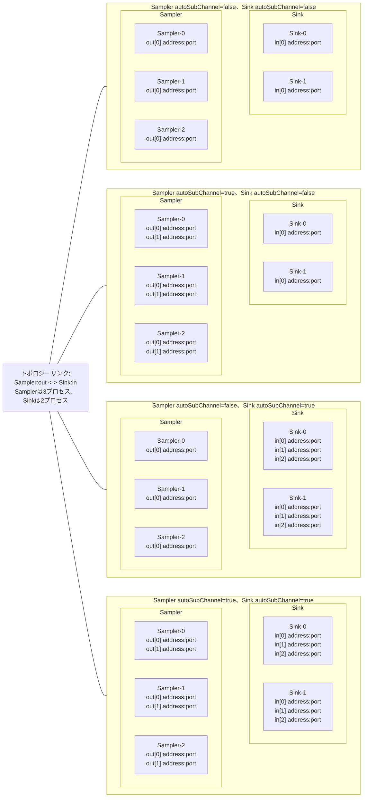
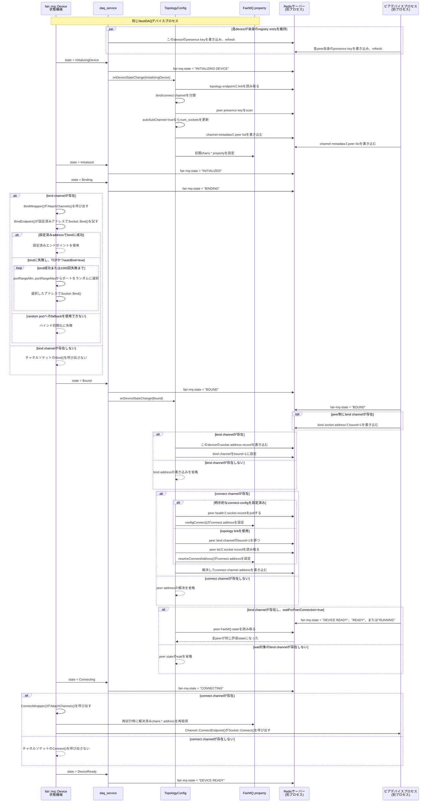
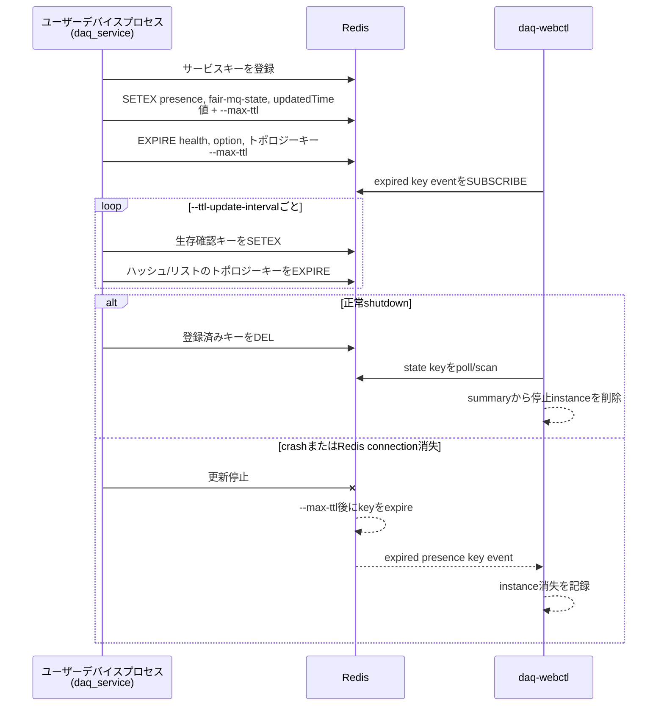

# NestDAQ FairMQプラグイン

[English](README.md) | [日本語](README.ja.md)

[トップ: NestDAQ](../README.ja.md) | [前へ: スクリプト](../scripts/README.ja.md) | [次へ: ウェブコントローラー](../controller/README.ja.md)

NestDAQは3つのFairMQプラグインを共有ライブラリとしてインストールします。

<a id="table-available-plugins-ja"></a>
**表1：利用可能なプラグインとライブラリ。**

| プラグイン名 | ライブラリ | 目的 |
| --- | --- | --- |
| `daq_service` | `libFairMQPlugin_daq_service.so` | FairMQデバイスをRedisへ登録し、ヘルス情報/状態およびトポロジー/チャネルデータを書き込み、データ収集 (DAQ) コマンドを処理します。 |
| `metrics` | `libFairMQPlugin_metrics.so` | プロセスメトリクスおよびFairMQチャネルのスループットメトリクスをRedisとRedisTimeSeriesへ書き込みます。 |
| `parameter_config` | `libFairMQPlugin_parameter_config.so` | Redisからパラメーターを読み取り、FairMQプログラムオプションへ反映します。 |

読み込んだ各プラグインはRedisサーバーへの接続を必要とします。
RedisTimeSeriesが必要なのは、時系列キーを作成して更新する`metrics`プラグインを読み込む場合だけです。
`daq_service`と`parameter_config`はRedisの基本コマンドを使用し、RedisTimeSeriesを必要としません。

プラグインを読み込む正確なオプションは、FairMQとFairMQを使用する実行ファイルが定義します。
これらのライブラリを有効にするときは、上記のプラグイン名を使用してください。

以下のキーパターンでは、`{sep}`が設定された区切り文字を表します。
既定の区切り文字は`:`です。
その他のプレースホルダーは`{service}`、`{id}`、`{channel}`、`{subindex}`です。

<a id="1-time-to-live-ttl-behavior"></a>
## 1. Time To Live (TTL) の動作

TTLの扱いはプラグインごとに異なります。

- `daq_service`はRedisキーの期限切れを管理します。
  デバイスの生存中はレジストリーキーを更新し、デバイスが予期せず終了した場合は期限切れを代替クリーンアップ機構として使用します。
- `metrics`はメトリクスハッシュおよびRedisTimeSeriesキーにRedisの期限切れコマンドを実行しません。
  代わりに、`--metrics-max-ttl`はプラグイン起動時に1回だけ行うクリーンアップで、共有メトリクスハッシュから古いインスタンスフィールドを削除するための経過時間を指定します。
  RedisTimeSeries retentionは`--retention`で別に制御します。
- `parameter_config`はパラメーターキーへTTLを設定しません。
  Redisキーを書き込む生成側または運用者がパラメーターの有効期間を制御します。

<a id="2-daq_service"></a>
## 2. daq_service

`daq_service`はRedisサービスレジストリプラグインです。
デバイスインスタンスの登録、TTLの更新、FairMQ状態、ヘルス情報、トポロジー、チャネルデータの書き込み、およびDAQコマンドの購読を行います。

<a id="21-command-line-options"></a>
### 2.1. コマンドラインオプション

この文書で説明するコマンドラインオプションは、すべて省略できます。
省略した場合、プラグインは[表2](#table-daq-service-options-ja)に示す既定値を使用します。

<a id="table-daq-service-options-ja"></a>
**表2：`daq_service`のコマンドラインオプション。**

| オプション | デフォルト | 説明 |
| --- | --- | --- |
| `--service-name` | 未設定（オプションなし）、その後に実行ファイルのベース名 | Redisキーパスおよびヘルス情報の`serviceName`フィールドで使用する、このNestDAQデバイスプロセスのサービス名。 |
| `--uuid` | 生成 | このNestDAQデバイスプロセスのUUID。この値は、`--otel-service-instance-id`を設定しない限り、テレメトリーの`service.instance.id`のデフォルト値になります。`--uuid`を省略すると、標準FairMQデバイスラッパーは生成したテレメトリーUUIDをこのプロパティへコピーします。このプロパティが存在しない場合、プラグインがUUIDを生成します。 |
| `--host-ip` | 検出値/設定値 | ヘルス情報の`hostIp`フィールドへ保存する、このNestDAQデバイスプロセスのアドレス。名前解決可能なホスト名も指定できます。省略した場合、プラグインは設定されたネットワークインターフェースを使用し、取得できなければデフォルトルートのインターフェースを使用します。 |
| `--hostname` | 検出値/設定値 | ヘルス情報の`hostName`フィールドへ保存するホスト名。省略した場合、プラグインはオペレーティングシステムのホスト名を使用します。 |
| `--registry-uri` | `tcp://127.0.0.1:6379/0` | DAQサービスレジストリのRedis URI。 |
| `--separator` | `:` | Redisキーを構成するときの区切り文字。 |
| `--max-ttl` | `5` | 一時レジストリーキーのTTL (秒)。 |
| `--ttl-update-interval` | `3` | TTL更新間隔 (秒)。 |
| `--startup-state` | `idle` | 起動時にプラグインがデバイスを`Idle`から自動的に進めるFairMQ状態：`idle`、`initializing-device`、`initialized`、`bound`、`device-ready`、`ready`、`running`。 |
| `--enable-uds` | `true` | すべての接続相手の`hostIp`がこのプロセスと同じZeroMQバインドチャネルだけにUnixドメインソケット (UDS) アドレスを追加します。`true`または`1`で有効になります。 |
| `--connect-config` | 未設定（オプションなし） | 一時メッセージキュー (MQ) チャネル接続パラメーターを記述するJavaScript Object Notation (JSON) 文字列。2.5.3節で構造と接続相手の記法を説明します。 |
| `--max-retry-to-resolve-address` | `10` | 接続アドレス解決の最大再試行回数。 |

<a id="22-daq-service-identity-defaults"></a>
### 2.2. DAQサービス識別情報の既定値

`daq_service`は、Redisキーパス、ヘルス情報の`serviceName`フィールド、およびコントローラーの表示で、このNestDAQデバイスプロセスのサービス名として`--service-name`を使用します。
`--service-name`が未設定または空の場合、プラグインは実行ファイル名の最後のパス要素を使用します。

FairMQの`--id`オプションが設定されている場合、その値をNestDAQサービスインスタンスIDとして使用します。
`--id`が未設定または空の場合、`daq_service`は`daq_service{sep}service-instance-index{sep}{service}`で数値インデックスを割り当て、インスタンスIDを`Sampler-0`のような`{service-name}-{index}`に設定します。
`--uuid`値はインスタンスIDとは別で、存在情報、ヘルス情報、インデックス再利用においてこのプロセスを識別します。
また、`--otel-service-instance-id`を明示的に設定しない限り、テレメトリーの`service.instance.id`のデフォルト値になります。
`--uuid`を省略すると、標準FairMQデバイスラッパーは生成したテレメトリーUUIDを`uuid`プロパティへコピーします。`uuid`プロパティが存在しない場合、プラグインが生成します。

<a id="23-redis-keys-written-or-read"></a>
### 2.3. `daq_service`が使用するRedisキー

ヘルスデータは、デバイス識別情報、ホスト情報、FairMQ状態、およびライフサイクルのタイムスタンプを含むRedisハッシュデータです。
`TopologyConfig`は接続解決に`hostIp`フィールドを使用し、監視クライアントは他のフィールドをデバイス状態の表示に使用できます。

「書き込み元/読み取り元」列は、NestDAQデバイスプロセスへ読み込んだ`daq_service`プラグインが行う操作を示します。
`daq-webctl`が行うRedis操作は、[`controller/README.ja.md`](../controller/README.ja.md#6-redis-command-interface)を参照してください。

`createdTime`、`updated_time`、`updatedTime`、`start_time`、`stop_time`は、ローカル時刻を秒精度の`YYYY-MM-DDTHH:MM:SS`形式で表した文字列です。
timezone offsetは含みません。
`uptime`は`daq_service`プラグインの生成後に経過したミリ秒です。
`start_time_ns`と`stop_time_ns`は同じ起点からの経過ナノ秒であり、Unixエポックのタイムスタンプではありません。

<a id="table-daq-service-redis-keys-ja"></a>
**表3：`daq_service`が使用するRedisキー。**

| キーパターン | Redis型 | フィールド/値 | 書き込み元/読み取り元 | 目的 |
| --- | --- | --- | --- | --- |
| `daq_service{sep}{service}{sep}{id}{sep}presence` | 文字列 | TTL付きで更新されるUUID文字列 | `daq_service`が書き込み/読み取り | デバイスインスタンスの存在マーカー。 |
| `daq_service{sep}{service}{sep}{id}{sep}health` | ハッシュ | `instanceID`, `uuid`, `hostName`, `hostIp`, `serviceName`, `fair:mq:state`, `createdTime`, `updated_time`, `uptime`。実行時刻の記録時は`start_time`, `start_time_ns`, `stop_time`, `stop_time_ns`も含む | `daq_service`が書き込み/読み取り | デバイスインスタンスのヘルス情報とライフサイクルメタデータ。 |
| `daq_service{sep}{service}{sep}{id}{sep}fair-mq-state` | 文字列 | FairMQ状態名 | `daq_service`が書き込み/読み取り、`daq-webctl`が読み取り | TTL付きの現在のFairMQ状態。 |
| `daq_service{sep}{service}{sep}{id}{sep}updatedTime` | 文字列 | 最終更新タイムスタンプ | `daq_service`が書き込み、`daq-webctl`が読み取り | TTL付きの軽量な最終更新キー。 |
| `daq_service{sep}{service}{sep}{id}{sep}option` | ハッシュ | `severity`, `file-severity`, `verbosity`, `color`, `log-to-file`, `id`, `io-threads`, `transport`, `network-interface`, `init-timeout`、共有メモリーオプション、`rate`, `session`などのFairMQプログラムオプション | `daq_service`が書き込み | 監視やデバッグに使用する現在のオプション値。 |
| `daq_service{sep}service-instance-index{sep}{service}` | ハッシュ | フィールド：数値インスタンスインデックス、値：UUID | `daq_service`が読み取り/書き込み | `--id`未指定時に`{service}-{index}`インスタンスIDを割り当て、再利用。 |
| `run_info{sep}run_number` | 文字列整数 | 現在または次の実行番号 | `daq_service`が読み取り、`daq-webctl`が読み取り/書き込み | 実行メタデータへ記録する実行番号を取得。 |
| `daqctl` | Pub/Subチャネル | JSON形式のDAQコマンドメッセージ | `daq-webctl`または他のRedisクライアントが発行、`daq_service`が購読 | DAQ状態遷移要求を受信。 |

<a id="24-daq-command-publishsubscribe-pubsub"></a>
### 2.4. DAQコマンドのPublish/Subscribe (Pub/Sub)

Redis Pub/Subは各`daqctl`メッセージを、このチャネルを購読するすべてのユーザーデバイスプロセスへ配信します。
Redisはサービスやインスタンスによってメッセージを絞り込みません。
完全修飾インスタンスIDは、`service-name`、設定済みの区切り文字、インスタンスIDを連結した値です。
例えばデフォルトの区切り文字では、サービス名`Sampler`とインスタンスID `Sampler-0`から`Sampler:Sampler-0`を生成します。
各デバイスの`daq_service`プラグインは、メッセージの`services`および`instances`配列を、そのデバイスのサービス名および完全修飾インスタンスIDと比較します。
これらの配列がそのデバイスインスタンスを選択していない場合、プラグインはメッセージを無視します。

`daqctl`へ発行するメッセージの形式は次のとおりです。

```json
{
  "command": "change_state",
  "value": "RUN",
  "services": ["Sampler", "Sink"],
  "instances": ["Sampler:Sampler-0", "Sink:Sink-0"]
}
```

`services`配列はサービス名を選択し、`instances`配列はインスタンスIDを選択します。
両arrayが存在して空でないことが必要であり、いずれも複数entryを含められます。
プラグインはエントリーを集合として保存するため、順序や重複は対象照合に影響しません。
`daq_service`プラグインが現在`command`フィールドで処理する値は、大文字と小文字を区別した文字列`"change_state"`だけです。
その他の`command`値を持つメッセージは無視します。
`value`フィールドには、プラグインが扱う次のFairMQまたはNestDAQコマンド文字列を指定できます。

```text
BIND, COMPLETE INIT, CONNECT, END, INIT DEVICE, INIT TASK, RESET DEVICE,
RESET TASK, RUN, STOP, exit, quit, reset, start
```

正しい形式のメッセージであれば、`daq-webctl`を使用せず、他のRedisクライアントからも`daqctl`へ発行できます。
例えば次の`redis-cli`コマンドは、ローカルRedisサーバーを通して`Sampler-0`デバイスインスタンスへ`RUN`を発行します。

```sh
# RUN要求をdaqctl channelへ直接publishします。
redis-cli -u redis://127.0.0.1:6379 PUBLISH daqctl \
  '{"command":"change_state","value":"RUN","services":["Sampler"],"instances":["Sampler:Sampler-0"]}'
```

Redis Pub/SubチャネルはRedisデータベース番号で分離されません。
Redisエンドポイント、チャネル名、および設定済み区切り文字は、操作対象の環境に合わせて変更してください。

対象選択では特殊な小文字の文字列`"all"`を使用できます。

- `services: ["all"]`は`instances`に関係なく全デバイスを対象にします。
- `services: ["Sampler"]`と`instances: ["all"]`は`Sampler`サービスの全インスタンスを対象にします。
- `services: ["Sampler"]`と`instances: ["Sampler:Sampler-0"]`は`Sampler-0`インスタンスだけを対象にします。
- その他のデバイスはメッセージを無視します。

実装は大文字と小文字を変換せず、文字列`"all"`と比較します。
`"ALL"`や`"All"`ではなく、小文字の`"all"`を使用してください。

例：

```json
{
  "command": "change_state",
  "value": "STOP",
  "services": ["all"],
  "instances": ["all"]
}
```

```json
{
  "command": "change_state",
  "value": "RUN",
  "services": ["Sampler"],
  "instances": ["all"]
}
```

```json
{
  "command": "change_state",
  "value": "RUN",
  "services": ["Sampler"],
  "instances": ["Sampler:Sampler-0"]
}
```

複数サービスとその配下の全インスタンスを対象にします。

```json
{
  "command": "change_state",
  "value": "CONNECT",
  "services": ["Sampler", "Sink"],
  "instances": ["all"]
}
```

サービスをまたいで選択したインスタンスを対象にします。

```json
{
  "command": "change_state",
  "value": "RUN",
  "services": ["Sampler", "Sink"],
  "instances": ["Sampler:Sampler-0", "Sampler:Sampler-1", "Sink:Sink-0"]
}
```

最後のメッセージも全`daqctl`購読者へ配信されます。
例えば`Sampler-2`と`Sink-1`もメッセージを受信しますが、それぞれの完全修飾インスタンスIDである`Sampler:Sampler-2`と`Sink:Sink-1`が`instances`にないため無視します。

<a id="25-topology-and-channel-keys"></a>
### 2.5. トポロジーおよびチャネルキー

各`daq_service`プラグインの`TopologyConfig`オブジェクトはトポロジー定義を読み取り、そのデバイスのチャネルおよびソケットメタデータをRedisへ書き込みます。
バインド側が最初にアドレスを書き込み、接続側がそのアドレスを読み取って自身のFairMQソケットを設定します。

<a id="table-topology-channel-redis-keys-ja"></a>
**表4：トポロジーおよびチャネル設定用のRedisキー。**

| キーパターン | Redis型 | フィールド/値 | 書き込み元/読み取り元 | 目的 |
| --- | --- | --- | --- | --- |
| `daq_service{sep}{service}{sep}{id}{sep}channel{sep}{channel}` | ハッシュ | `name`, `type`, `method`, `address`, `transport`、バッファー/カーネルサイズ、`linger`, `rateLogging`、ポート範囲、`autoBind`, `num_sockets`, `autoSubChannel`, `bound`, `waitForPeerConnection` | `{service}`と`{id}`が示すデバイスインスタンスの`TopologyConfig`がバインドチャネルと接続チャネルの両方を書き込み。トポロジーリンクからアドレスを解決する場合、接続側がピアのバインドチャネルメタデータと`bound`フィールドを読み取り | 保存されたチャネルエンドポイントのメタデータ。 |
| `daq_service{sep}{service}{sep}{id}{sep}channel{sep}{channel}{sep}peer` | リスト | ピアチャネルのキー文字列 | 各デバイスの`TopologyConfig`が書き込み。トポロジーリンクからアドレスを解決する場合、接続側が自身のチャネルのピアリストおよび対応するピアリストを読み取り | チャネルのピアリスト。 |
| `daq_service{sep}{service}{sep}{id}{sep}socket{sep}chans.{channel}.{subindex}` | ハッシュ | そのデバイスインスタンスのサブチャネル/ソケットパラメーターと`num_sockets`, `autoSubChannel` | バインド側の`TopologyConfig`がバインド済みソケットアドレスを書き込み。接続側がそのレコードを読み取ってアドレスを解決し、自身のソケットレコードを書き込み | サブチャネルごとの接続メタデータ。 |
| `daq_service{sep}topology{sep}endpoint...` | ハッシュ | トポロジーエンドポイント設定 | `scripts/topology-*.sh`または他のRedisクライアントが書き込み。対象サービスの各デバイスにある`TopologyConfig`が走査/読み取り | バインドチャネルおよび接続チャネルを定義する外部トポロジー設定。 |
| `daq_service{sep}topology{sep}link...` | 文字列 | トポロジーリンク設定 | `scripts/topology-*.sh`または他のRedisクライアントが書き込み。リンク両側のデバイスにある`TopologyConfig`が走査/読み取り | サービスとチャネルを接続する外部トポロジー設定。 |

トポロジー用シェルスクリプトは、デバイスの起動前に`redis-cli`を通して`topology{sep}endpoint`キーおよび`topology{sep}link`キーを書き込みます。
リポジトリが提供するスクリプトはRedisデータベース`0`と区切り文字`:`を使用します。
異なる値を使用する環境では、スクリプトのRedis URIおよびキー生成処理を変更してください。
`scripts/mq-param.sh`はパラメーター設定キーを書き込むスクリプトであり、これらのトポロジーキーは書き込みません。

<a id="251-autosubchannel"></a>
#### 2.5.1. `autoSubChannel`

FairMQでは、同じ名前のチャネルを`std::vector<fair::mq::Channel>`として保持します。
各`fair::mq::Channel`は1つのFairMQソケットを包み、ベクターのインデックスがサブチャネルを識別します。
デバイスのC++コードでは、`Send()`または`Receive()`のインデックス引数で、そのチャネルのサブチャネルを選択します。
インデックス引数を省略すると`0`を使用します。

トポロジーエンドポイントおよびリンクを使用する構成では、`autoSubChannel`は、Redisの存在キーから検出したピアデバイスインスタンスに応じて`TopologyConfig`がそのデバイスのチャネルへサブチャネルを追加するかどうかを制御します。
既定値は`false`です。

- `autoSubChannel=false`はチャネル設定にある固定のサブチャネル数を維持します。
  1:1などの固定connectionに適します。
- `autoSubChannel=true`は、バインドエンドポイントと接続エンドポイントの両方で、検出したピアデバイスインスタンスから`num_sockets`を増やします。
  プロセス動作中に接続相手またはソケット数を検出するn:mトポロジーに適します。

connect endpointが複数のpeerすべてのbind addressを解決して接続する場合は、ユーザーコードがsubchannel indexでpeerを区別しなくても、connect側へ`autoSubChannel=true`を設定します。
bind endpointでは、peerごとに異なるローカルsubchannelとbind addressが必要な場合に`autoSubChannel=true`を設定します。
peerをローカルsubchannelで区別する必要がなければ、`autoSubChannel=false`の1つのbind socketで複数peerからの接続を受けられます。

[図1](#figure-auto-subchannel-sockets-ja)は、プロセス数が異なる2つのサービスをトポロジーが接続するとき、各側の`autoSubChannel`設定によってアドレスを持つチャネルソケット数がどう変わるかを示します。
[図1](#figure-auto-subchannel-sockets-ja)はソケットおよびサブチャネル数の例であり、固定ポート番号の割り当てやメッセージ方向を示すものではありません。
非表示の配置用リンクは`Sampler`を左、`Sink`を右に保つためのものであり、データ経路ではありません。



<a id="figure-auto-subchannel-sockets-ja"></a>
**図1：`autoSubChannel`設定がチャネルソケット数に与える影響。**

プラグインは通常、トポロジーから`num_sockets`を計算します。
`autoSubChannel=true`のチャネルでは、検出したピアデバイスインスタンスに応じて`num_sockets`が増え、各FairMQサブソケットへ異なる`address:port`とサブチャネルインデックスを設定できます。

Redis topologyによる自動構成を使わず、FairMQの`--channel-config`だけでローカルsubchannel数とアドレスを固定することもできます。
[表5](#table-channel-configuration-modes-ja)は、この固定設定をRedis topology設定および混合設定と区別して示します。

<a id="table-channel-configuration-modes-ja"></a>
**表5：FairMQとRedis topologyによるチャネル設定方式。**

| 設定方式 | ローカルsubchannel数 | アドレス | 運用上の制約 |
|----------|----------------------|----------|--------------|
| FairMQ固定設定 | `--channel-config`の`numSockets`または複数の`address`フィールドで指定します。 | `address`フィールドで直接指定します。 | Redis topologyによるpeer検出とアドレス解決を使用しません。トポロジーを変更する場合はコマンドライン設定も変更します。 |
| Redis topology設定 | topology endpointの`num_sockets`、または`autoSubChannel=true`の場合は検出したpeerから導出します。 | Redisに保存されたbind側の情報から解決します。 | 対応するtopology endpointとlinkが必要です。 |
| 混合設定 | FairMQとRedisのsubchannel数を明示的に一致させます。 | 対応するendpointとlinkがあればRedisで解決できます。 | 設定元が2つに分かれます。この組合せが必要な場合を除き、前の2方式のどちらか一方を使用してください。 |

`INIT DEVICE`を発行する前に、必要な全peerプロセスを起動し、それらすべてのpresenceキーがRedisへ登録されたことを確認してください。
すべてのデバイスが同じpeerキー集合と同じトポロジー定義を参照すれば、トポロジー検出は同じ文字列ソート順を使用し、同じsubchannel割り当てを再現します。
subchannelの割り当ては、デバイスが`INIT DEVICE`を処理した時点のpeer集合に基づいて固定され、`DeviceReady`へ到達した後は自動更新されません。

peerを追加、削除、または名前変更した場合は、影響するすべてのデバイスを`RESET DEVICE`で`Idle`へ戻し、変更後のpeer集合がRedisに反映されたことを確認してから、`INIT DEVICE`を再度実行してください。
デバイスを`Ready`から`DeviceReady`へ戻す`RESET TASK`では、トポロジーを再構築しません。

現在の実装では、トポロジー検出はpeerキーを`std::string`の文字列順でソートしてから、ローカルsubchannel indexを割り当てます。
数値suffixは数値として比較されません。
例えば、peerキーが`Sink-1`、`Sink-10`、`Sink-2`の場合、次の順序で割り当てます。

```text
subchannel 0 -> Sink-1
subchannel 1 -> Sink-10
subchannel 2 -> Sink-2
```

indexは実行時のローカル位置として扱い、現在の要素数を確認してください。
index _N_ が、インスタンス名の末尾に`-N`を持つpeerを表すという仮定を保存しないでください。

<a id="selecting-local-subchannels-ja"></a>
#### 2.5.2. ユーザーコードでのローカルsubchannel選択

`Send()`と`Receive()`は、peerのサービスまたはインスタンスを直接選ぶのではなく、ローカルチャネルvectorの要素を選びます。
indexを指定する前に`GetNumSubChannels()`で現在の要素数を取得し、範囲外の値を拒否してください。
indexを省略するとローカルsubchannel `0`を選択します。

```cpp
const auto kChannel = std::string{"data"};
const auto kSubchannel = std::size_t{2};
const auto kCount = GetNumSubChannels(kChannel);
if (kSubchannel >= kCount) {
    throw std::out_of_range{"configured subchannel does not exist"};
}

if (Send(message, kChannel, static_cast<int>(kSubchannel)) < 0) {
    LOG(error) << "failed to send on subchannel " << kSubchannel;
}
```

受信するsubchannelを明示する場合は、対応するoverloadを使用します。

```cpp
if (Receive(message, "in", static_cast<int>(kSubchannel)) < 0) {
    LOG(error) << "failed to receive on subchannel " << kSubchannel;
}
```

選択する側には、そのindexまでのローカルsubchannelが必要です。
トポロジーで管理する構成では、接続相手ごとのローカルsubchannelをユーザーコードから選ぶ側に`autoSubChannel=true`を設定します。
connect endpointが複数のpeerすべてのbind addressを解決して接続する場合も、ユーザーコードからpeerを明示的に選択するかどうかに関係なく、`autoSubChannel=true`が必要です。
bind/connectの向きを含む1対N、N対1、N対Mの設定は、[scripts文書の表2](../scripts/README.ja.md#table-topology-cardinality-ja)に示します。

`OnData(channel, callback)`は、指定した名前のチャネル全体にcallbackを登録するものであり、1つのsubchannelを選択しません。
FairMQは準備できたローカルsubchannelから受信し、そのローカルindexをcallbackへ渡します。
1つのsubchannelだけから受信する場合は、`ConditionalRun()`または`Run()`で`Receive(..., channel, index)`を呼ぶ手動受信loopを実装します。
`OnData()`を1つでも登録すると、デバイスは手動実行loopではなくcallback方式の入力処理へ切り替わるため、そのデバイスでは`OnData()` callbackを登録しないでください。

<a id="253-connect-config"></a>
#### 2.5.3. `--connect-config`

`--connect-config`は、このオプションを受け取るデバイスプロセスの接続チャネルおよび接続相手をJSON文字列で直接定義します。
`TopologyConfig`は、このJSONの各最上位チャネルへ`method=connect`を設定します。
このオプションが空でない場合、`TopologyConfig`はトポロジーリンクによる接続相手の解決に代えて、この`peer`参照から接続アドレスを解決します。

次の例は、このオプションを受け取るデバイスに`in`というプルチャネルを定義し、`Sampler`サービスの`Sampler-0`インスタンスが持つバインドチャネル`out`のサブチャネル`0`へ接続します。

```json
{
  "in": {
    "type": "pull",
    "peer": "Sampler:Sampler-0:out[0]"
  }
}
```

最上位のキー`in`はこのオプションを受け取るデバイスへ設定するチャネル名、`type`はそのFairMQソケット型、`peer`は接続相手のチャネルを示します。
デフォルトの区切り文字`:`を使用する場合、完全修飾ピア参照は`{service}:{instance-id}:{channel}[{subindex}]`形式です。
`[0]` suffixは接続相手のsubchannel `0`を選択します。
これは`TopologyConfig`が解釈するJSONデータであり、C++の構文やトポロジー用シェルスクリプトの`link`コマンドに記述する構文ではありません。
[表4](#table-topology-channel-redis-keys-ja)の`{subindex}`はプレースホルダーですが、`[0]`はピア参照に記述する実際の接尾辞です。
`peer`には1つの文字列または文字列配列を指定できます。

`--connect-config`の`[N]` suffixは、`Send()`または`Receive()`へ渡すindexとは対象が異なります。
suffixはアドレス解決時にリモートのbindチャネルにあるsubchannel _N_ を選択し、C++ APIのindexはローカルチャネルvectorの要素を選択します。
両者のindexが同じ値になるとは限りません。

`[0]`のようにsuffixを明示した場合は、`autoSubChannel`に関係なく、そのsubchannelだけを選択します。
suffixを省略して`autoSubChannel=false`を設定した場合、`TopologyConfig`はsubchannel `0`を選択します。
現在の実装では、suffixを省略して`autoSubChannel=true`を設定する経路が保存済みの`chans.{channel}.{subindex}` key patternと確実には一致しません。
明示的な`[N]`接尾辞、またはトポロジーのエンドポイント/リンク設定を使用してください。

<a id="254-bindconnect-sequence"></a>
#### 2.5.4. bind/connectシーケンス

`TopologyConfig`はFairMQ状態遷移中にRedisを通じてバインドエンドポイントと接続エンドポイントを同期します。
[図2](#figure-bind-connect-sequence-ja)の`Device`、`TopologyConfig`、`FairMQプロパティ`は、同じNestDAQデバイスプロセスに属します。
Redisサーバーおよび各接続相手デバイスは、それぞれ別のプロセスで動作します。



<a id="figure-bind-connect-sequence-ja"></a>
**図2：FairMQ状態遷移中のバインドおよび接続シーケンス。**

各バインドチャネルについて、`Channel::BindEndpoint()`は最初に設定済みアドレスでバインドを試します。
bindに失敗した場合、protocolがTCPかつ`autoBind=true`であれば、FairMQは`portRangeMin`から`portRangeMax`までの範囲からport番号をランダムに選び、bindを再試行します。
範囲には両端の値を含みます。
random portを試す回数は最大1000回です。
TCP以外のエンドポイント、`autoBind=false`、または最大回数まで成功しなかった場合は、バインド初期化に失敗します。
バインドチャネルは最初に自身のアドレスをRedisへ書き込みます。
接続チャネルは接続相手のバインドチャネルが`bound=1`になるのを待ち、Redisから接続相手のソケットアドレスを解決して、結果をFairMQの`chans.*`プロパティーへ書き込みます。
`waitForPeerConnection=false`のバインドチャネルは、最後の接続相手準備待ちを省略します。
許容するRedis状態値は`DEVICE READY`、`READY`、`RUNNING`です。待機を終了するには、確認できた全ピアが同じ許容値を示す必要があります。
resetまたはcancellationはwait stepを中断します。
各`daq_service`インスタンスは、自身のデバイスプロセスの存在キーと現在のFairMQ状態を書き込み、更新します。
`TopologyConfig`は`Bound`状態のコールバックで各接続相手アドレスを解決し、FairMQの`chans.*`プロパティーへ保存します。
状態機械が`Connecting`へ遷移した後、`fair::mq::Device::ConnectWrapper()`が`AttachChannels()`を呼び出します。その処理は`Channel::ConnectEndpoint()`を経由してトランスポートソケットの`Connect()`を実行します。
仮想メンバー関数`fair::mq::Device::Connect()`はチャネル接続処理の後に呼び出されるライフサイクルフックであり、トランスポートソケットの接続処理ではありません。

<a id="26-ttl-details-daq_service"></a>
### 2.6. TTLの詳細 (daq_service)

`daq_service`はseconds単位の`--max-ttl`を使用します。
既定値は`5`秒です。
`--ttl-update-interval`はプラグインがTTLを更新する頻度を制御し、既定の更新間隔は`3`秒です。

[図3](#figure-daq-service-ttl-refresh-ja)は、プラグインがRedisキーを更新する2つの方法をまとめています。

- `presence`、`fair-mq-state`、`updatedTime`は`SETEX`で更新し、値とTTLの両方を更新します。
- `health`、`option`、トポロジーチャネルキー、トポロジーソケットキー、ピアリストキーは`EXPIRE`で有効期限を更新します。



<a id="figure-daq-service-ttl-refresh-ja"></a>
**図3：`daq_service`のTTL更新および期限切れシーケンス。**

正常なシャットダウンでは、プラグインが登録済みキーを削除します。
プロセスがクラッシュするかRedis接続を失うと、更新停止後にTTL期限切れが一時レジストリーキーを削除します。

TTL expiration自体にRedis keyspace notificationは不要です。
ただし、`daq-webctl`が次のpolling cycleを待たずに消失instanceを検出するにはexpired key eventが必要です。
`metrics`プラグインは`--metrics-max-ttl`をRedisキーのTTLとして使用しません。
メトリクスの更新が停止したインスタンスのフィールドを削除するために使用します。
`parameter_config`プラグインはパラメーターキーへTTLを設定しません。

<a id="3-metrics"></a>
## 3. metrics

`metrics`はプロセスレベルのメトリクスとFairMQチャネルのスループットメトリクスをRedisへ記録します。
プロセスの中央処理装置 (CPU) 使用率はtop/htop形式で、1 CPUコアを完全に使用すると約`100`、2コアを完全に使用すると約`200`です。
memory usageはmebibytes (MiB) 単位のcurrent resident set size (RSS) です。

<a id="31-command-line-options"></a>
### 3.1. コマンドラインオプション

<a id="table-metrics-options-ja"></a>
**表6：`metrics`のコマンドラインオプション。**

| オプション | デフォルト | 説明 |
| --- | --- | --- |
| `--proc-stat-update-interval` | `1000` | プロセスのCPU/メモリーメトリクスの更新間隔 (ミリ秒)。 |
| `--metrics-uri` | 未設定（`--registry-uri`を使用） | メトリクス用Redis URI。省略時は`--registry-uri`を使用し、空文字列を明示するとメトリクス用Redis接続を無効にします。 |
| `--retention` | `0` | RedisTimeSeries内の最大タイムスタンプを基準としたサンプルの最大経過時間 (ミリ秒)。`0`は保持期間による削除を無効にします。 |
| `--recreate-ts` | `true` | `Ready`への遷移時に登録済みRedisTimeSeriesキーを削除し、`Running`への遷移時に設定済み保持期間とラベルを持つキーを作成します。 |
| `--metrics-max-ttl` | `3000` | プラグイン起動時に1回だけ行う古いフィールドのクリーンアップで使用する経過時間 (ミリ秒)。0以下の場合、このクリーンアップを無効にします。 |

<a id="32-redis-keys-written-or-read"></a>
### 3.2. 書き込みまたは読み取りを行うRedisキー

[表7](#table-metrics-redis-keys-ja)の`metrics`は、各NestDAQデバイスプロセスへ読み込まれたプラグインインスタンスを指します。
書き込み元/読み取り元の列には、メトリクス処理のために各キーへ直接アクセスする、このリポジトリ内の構成要素を記載します。
Redisへ接続するように設定したGrafanaやSlowDashなどの外部可視化ツールは、これらのメトリクスを読み取り、ダッシュボードやグラフの表示に利用できます。
現在の`daq-webctl`実装は、これらのメトリクスキーを読み取りません。

<a id="table-metrics-redis-keys-ja"></a>
**表7：`metrics`が使用するRedisキー。**

| キーパターン | Redis型 | フィールド/値 | 書き込み元/読み取り元 | 目的 |
| --- | --- | --- | --- | --- |
| `metrics{sep}created-time` | ハッシュ | フィールド：`{id}`、値：作成タイムスタンプ | `metrics`が書き込み。リポジトリ内に専用の読み取り元なし | デバイス作成時刻。 |
| `metrics{sep}hostname` | ハッシュ | フィールド：`{id}`、値：ホスト名 | `metrics`が書き込み。リポジトリ内に専用の読み取り元なし | ホストメタデータ。 |
| `metrics{sep}host-ip` | ハッシュ | フィールド：`{id}`、値：ホストIPアドレス | `metrics`が書き込み。リポジトリ内に専用の読み取り元なし | ホストメタデータ。 |
| `metrics{sep}state` | ハッシュ | フィールド：`{id}`、値：FairMQ状態名 | `metrics`が書き込み。リポジトリ内に専用の読み取り元なし | 文字列形式の現在状態。 |
| `metrics{sep}state-id` | ハッシュ | フィールド：`{id}`、値：数値FairMQ状態ID | `metrics`が書き込み。リポジトリ内に専用の読み取り元なし | 数値形式の現在状態。 |
| `metrics{sep}last-update` | ハッシュ | フィールド：`{id}`、値：タイムスタンプ | `metrics`が書き込み。リポジトリ内に専用の読み取り元なし | 最終メトリクス更新時刻。 |
| `metrics{sep}last-update-ns` | ハッシュ | フィールド：`{id}`、値：ナノ秒単位のタイムスタンプ | `metrics`が書き込み、起動時クリーンアップで読み取り | 古いメトリクスフィールドの識別。 |
| `metrics{sep}cpu-stat` | ハッシュ | フィールド：`{id}`、値：CPU使用率 | `metrics`が書き込み。リポジトリ内に専用の読み取り処理なし | プロセスのCPU使用率。 |
| `metrics{sep}ram-stat` | ハッシュ | フィールド：`{id}`、値：現在のRSS (MiB) | `metrics`が書き込み。リポジトリ内に専用の読み取り処理なし | プロセスのメモリー使用量。 |
| `metrics{sep}msg-in`, `metrics{sep}msg-out` | ハッシュ | フィールド：`{id}{sep}{channel}[{subindex}]`、値：メッセージ数/秒 | `metrics`が書き込み、起動時クリーンアップで読み取り | 現在のチャネルメッセージレート。 |
| `metrics{sep}mb-in`, `metrics{sep}mb-out` | ハッシュ | フィールド：`{id}{sep}{channel}[{subindex}]`、値：MiB/秒 | `metrics`が書き込み、起動時クリーンアップで読み取り | 現在のチャネルスループット。 |
| `metrics{sep}msg-in-sum`, `metrics{sep}msg-out-sum` | ハッシュ | フィールド：`{id}{sep}{channel}[{subindex}]`、値：丸めた累積メッセージ数 | `metrics`が書き込み、起動時クリーンアップで読み取り | 累積メッセージ数。 |
| `metrics{sep}mb-in-sum`, `metrics{sep}mb-out-sum` | ハッシュ | フィールド：`{id}{sep}{channel}[{subindex}]`、値：累積MiB | `metrics`が書き込み、起動時クリーンアップで読み取り | 累積スループット。 |
| `metrics{sep}num-msg`, `metrics{sep}mb` | ハッシュ | フィールド：`{id}{sep}{channel}[{subindex}].in` または `.out`、値：現在レート | `metrics`が書き込み、起動時クリーンアップで読み取り | 方向付き現在レート。 |
| `metrics{sep}num-msg-sum`, `metrics{sep}mb-sum` | ハッシュ | フィールド：`{id}{sep}{channel}[{subindex}].in` または `.out`、値：累積値 | `metrics`が書き込み、起動時クリーンアップで読み取り | 方向付き累積値。 |
| `ts{sep}{id}{sep}cpu-stat`, `ts{sep}{id}{sep}ram-stat`, `ts{sep}{id}{sep}state-id` | RedisTimeSeries | `TS.ADD`で追加するサンプル。ラベルは`service`, `id`、データ型 | `metrics`が存在確認、作成、書き込み。リポジトリ内にサンプルの読み取り処理なし | プロセス/状態の時系列。 |
| `ts{sep}{id}{sep}{channel}[{subindex}]{sep}...` | RedisTimeSeries | `name`、`socket`、`transport`などのラベルを持つチャネルレート/累積サンプル | `metrics`が存在確認、作成、書き込み。リポジトリ内にサンプル読み取り元なし | チャネル時系列。 |

<a id="321-redistimeseries-labels"></a>
#### 3.2.1. RedisTimeSeriesラベル

`metrics`プラグインは、RedisTimeSeriesキーを明示的に作成するときにラベルを追加します。
可視化ツールは、これらのラベルを使って時系列の絞り込みやグループ化を行えます。

<a id="table-redistimeseries-labels-ja"></a>
**表8：RedisTimeSeriesキーに付与するラベル。**

| ラベル | 対象時系列 | 値 |
| --- | --- | --- |
| `service` | すべてのプロセス、状態、チャネル系列 | FairMQの`service-name`プロパティの値。 |
| `id` | すべてのプロセス、状態、チャネル時系列 | FairMQデバイスの`id`プロパティーの値。 |
| `data` | すべてのプロセス、状態、チャネル時系列 | `cpu-stat`、`ram-stat`、`state-id`、`msg-in`、`msg-out`、`mb-in`、`mb-out`など、測定値の種類。累積時系列には対応する`-sum`接尾辞が付きます。 |
| `name` | チャネル時系列のみ | `<channel>[<index>]`形式のFairMQサブチャネル名。 |
| `socket` | チャネル時系列のみ | `push`、`pull`、`pub`、`sub`などのFairMQソケット型。 |
| `transport` | チャネル時系列のみ | チャネルに設定したFairMQトランスポート。 |

これらのラベルは、プラグインが`TS.CREATE`を実行した場合だけ設定されます。
`--recreate-ts=false`で、存在しない時系列を`TS.ADD`が暗黙に作成した場合、その時系列にこれらのラベルは付きません。

次のコマンドは`redis-cli`を使用し、既定のメトリクスデータベースであるDB `1`からRedisTimeSeriesデータを読み取ります。
URI、キー名、タイムスタンプ、およびラベルフィルターは、操作対象の環境に合わせて変更してください。
このshellの例では、`#`で始まる行はcommentです。

```bash
# 1つのprocess CPU seriesから最新sampleを読み取る。
redis-cli -u redis://127.0.0.1:6379/1 \
  TS.GET 'ts:Sampler-0:cpu-stat'

# 1つのchannel throughput seriesからすべてのsampleを読み取る。
redis-cli -u redis://127.0.0.1:6379/1 \
  TS.RANGE 'ts:Sampler-0:out[0]:mb-out' - +

# serviceラベルがSamplerである全系列をタイムスタンプ範囲で読み取る。
redis-cli -u redis://127.0.0.1:6379/1 \
  TS.MRANGE 1710000000000 1710003600000 FILTER service=Sampler
```

`TS.GET`は最新サンプルを返し、`TS.RANGE`は1つの時系列を読み取り、`TS.MRANGE`はラベルを使用して複数の時系列を選択します。
`TS.RANGE`の範囲に`-`と`+`を指定すると、保持されている全範囲を取得します。

プラグインはFairMQのFairLoggerスループット行を監視し、次のような入力、出力、およびData Quality Monitoring (DQM、データ品質監視) チャネルのレコードを解析します。

```text
out[0]: in: 0 (0 MB) out: 67 (8.9 MB)
in[0]: in: 123 (4.5 MB) out: 0 (0 MB)
dqm[0]: in: 0 (0 MB) out: 5 (0.2 MB)
```

`out`と`dqm`は送信のみ、`in`は受信のみの例です。
FairMQチャネルは片方向にデータを転送する場合が多いため、通常は入力レートまたは出力レートのどちらかが`0`になります。
チャネルスループットメトリクスにはインデックス付きサブチャネルレコードだけを使用します。

<a id="33-ttl-and-retention-details-metrics"></a>
### 3.3. TTLと保持期間の詳細 (metrics)

この節で共有メトリクスハッシュと呼ぶものは、[表7](#table-metrics-redis-keys-ja)にある`metrics{sep}...`形式のRedisハッシュです。
これはRedis data typeの名称ではなく、この文書で構造を説明するために使用する表現です。
1つのハッシュキーが複数のデバイスインスタンスのフィールドを持ち、各フィールド名がインスタンスID、その値が該当インスタンスのメトリクスです。
例えば既定の区切り文字`:`を使用する場合、次のコマンドで3つのインスタンスのCPUメトリクスが返されることがあります。

```bash
redis-cli --raw -u redis://127.0.0.1:6379/1 HGETALL metrics:cpu-stat
```

```text
Sampler-0
12.5
Sampler-1
8.2
Sink-0
4.1
```

[表7](#table-metrics-redis-keys-ja)にある`ts{sep}...`形式のRedisTimeSeriesキーはインスタンスごとに分かれたキーであり、共有メトリクスハッシュには含みません。

<a id="table-metric-cleanup-mechanisms-ja"></a>
**表9：メトリクスのクリーンアップおよび保持機構。**

| Mechanism | 削除対象 | 削除を判定する時点 | 結果 |
| --- | --- | --- | --- |
| `--metrics-max-ttl` | 共有メトリクスハッシュにある、更新が止まったインスタンスのフィールド | `metrics`プラグインインスタンスの起動時に1回 | 対象ハッシュフィールドを`HDEL`で削除 |
| `--retention` | 各RedisTimeSeriesキー内の古いサンプル | 後続サンプルによって、その時系列の最大タイムスタンプが進んだとき | 保持期間外のサンプルを削除 |
| Redis `EXPIRE` | Redis key全体 | keyのwall-clock timeoutが経過したとき | keyとその内容をすべて削除。`metrics`は使用しない |

`--metrics-max-ttl`はRedis keyのTTLではありません。
`metrics{sep}last-update-ns`に記録されたinstanceの時刻について、許容する最大経過時間をmilliseconds単位で指定します。
プラグインは起動時に1回だけクリーンアップを行い、この時間を超えたインスタンスのフィールドを共有メトリクスハッシュから`HDEL`で削除します。
キー単位の`EXPIRE`を使用すると、メトリクスを更新中のインスタンスフィールドを含む共有ハッシュ全体が削除されるため、このクリーンアップが必要です。
`--metrics-max-ttl`が0以下なら、このcleanupは無効です。

`--retention`はプラグインが作成するRedisTimeSeriesキーだけに適用します。
この値はmilliseconds単位で`TS.CREATE ... RETENTION`へ渡されます。
[RedisTimeSeriesの保持期間](https://redis.io/docs/latest/commands/ts.create/)はRedisTimeSeriesキーの実時間での寿命ではなく、その時系列で報告された最大タイムスタンプを基準とするサンプルの最大経過時間です。
RedisTimeSeriesは後続サンプルの書き込み時に古いサンプルを評価し、削除します。
この処理は保持期間より古いサンプルを削除しますが、RedisTimeSeriesキーおよびラベルは削除しません。
`0`の場合、保持期間によるサンプルの削除を無効にします。

RedisTimeSeriesキーにはRedis共通の[`EXPIRE`](https://redis.io/docs/latest/commands/expire/)を使用できますが、`metrics`プラグインは使用しません。
`EXPIRE`は個別サンプルの削除ではなく、RedisTimeSeriesキー全体を削除します。
プロセスおよびチャネルサンプルでは、`TS.ADD`のタイムスタンプ引数に`*`を指定します。
このためRedisTimeSeriesは、Redisサーバーが各コマンドを処理した時点のUnix時刻をミリ秒単位でサンプルタイムスタンプとして記録します。
タイムスタンプはデバイスプロセスのクロックやメトリクスを測定した厳密な時刻ではなく、Redisサーバーホストのクロックを基準とするため、コマンドのバッファリングやネットワーク遅延によって測定時刻より少し後になる場合があります。

`--recreate-ts=true`の場合、プラグインは`Ready`への遷移時に登録済みRedisTimeSeriesキーを削除し、`Running`への遷移時に再作成します。
プラグインは`TS.CREATE`の前にも、同名のキーが存在すれば削除します。
したがって既存サンプルは削除され、新しいキーには設定済み保持期間とラベルが設定されます。
`--recreate-ts=false`の場合、プラグインは`Ready`および`Running`への遷移時に、RedisTimeSeriesキーの削除と`TS.CREATE`による再作成を行いません。
その後、存在しないキーを`TS.ADD`が自動作成した場合、そのキーにはプラグインの`--retention`値とラベルが適用されません。

<a id="4-parameter_config"></a>
## 4. parameter_config

`parameter_config`はRedisパラメーターキーを読み取り、`SetProperty`でRedisにある値をFairMQプログラムオプションへ反映します。
`fair::mq::ProgOptions`、`fConfig`、およびデバイス側からのアクセス方法は、[コマンドラインオプションと型変換](../examples/README.ja.md#43-command-line-options-and-type-conversion)を参照してください。

Redisキースペース通知は、キーの変更時にPub/Subイベントを発行するRedisの機能です。
`parameter_config`はこのイベントを購読し、デバイスプロセスを再起動せずに変更されたパラメーターを再読み込みします。この文書では、この動作をライブリロードと呼びます。

プラグインは、次の2つの時点でパラメーターを読み取り、反映します。

1. **初期パラメーター読み込み：** コマンドライン解析の後、FairMQデバイスの状態機械を開始する前のプラグイン構築時に、グループパラメーターキーとインスタンスパラメーターキーを1回読み取り、`SetProperty`で値を反映します。この処理は`Init()`または`InitTask()`より前に完了します。
2. **動的再読み込み：** 起動後、キースペース通知の購読者がグループパラメーターハッシュまたはインスタンスパラメーターハッシュの変更イベントを受信すると、パラメーターを再度読み取り、Redisに存在する値について`SetProperty`を呼び出します。

各読み取りではグループパラメーターキー、インスタンスパラメーターキーの順に処理します。
両方のキーに同じプロパティーがある場合、後から反映するインスタンス固有値がグループ値を上書きします。

<a id="41-command-line-options"></a>
### 4.1. コマンドラインオプション

<a id="table-parameter-config-options-ja"></a>
**表10：`parameter_config`のコマンドラインオプション。**

| オプション | デフォルト | 説明 |
| --- | --- | --- |
| `--parameter-config-uri` | 未設定（`--registry-uri`を使用） | パラメーター設定用Redis URI。省略時は`--registry-uri`を使用し、空文字列を明示するとパラメーター用Redis接続を無効にします。 |

<a id="42-redis-keys-read-or-subscribed"></a>
### 4.2. 読み取りまたは購読するRedisキー

Redisクライアントを呼び出すスクリプト、またはRedisクライアントを直接使用するアプリケーションがパラメーター値を書き込みます。
付属の`scripts/mq-param.sh`はハッシュパラメーターを書き込むスクリプトの1つですが、対応するすべてのRedisデータ型の例を提供しているわけではありません。
実装内容と引数の例は[`mq-param.sh`の説明](../scripts/README.ja.md#31-mq-paramsh)を参照してください。

<a id="table-parameter-config-redis-keys-ja"></a>
**表11：`parameter_config`が使用するRedisキー。**

| キーパターン | Redis型 | フィールド/値 | 書き込み元/読み取り元 | 目的 |
| --- | --- | --- | --- | --- |
| `parameters{sep}{id}` | ハッシュ | フィールド：オプション名、値：オプション値の文字列 | Redisクライアントを呼び出すスクリプト、または他のRedisクライアントが書き込み。`parameter_config`が読み取り | インスタンス固有のパラメーターセット。 |
| `parameters{sep}{group}` | ハッシュ | フィールド：オプション名、値：オプション値の文字列 | Redisクライアントを呼び出すスクリプト、または他のRedisクライアントが書き込み。`parameter_config`が読み取り | グループのデフォルトパラメーターセット。`{group}`は`{id}`末尾の数値`-N`接尾辞を除いて生成。 |
| `parameters{sep}{id}{sep}*` | 文字列/リスト/ハッシュ/集合/ソート済み集合 | インスタンスキー配下の追加構造化パラメーター | Redisクライアントを呼び出すスクリプト、または他のRedisクライアントが書き込み。`parameter_config`が走査して読み取り | インスタンスごとの構造化パラメーター値。 |
| `parameters{sep}{group}{sep}*` | 文字列/リスト/ハッシュ/集合/ソート済み集合 | グループキー配下の追加構造化パラメーター | Redisクライアントを呼び出すスクリプト、または他のRedisクライアントが書き込み。`parameter_config`が走査して読み取り | グループ単位の構造化パラメーター値。 |
| `__keyspace@{db}__:{key}` | Pub/Subチャネル | Redisキースペース通知イベント | Redisが発行。`parameter_config`が購読 | インスタンス/グループのパラメーターキーの動的再読み込みを開始。 |

次の例では既定の区切り文字`:`を使用し、追加の構造化RedisキーがFairMQプロパティーへ変換される方法を示します。

<a id="table-redis-property-mapping-ja"></a>
**表12：RedisコマンドからFairMQプロパティへの対応。**

| Redisコマンド | 生成されるFairMQプロパティ |
| --- | --- |
| `SET parameters:Sampler-0:text Hello` | 文字列値`Hello`を持つ`text` |
| `HSET parameters:Sampler-0:limits low 1 high 10` | 文字列値`1`を持つ`limits:low`と、文字列値`10`を持つ`limits:high` |
| `RPUSH parameters:Sampler-0:inputs in0 in1` | `std::vector<std::string>`値を持つ`parameters:Sampler-0:inputs` |
| `SADD parameters:Sampler-0:tags primary monitor` | `std::unordered_set<std::string>`値を持つ`parameters:Sampler-0:tags` |
| `ZADD parameters:Sampler-0:weights 1.0 low 2.0 high` | メンバーからスコアへの`std::unordered_map<std::string, double>`値を持つ`parameters:Sampler-0:weights` |

文字列キーでは最後のパス要素をプロパティー名として使用します。
配下のハッシュでは、最後のパス要素を各ハッシュフィールドの接頭辞にします。
リスト、集合、およびソート済み集合では、Redisキー全体をプロパティー名として使用します。

ライブリロードでは、デバイスプロセスの再起動や状態遷移の再実行を行わずにFairMQプログラムオプションを更新します。
プラグインは最上位のグループハッシュキーとインスタンスハッシュキーの通知を購読します。
配下の構造化キーだけを変更しても、直接再読み込みを開始しません。
プラグインはプログラムプロパティーを更新しますが、デバイスの動作が直ちに変わるのは、デバイス実装がプロパティー変更を監視するか、プロパティーを再度読み取る場合だけです。
現在の実装はRedisに存在する値を上書きするだけであり、フィールドまたはキーを削除しても、対応する既存のFairMQプログラムオプション値は削除されません。

`daq-webctl`は同じRedisサーバーへの接続時に`notify-keyspace-events`を`AKE`へ設定し、動的再読み込みに必要な通知を有効にします。
この構成では、追加のRedis設定は不要です。
初期パラメーター読み込みにはキースペース通知は不要です。
この動作は[`daq-webctl`のRedisコマンドインターフェース](../controller/README.ja.md#6-redis-command-interface)を参照してください。

<a id="43-ttl-details-parameter_config"></a>
### 4.3. TTLの詳細 (parameter_config)

`parameter_config`はパラメーターキーに対して`EXPIRE`、`SETEX`、`DEL`を呼びません。
パラメーターキーを読み、動的再読み込み用にキースペース通知を購読します。
パラメーターキーを期限切れにする場合は、そのキーの書き込み元がTTLを設定する必要があります。
