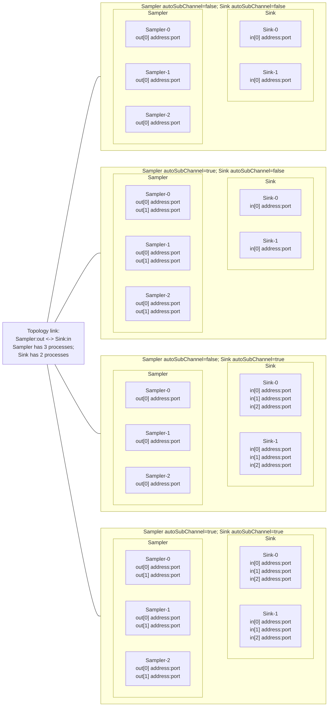
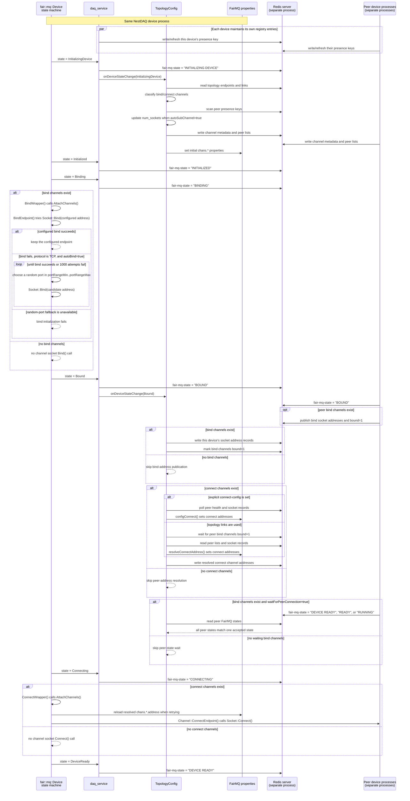
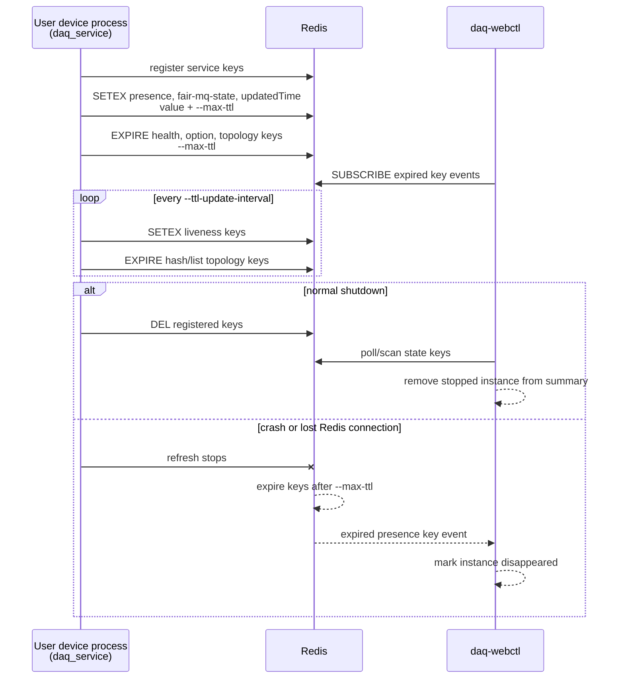

# NestDAQ FairMQ Plugins

[English](README.md) | [日本語](README.ja.md)

[Top: NestDAQ](../README.md) | [Previous: Scripts](../scripts/README.md) | [Next: Web controller](../controller/README.md)

NestDAQ installs three FairMQ plugins as shared libraries:

<a id="table-available-plugins-en"></a>
**Table 1: Available plugins and their libraries.**

| Plugin name        | Library                               | Purpose |
|--------------------|----------------------------------------|---------|
| `daq_service`      | `libFairMQPlugin_daq_service.so`       | Registers the FairMQ device in Redis, writes health/state and topology/channel data, and handles data acquisition (DAQ) commands. |
| `metrics`          | `libFairMQPlugin_metrics.so`           | Writes process metrics and FairMQ channel throughput metrics to Redis and RedisTimeSeries. |
| `parameter_config` | `libFairMQPlugin_parameter_config.so`  | Reads parameters from Redis and applies them to FairMQ program options. |

Each loaded plugin requires access to a Redis server.
RedisTimeSeries is required only when the `metrics` plugin is loaded because that plugin creates and updates time-series keys.
The `daq_service` and `parameter_config` plugins use core Redis commands and do not require RedisTimeSeries.

FairMQ and the executable that uses it define the exact option for loading plugins.
Use the plugin names above when enabling these libraries.

In the key patterns below, `{sep}` represents the configured separator.
The default separator is `:`.
The other placeholders are `{service}`, `{id}`, `{channel}`, and `{subindex}`.

## 1. Time To Live (TTL) Behavior

TTL handling is different for each plugin:

- `daq_service` manages Redis key expiration.
  It refreshes registry keys while the device is alive and uses expiration as a fallback cleanup mechanism when a device terminates unexpectedly.
- `metrics` does not issue Redis expiration commands for metric hashes or RedisTimeSeries keys.
  Instead, `--metrics-max-ttl` sets the age threshold for a one-time startup cleanup of stale instance fields in shared metric hashes.
  `--retention` controls RedisTimeSeries retention separately.
- `parameter_config` does not set TTLs on parameter keys.
  The producer or operator that writes those Redis keys controls their lifetime.

## 2. daq_service

`daq_service` is a Redis service-registry plugin.
It registers a device instance, refreshes TTLs, writes FairMQ state, health, topology, and channel data, and subscribes to DAQ commands.

<a id="21-runtime-options"></a>
### 2.1. Command-Line Options

All command-line options in this document are optional.
When an option is omitted, the plugin uses the default shown in [Table 2](#table-daq-service-options-en).

<a id="table-daq-service-options-en"></a>
**Table 2: `daq_service` command-line options.**

| Option                           | Default                    | Description |
|----------------------------------|----------------------------|-------------|
| `--service-name`                 | not set (option absent), then executable basename | Service name of this NestDAQ device process, used in Redis key paths and the health `serviceName` field. |
| `--uuid`                         | generated                  | UUID of this NestDAQ device process. This value supplies the default telemetry `service.instance.id` unless `--otel-service-instance-id` is set. When `--uuid` is omitted, the standard FairMQ device wrapper copies its generated telemetry UUID to this property; if the property is absent, the plugin generates a UUID. |
| `--host-ip`                      | detected/configured value  | Address of this NestDAQ device process, stored in the health `hostIp` field. A resolvable hostname is accepted. If omitted, the plugin uses the configured network interface or the default-route interface. |
| `--hostname`                     | detected/configured value  | Host name stored in the health `hostName` field. If omitted, the plugin uses the operating system hostname. |
| `--registry-uri`                 | `tcp://127.0.0.1:6379/0`   | Redis URI for the DAQ service registry. |
| `--separator`                    | `:`                        | Separator used when composing Redis keys. |
| `--max-ttl`                      | `5`                        | TTL in seconds for transient registry keys. |
| `--ttl-update-interval`          | `3`                        | TTL refresh interval in seconds. |
| `--startup-state`                | `idle`                     | FairMQ state to which the plugin automatically advances the device from `Idle` during startup: `idle`, `initializing-device`, `initialized`, `bound`, `device-ready`, `ready`, or `running`. |
| `--enable-uds`                   | `true`                     | Adds Unix domain socket (UDS) addresses only to ZeroMQ bind channels whose peers all have the same `hostIp` as this process. `true` and `1` enable it. |
| `--connect-config`               | not set (option absent)    | JavaScript Object Notation (JSON) string describing temporary message queue (MQ) channel connection parameters. Section 2.5.3 describes its structure and peer syntax. |
| `--max-retry-to-resolve-address` | `10`                       | Maximum retry count for resolving connect addresses. |

### 2.2. DAQ Service Identity Defaults

`daq_service` uses `--service-name` as this NestDAQ device process's service name in Redis key paths, the health `serviceName` field, and controller displays.
When `--service-name` is not set or is empty, the plugin uses the final path component of the executable name.

When set, the FairMQ `--id` option supplies the NestDAQ service instance id.
When `--id` is not set or is empty, `daq_service` allocates a numeric index in `daq_service{sep}service-instance-index{sep}{service}` and sets the instance id to `{service-name}-{index}`, such as `Sampler-0`.
The `--uuid` value is separate from the instance id and identifies the process for presence, health, and index reuse.
It also supplies the default telemetry `service.instance.id` unless `--otel-service-instance-id` is set explicitly.
When `--uuid` is omitted, the standard FairMQ device wrapper copies its generated telemetry UUID to the `uuid` property; if no `uuid` property exists, the plugin generates one.

<a id="23-redis-keys-written-or-read"></a>
### 2.3. Redis Keys Used by `daq_service`

Health data is a Redis hash containing device identity, host details, FairMQ state, and lifecycle timestamps.
`TopologyConfig` uses its `hostIp` field for connection resolution, and monitoring clients can read the other fields to report device status.

The `Writer / reader` column describes the operations performed by the `daq_service` plugin loaded in a NestDAQ device process.
Redis operations performed by `daq-webctl` are documented in [`controller/README.md`](../controller/README.md#6-redis-command-interface).

`createdTime`, `updated_time`, `updatedTime`, `start_time`, and `stop_time` are local-time strings in `YYYY-MM-DDTHH:MM:SS` format, with second precision and no time-zone offset.
`uptime` is the number of elapsed milliseconds since the `daq_service` plugin was created.
`start_time_ns` and `stop_time_ns` are elapsed nanoseconds from the same starting point, not Unix epoch timestamps.

<a id="table-daq-service-redis-keys-en"></a>
**Table 3: Redis keys used by `daq_service`.**

| Key pattern | Redis type | Fields / value | Writer / reader | Purpose |
|-------------|------------|----------------|-----------------|---------|
| `daq_service{sep}{service}{sep}{id}{sep}presence` | string | UUID string, refreshed with TTL | Written/read by `daq_service` | Presence marker for one device instance. |
| `daq_service{sep}{service}{sep}{id}{sep}health` | hash | `instanceID`, `uuid`, `hostName`, `hostIp`, `serviceName`, `fair:mq:state`, `createdTime`, `updated_time`, `uptime`; also `start_time`, `start_time_ns`, `stop_time`, `stop_time_ns` when run timing is recorded | Written/read by `daq_service` | Health and lifecycle metadata for one device instance. |
| `daq_service{sep}{service}{sep}{id}{sep}fair-mq-state` | string | FairMQ state name | Written/read by `daq_service`; read by `daq-webctl` | Current FairMQ state with TTL. |
| `daq_service{sep}{service}{sep}{id}{sep}updatedTime` | string | Last update timestamp | Written by `daq_service`; read by `daq-webctl` | Lightweight last-update key with TTL. |
| `daq_service{sep}{service}{sep}{id}{sep}option` | hash | Selected FairMQ program options such as `severity`, `file-severity`, `verbosity`, `color`, `log-to-file`, `id`, `io-threads`, `transport`, `network-interface`, `init-timeout`, shared-memory options, `rate`, and `session` | Written by `daq_service` | Current option values for monitoring and debugging. |
| `daq_service{sep}service-instance-index{sep}{service}` | hash | Field: numeric instance index; value: UUID | Read/write by `daq_service` | Allocates and reuses `{service}-{index}` instance IDs when `--id` is not given. |
| `run_info{sep}run_number` | string integer | Current or next run number | Read by `daq_service`; read/written by `daq-webctl` | Supplies the run number stored in run metadata. |
| `daqctl` | pub/sub channel | JSON DAQ command messages | Published by `daq-webctl` or another Redis client; subscribed by `daq_service` | Receives DAQ state-transition requests. |

### 2.4. DAQ Command Publish/Subscribe (Pub/Sub)

Redis Pub/Sub delivers each `daqctl` message to every user device process subscribed to the channel.
Redis does not filter messages by service or instance.
The fully qualified instance ID joins the `service-name`, configured separator, and instance ID.
For example, the default separator produces `Sampler:Sampler-0` from the service name `Sampler` and instance ID `Sampler-0`.
Each subscribing device's `daq_service` plugin compares the message's `services` and `instances` arrays with that device's service name and fully qualified instance ID.
The plugin ignores the message when those arrays do not select that device instance.

Messages published to `daqctl` have this shape:

```json
{
  "command": "change_state",
  "value": "RUN",
  "services": ["Sampler", "Sink"],
  "instances": ["Sampler:Sampler-0", "Sink:Sink-0"]
}
```

The `services` array selects service names, and the `instances` array selects instance ids.
Both arrays must be present and non-empty, and each can contain multiple entries.
The plugin stores the entries as sets, so their order and duplicates do not affect target matching.
The `daq_service` plugin currently handles only the exact, case-sensitive value `"change_state"` in the `command` field.
It ignores messages with any other `command` value.
The `value` field accepts one of the following FairMQ or NestDAQ command strings handled by the plugin:

```text
BIND, COMPLETE INIT, CONNECT, END, INIT DEVICE, INIT TASK, RESET DEVICE,
RESET TASK, RUN, STOP, exit, quit, reset, start
```

Any Redis client can publish a correctly formed message to `daqctl`; using `daq-webctl` is not required.
For example, the following `redis-cli` command publishes `RUN` to the `Sampler-0` device instance through a local Redis server:

```sh
# Publish a RUN request directly to the daqctl channel.
redis-cli -u redis://127.0.0.1:6379 PUBLISH daqctl \
  '{"command":"change_state","value":"RUN","services":["Sampler"],"instances":["Sampler:Sampler-0"]}'
```

Redis Pub/Sub channels are not scoped by Redis database number.
Adjust the Redis endpoint, channel name, and configured separator for the target environment.

Target selection supports the special lowercase string `"all"`:

- `services: ["all"]` targets every device, regardless of `instances`.
- `services: ["Sampler"]` with `instances: ["all"]` targets every instance of
  the `Sampler` service.
- `services: ["Sampler"]` with `instances: ["Sampler:Sampler-0"]` targets only
  the `Sampler-0` instance.
- Other devices ignore the message.

The implementation compares the literal string `"all"` without case conversion.
Use lowercase `"all"`, not `"ALL"` or `"All"`.

Examples:

```json
{
  "command": "change_state",
  "value": "STOP",
  "services": ["all"],
  "instances": ["all"]
}
```

```json
{
  "command": "change_state",
  "value": "RUN",
  "services": ["Sampler"],
  "instances": ["all"]
}
```

```json
{
  "command": "change_state",
  "value": "RUN",
  "services": ["Sampler"],
  "instances": ["Sampler:Sampler-0"]
}
```

Target multiple services and every instance under those services:

```json
{
  "command": "change_state",
  "value": "CONNECT",
  "services": ["Sampler", "Sink"],
  "instances": ["all"]
}
```

Target selected instances across services:

```json
{
  "command": "change_state",
  "value": "RUN",
  "services": ["Sampler", "Sink"],
  "instances": ["Sampler:Sampler-0", "Sampler:Sampler-1", "Sink:Sink-0"]
}
```

The last message is still delivered to every `daqctl` subscriber.
For example, `Sampler-2` and `Sink-1` receive the message but ignore it because their fully qualified instance IDs, `Sampler:Sampler-2` and `Sink:Sink-1`, are not listed in `instances`.

### 2.5. Topology and Channel Keys

The `TopologyConfig` object in each `daq_service` plugin reads the topology definition and publishes metadata for that device's channels and sockets.
The bind side publishes addresses first, and the connect side reads those addresses to configure its FairMQ sockets.

<a id="table-topology-channel-redis-keys-en"></a>
**Table 4: Redis keys for topology and channel configuration.**

| Key pattern | Redis type | Fields / value | Writer / reader | Purpose |
|-------------|------------|----------------|-----------------|---------|
| `daq_service{sep}{service}{sep}{id}{sep}channel{sep}{channel}` | hash | `name`, `type`, `method`, `address`, `transport`, buffer sizes, kernel sizes, `linger`, `rateLogging`, port range, `autoBind`, `num_sockets`, `autoSubChannel`, `bound`, `waitForPeerConnection` | Written by the `TopologyConfig` of the device instance identified by `{service}` and `{id}` for both bind and connect channels. During topology-link resolution, the connect side reads peer bind-channel metadata and its `bound` field. | Stored channel endpoint metadata. |
| `daq_service{sep}{service}{sep}{id}{sep}channel{sep}{channel}{sep}peer` | list | Peer channel key strings | Written by each device's `TopologyConfig`. During topology-link resolution, the connect side reads its own channel's peer list and the corresponding peer lists. | Peer list for the channel. |
| `daq_service{sep}{service}{sep}{id}{sep}socket{sep}chans.{channel}.{subindex}` | hash | Subchannel/socket parameters for the device instance plus `num_sockets` and `autoSubChannel` | The bind side's `TopologyConfig` writes bound socket addresses. The connect side reads those records, resolves its addresses, and writes its own socket records. | Per-subchannel connection metadata. |
| `daq_service{sep}topology{sep}endpoint...` | hash | Topology endpoint configuration | Written by `scripts/topology-*.sh` or another Redis client. Scanned and read by `TopologyConfig` in each device of the matching service. | External topology configuration used to define bind and connect channels. |
| `daq_service{sep}topology{sep}link...` | string | Topology link configuration | Written by `scripts/topology-*.sh` or another Redis client. Scanned and read by `TopologyConfig` in devices on both sides of the link. | External topology configuration used to link services and channels. |

The topology shell scripts write the `topology{sep}endpoint` and `topology{sep}link` keys through `redis-cli` before the devices start.
The supplied scripts use Redis database `0` and the `:` separator; edit their Redis URI and key construction when the deployment uses different values.
`scripts/mq-param.sh` writes parameter-configuration keys instead and does not write these topology keys.

#### 2.5.1. `autoSubChannel`

FairMQ stores each named channel as a `std::vector<fair::mq::Channel>`.
Each `fair::mq::Channel` wraps one FairMQ Socket, and the vector index identifies
a subchannel.
Device code selects one of the channel's subchannels with the index argument of `Send()` or
`Receive()`; omitting that argument selects index `0`.

For topology endpoint and link configuration, `autoSubChannel` controls whether `TopologyConfig` creates additional subchannels for that device's channel from peer device instances discovered through Redis presence keys.
Its default is `false`.

- `autoSubChannel=false` keeps the fixed subchannel count from the channel configuration.
  This setting is suitable for 1:1 or other fixed connections.
- `autoSubChannel=true` increases `num_sockets` from the discovered peer device instances on both bind and connect endpoints.
  This setting is suitable for n:m topologies in which the process discovers the number of peers or sockets while running.

Set `autoSubChannel=true` on a connect endpoint when it must resolve and connect
to all of multiple peer bind addresses, even if device code does not distinguish
the peers by subchannel index. On a bind endpoint, use it when a separate local
subchannel and bind address are required for each peer. A single bind socket can
instead accept connections from multiple peers with `autoSubChannel=false` when
the application does not need to distinguish those peers by local subchannel.

As [Figure 1](#figure-auto-subchannel-sockets-en) shows, each side's `autoSubChannel` setting changes the number of address-bearing channel sockets when a topology connects two services with different process counts.
[Figure 1](#figure-auto-subchannel-sockets-en) illustrates socket and subchannel counts, not fixed port assignments or message direction.
Invisible layout links keep `Sampler` on the left and `Sink` on the right; they are not data paths.



<a id="figure-auto-subchannel-sockets-en"></a>
**Figure 1: Effect of `autoSubChannel` settings on channel socket counts.**

The plugin normally calculates `num_sockets` from the topology.
For channels with `autoSubChannel=true`, `num_sockets` grows with the discovered peer device instances so that each FairMQ sub-socket can receive a distinct `address:port` and subchannel index.

Without using automatic configuration through the Redis topology, FairMQ's
`--channel-config` alone can fix both the local subchannel count and addresses.
[Table 5](#table-channel-configuration-modes-en) distinguishes this fixed mode
from Redis topology configuration and from a mixed configuration.

<a id="table-channel-configuration-modes-en"></a>
**Table 5: FairMQ and Redis topology channel-configuration modes.**

| Configuration mode | Local subchannel count | Addresses | Operational constraint |
|--------------------|------------------------|-----------|------------------------|
| FairMQ fixed configuration | Set with `--channel-config` using `numSockets` or repeated `address` fields. | Set directly with `address` fields. | Does not use Redis topology discovery or address resolution. Update the command-line configuration when the topology changes. |
| Redis topology configuration | Derived from topology endpoint `num_sockets` or discovered peers when `autoSubChannel=true`. | Resolved from bind-side records in Redis. | Requires matching topology endpoints and links. |
| Mixed configuration | FairMQ and Redis counts must be kept consistent explicitly. | Redis can resolve addresses when matching endpoints and links exist. | Configuration ownership is split between two sources; prefer one of the first two modes unless the deployment requires this combination. |

Before issuing `INIT DEVICE`, start every required peer process and confirm
that all of their presence keys have been registered in Redis. When every
device sees the same peer-key set and the same topology definitions, topology
discovery uses the same string-sort order and reproduces the same subchannel
assignment. Subchannel assignment is fixed from that peer set when the device
processes `INIT DEVICE`; it is not updated automatically after the device
reaches `DeviceReady`.

After adding, removing, or renaming a peer, return all affected devices to
`Idle` with `RESET DEVICE`, confirm that Redis reflects the changed peer set,
and run `INIT DEVICE` again. `RESET TASK`, which returns a device from `Ready`
to `DeviceReady`, does not rebuild the topology.

In the current implementation, topology discovery sorts peer keys in
`std::string` order before assigning local subchannel indices. Numeric suffixes
are not compared as numbers. For example, the peer keys `Sink-1`, `Sink-10`,
and `Sink-2` are ordered as shown below:

```text
subchannel 0 -> Sink-1
subchannel 1 -> Sink-10
subchannel 2 -> Sink-2
```

Treat an index as a local runtime position and query the current count. Do not
persist an assumption that index _N_ identifies the peer whose instance name
ends in `-N`.

<a id="selecting-local-subchannels-en"></a>
#### 2.5.2. Selecting local subchannels in device code

`Send()` and `Receive()` select an element of the local channel vector, not a
peer service or instance directly. Before selecting an index, obtain the
current count with `GetNumSubChannels()` and reject an out-of-range value.
Omitting the index selects local subchannel `0`.

```cpp
const auto kChannel = std::string{"data"};
const auto kSubchannel = std::size_t{2};
const auto kCount = GetNumSubChannels(kChannel);
if (kSubchannel >= kCount) {
    throw std::out_of_range{"configured subchannel does not exist"};
}

if (Send(message, kChannel, static_cast<int>(kSubchannel)) < 0) {
    LOG(error) << "failed to send on subchannel " << kSubchannel;
}
```

For explicit receive selection, use the corresponding overload:

```cpp
if (Receive(message, "in", static_cast<int>(kSubchannel)) < 0) {
    LOG(error) << "failed to receive on subchannel " << kSubchannel;
}
```

The selected side must have that many local subchannels. In topology-managed
configurations, set `autoSubChannel=true` on the side whose device code needs
one local subchannel per discovered peer. A connect endpoint also needs
`autoSubChannel=true` to resolve and connect to all of multiple peer bind
addresses even when device code does not select the peers explicitly. [Table 2 in the scripts
documentation](../scripts/README.md#table-topology-cardinality-en) gives the
settings for 1:N, N:1, and N:M connections for both bind/connect orientations.

`OnData(channel, callback)` registers the callback for the whole named channel;
it does not select one subchannel. FairMQ receives from whichever local
subchannel is ready and passes that local index to the callback. To receive
only one chosen subchannel, implement a manual receive loop with
`Receive(..., channel, index)` in `ConditionalRun()` or `Run()`. Do not register
any `OnData()` callback on that device, because registering one switches the
device to the callback-based input path instead of its manual run loop.

#### 2.5.3. `--connect-config`

`--connect-config` defines connect channels on the device process and their peers directly in a JSON string.
`TopologyConfig` sets `method=connect` for every top-level channel in this JSON.
When this option is not empty, `TopologyConfig` resolves connect addresses from these peer references instead of using topology-link peer resolution.

The following example defines a pull channel named `in` on the device receiving the option and connects it to subchannel `0` of the bind channel `out` owned by the `Sampler-0` instance of the `Sampler` service:

```json
{
  "in": {
    "type": "pull",
    "peer": "Sampler:Sampler-0:out[0]"
  }
}
```

The top-level key `in` names the channel configured on the device receiving the option, `type` is its FairMQ socket type, and `peer` identifies the remote channel.
With the default separator `:`, a fully qualified peer reference has the form `{service}:{instance-id}:{channel}[{subindex}]`.
The `[0]` suffix selects remote subchannel `0`; it is JSON data parsed by `TopologyConfig`, not C++ syntax or syntax used by a topology shell script's `link` command.
The `{subindex}` text in [Table 4](#table-topology-channel-redis-keys-en) is a placeholder, whereas `[0]` is an actual suffix in the peer reference.
`peer` accepts either one string or an array of strings.

The `[N]` suffix in `--connect-config` has a different scope from the index
passed to `Send()` or `Receive()`. The suffix selects subchannel _N_ of the
remote bind channel while resolving an address, whereas the C++ API index
selects a local channel-vector element. These two indices need not have the
same value.

An explicit suffix such as `[0]` selects only that subchannel regardless of `autoSubChannel`.
If the suffix is omitted and `autoSubChannel=false`, `TopologyConfig` selects subchannel `0`.
The current unindexed `autoSubChannel=true` path does not match the stored `chans.{channel}.{subindex}` key pattern reliably; use explicit `[N]` suffixes or topology endpoint/link configuration instead.

#### 2.5.4. Bind/Connect Sequence

`TopologyConfig` synchronizes bind and connect endpoints through Redis during FairMQ state transitions.
`Device`, `TopologyConfig`, and `FairMQ properties` in [Figure 2](#figure-bind-connect-sequence-en) belong to the same NestDAQ device process.
The Redis server and each peer device run in separate processes.



<a id="figure-bind-connect-sequence-en"></a>
**Figure 2: Bind and connect sequence during FairMQ state transitions.**

For each bind channel, `Channel::BindEndpoint()` first attempts the configured address.
If that attempt fails, the protocol is TCP, and `autoBind=true`, FairMQ selects a random port from the inclusive `portRangeMin` through `portRangeMax` range and retries the bind operation.
FairMQ makes at most 1000 random-port attempts; a non-TCP endpoint, `autoBind=false`, or exhaustion of all attempts causes bind initialization to fail.
Bind channels write their own addresses to Redis first.
Connect channels wait for the peer bind channel to become `bound=1`, resolve the peer socket addresses from Redis, and write the resulting FairMQ `chans.*` properties.
A bind channel with `waitForPeerConnection=false` skips the final wait for the peer to become ready.
The accepted Redis state values are `DEVICE READY`, `READY`, and `RUNNING`; all observed peers must report the same accepted value before the wait ends.
A reset or cancellation interrupts these waiting steps.
Each `daq_service` instance writes and refreshes the presence key and current FairMQ state for its own device process.
`TopologyConfig` resolves each peer address during the `Bound` state callback and stores it in the FairMQ `chans.*` properties.
After the state machine enters `Connecting`, `fair::mq::Device::ConnectWrapper()` calls `AttachChannels()`, which reaches `Channel::ConnectEndpoint()` and the transport socket's `Connect()` operation.
The virtual `fair::mq::Device::Connect()` lifecycle hook runs after channel attachment and is not the transport socket connection.

### 2.6. TTL Details (daq_service)

`daq_service` uses `--max-ttl` in seconds.
The default is `5` seconds.
`--ttl-update-interval` controls how often the plugin refreshes TTLs, with a default interval of `3` seconds.

[Figure 3](#figure-daq-service-ttl-refresh-en) summarizes the two ways the plugin refreshes Redis keys:

- `presence`, `fair-mq-state`, and `updatedTime` are updated with `SETEX`, which refreshes both the value and the TTL.
- `health`, `option`, topology channel keys, topology socket keys, and peer list keys are refreshed with `EXPIRE`.



<a id="figure-daq-service-ttl-refresh-en"></a>
**Figure 3: `daq_service` TTL refresh and expiration sequence.**

On normal shutdown, the plugin deletes its registered keys.
If the process crashes or loses its Redis connection, TTL expiration removes transient registry keys after the refreshes stop.

Redis keyspace notifications are not required for TTL expiration itself.
However, `daq-webctl` needs expired-key events to detect disappeared instances without waiting for its next polling cycle.
The `metrics` plugin uses `--metrics-max-ttl` to remove fields for instances that have stopped updating their metrics, not as a Redis key TTL.
The `parameter_config` plugin does not set TTLs on parameter keys.

## 3. metrics

`metrics` records process-level metrics and FairMQ channel throughput metrics in Redis.
Process central processing unit (CPU) usage follows the top/htop convention: one fully used CPU core is approximately `100`, and two fully used cores are approximately `200`.
Memory usage is the current resident set size (RSS) in mebibytes (MiB).

<a id="31-runtime-options"></a>
### 3.1. Command-Line Options

<a id="table-metrics-options-en"></a>
**Table 6: `metrics` command-line options.**

| Option                        | Default | Description |
|-------------------------------|---------|-------------|
| `--proc-stat-update-interval` | `1000`  | Update interval in milliseconds for process CPU and memory metrics. |
| `--metrics-uri`               | not set (uses `--registry-uri`) | Redis URI for metrics. When omitted, `--registry-uri` is used; an explicitly empty value disables the metrics Redis connection. |
| `--retention`                 | `0`     | Maximum RedisTimeSeries sample age in milliseconds relative to the series' greatest timestamp. `0` disables retention-based trimming. |
| `--recreate-ts`               | `true`  | Delete registered RedisTimeSeries keys on transition to `Ready` and create them with the configured retention and labels on transition to `Running`. |
| `--metrics-max-ttl`           | `3000`  | Age threshold in milliseconds for the one-time stale-field cleanup performed when the plugin starts. A value of zero or less disables this cleanup. |

### 3.2. Redis Keys Written or Read

In [Table 7](#table-metrics-redis-keys-en), `metrics` means the plugin instance loaded in each NestDAQ device process.
The writer/reader column lists components in this repository that directly access each key for metrics processing.
External visualization tools, such as Grafana or SlowDash configured to access Redis, may read these metrics and use them to create dashboards and plots.
The current `daq-webctl` implementation does not read these metrics keys.

<a id="table-metrics-redis-keys-en"></a>
**Table 7: Redis keys used by `metrics`.**

| Key pattern | Redis type | Fields / value | Writer / reader | Purpose |
|-------------|------------|----------------|-----------------|---------|
| `metrics{sep}created-time` | hash | Field: `{id}`; value: creation timestamp | `metrics` writes; no dedicated in-repo reader | Device creation time. |
| `metrics{sep}hostname` | hash | Field: `{id}`; value: hostname | `metrics` writes; no dedicated in-repo reader | Host metadata. |
| `metrics{sep}host-ip` | hash | Field: `{id}`; value: host IP address | `metrics` writes; no dedicated in-repo reader | Host metadata. |
| `metrics{sep}state` | hash | Field: `{id}`; value: FairMQ state name | `metrics` writes; no dedicated in-repo reader | Current state as a string. |
| `metrics{sep}state-id` | hash | Field: `{id}`; value: numeric FairMQ state ID | `metrics` writes; no dedicated in-repo reader | Current state as a numeric value. |
| `metrics{sep}last-update` | hash | Field: `{id}`; value: timestamp | `metrics` writes; no dedicated in-repo reader | Last metrics update time. |
| `metrics{sep}last-update-ns` | hash | Field: `{id}`; value: timestamp in nanoseconds | `metrics` writes and reads during startup cleanup | Used to identify stale metric fields. |
| `metrics{sep}cpu-stat` | hash | Field: `{id}`; value: CPU percent | `metrics` writes; no dedicated in-repo reader | Process CPU usage. |
| `metrics{sep}ram-stat` | hash | Field: `{id}`; value: current RSS MiB | `metrics` writes; no dedicated in-repo reader | Process memory usage. |
| `metrics{sep}msg-in`, `metrics{sep}msg-out` | hash | Field: `{id}{sep}{channel}[{subindex}]`; value: messages per second | `metrics` writes and reads during startup cleanup | Current channel message rate. |
| `metrics{sep}mb-in`, `metrics{sep}mb-out` | hash | Field: `{id}{sep}{channel}[{subindex}]`; value: MiB per second | `metrics` writes and reads during startup cleanup | Current channel throughput. |
| `metrics{sep}msg-in-sum`, `metrics{sep}msg-out-sum` | hash | Field: `{id}{sep}{channel}[{subindex}]`; value: cumulative rounded message count | `metrics` writes and reads during startup cleanup | Accumulated message counts. |
| `metrics{sep}mb-in-sum`, `metrics{sep}mb-out-sum` | hash | Field: `{id}{sep}{channel}[{subindex}]`; value: cumulative MiB | `metrics` writes and reads during startup cleanup | Accumulated throughput. |
| `metrics{sep}num-msg`, `metrics{sep}mb` | hash | Field: `{id}{sep}{channel}[{subindex}].in` or `.out`; value: current rate | `metrics` writes and reads during startup cleanup | Direction-qualified current rates. |
| `metrics{sep}num-msg-sum`, `metrics{sep}mb-sum` | hash | Field: `{id}{sep}{channel}[{subindex}].in` or `.out`; value: cumulative value | `metrics` writes and reads during startup cleanup | Direction-qualified cumulative values. |
| `ts{sep}{id}{sep}cpu-stat`, `ts{sep}{id}{sep}ram-stat`, `ts{sep}{id}{sep}state-id` | RedisTimeSeries | Samples added with `TS.ADD`; labels include `service`, `id`, and data type | `metrics` checks existence, creates, and writes; no in-repo sample reader | Process and state time series. |
| `ts{sep}{id}{sep}{channel}[{subindex}]{sep}...` | RedisTimeSeries | Channel rate and cumulative samples with labels such as `name`, `socket`, and `transport` | `metrics` checks existence, creates, and writes; no in-repo sample reader | Channel time series. |

#### 3.2.1. RedisTimeSeries Labels

The `metrics` plugin adds labels when it explicitly creates a RedisTimeSeries key.
Visualization tools can filter or group series by these labels.

<a id="table-redistimeseries-labels-en"></a>
**Table 8: Labels attached to RedisTimeSeries keys.**

| Label | Series | Value |
|-------|--------|-------|
| `service` | All process, state, and channel series | The value of the FairMQ `service-name` property. |
| `id` | All process, state, and channel series | The value of the FairMQ device `id` property. |
| `data` | All process, state, and channel series | The measured value type, such as `cpu-stat`, `ram-stat`, `state-id`, `msg-in`, `msg-out`, `mb-in`, or `mb-out`. Cumulative series use the corresponding `-sum` suffix. |
| `name` | Channel series only | The FairMQ subchannel name in `<channel>[<index>]` form. |
| `socket` | Channel series only | The FairMQ socket type, such as `push`, `pull`, `pub`, or `sub`. |
| `transport` | Channel series only | The FairMQ transport configured for the channel. |

These labels are applied only when the plugin runs `TS.CREATE`.
If `--recreate-ts=false` and `TS.ADD` implicitly creates a missing series, that series does not receive these labels.

The following commands use `redis-cli` to read RedisTimeSeries data from the default metrics database, DB `1`.
Replace the URI, key names, timestamps, and label filters for the target environment.
In this shell example, lines beginning with `#` are comments.

```bash
# Read the latest sample from one process CPU series.
redis-cli -u redis://127.0.0.1:6379/1 \
  TS.GET 'ts:Sampler-0:cpu-stat'

# Read every sample from one channel throughput series.
redis-cli -u redis://127.0.0.1:6379/1 \
  TS.RANGE 'ts:Sampler-0:out[0]:mb-out' - +

# Read all series whose service label is Sampler over a timestamp range.
redis-cli -u redis://127.0.0.1:6379/1 \
  TS.MRANGE 1710000000000 1710003600000 FILTER service=Sampler
```

`TS.GET` returns the latest sample, `TS.RANGE` reads one series, and `TS.MRANGE` selects multiple series using labels.
Use `-` and `+` as the `TS.RANGE` boundaries to request the complete available range.

The plugin listens for FairLogger throughput lines from FairMQ and parses records such as these input, output, and Data Quality Monitoring (DQM) channel examples:

```text
out[0]: in: 0 (0 MB) out: 67 (8.9 MB)
in[0]: in: 123 (4.5 MB) out: 0 (0 MB)
dqm[0]: in: 0 (0 MB) out: 5 (0.2 MB)
```

The `out` and `dqm` examples are output-only, while the `in` example is input-only.
FairMQ channels commonly transfer data in one direction, so either the input or output rate is usually zero.
Only indexed subchannel records are used for channel throughput metrics.

### 3.3. TTL and Retention Details (metrics)

In this section, a shared metric hash means one of the `metrics{sep}...` Redis hashes listed in [Table 7](#table-metrics-redis-keys-en).
This is a descriptive term used by this document, not a Redis data-type name.
One hash key stores fields for multiple device instances: each field name is an instance ID, and its value is that instance's metric.
For example, with the default `:` separator, the following command may return CPU metrics for three instances:

```bash
redis-cli --raw -u redis://127.0.0.1:6379/1 HGETALL metrics:cpu-stat
```

```text
Sampler-0
12.5
Sampler-1
8.2
Sink-0
4.1
```

The `ts{sep}...` RedisTimeSeries keys in [Table 7](#table-metrics-redis-keys-en) are separate per-instance keys and are not shared metric hashes.

<a id="table-metric-cleanup-mechanisms-en"></a>
**Table 9: Metric cleanup and retention mechanisms.**

| Mechanism | Target | When removal is evaluated | Result |
|-----------|--------|---------------------------|--------|
| `--metrics-max-ttl` | Fields for stale instances in shared metric hashes | Once, when a `metrics` plugin instance starts | Removes matching hash fields with `HDEL` |
| `--retention` | Old samples in each RedisTimeSeries key | When a later sample advances that series' greatest timestamp | Trims samples outside the retention window |
| Redis `EXPIRE` | A complete Redis key | When the key's wall-clock timeout elapses | Deletes the key and all of its contents; not used by `metrics` |

`--metrics-max-ttl` is not a Redis key's TTL.
It is the maximum allowed age in milliseconds of an instance's timestamp in `metrics{sep}last-update-ns`.
When the plugin starts, it performs one cleanup pass and removes fields belonging to older instances from the shared metric hashes with `HDEL`.
The cleanup is necessary because a key-level `EXPIRE` would remove the complete shared hash, including fields for instances that are still updating their metrics.
If `--metrics-max-ttl` is zero or negative, this cleanup is disabled.

`--retention` applies only to RedisTimeSeries keys created by the plugin.
The value is passed to `TS.CREATE ... RETENTION` in milliseconds.
[RedisTimeSeries retention](https://redis.io/docs/latest/commands/ts.create/) is the maximum sample age relative to the greatest timestamp reported to that time-series key, not a wall-clock lifetime for the key.
RedisTimeSeries evaluates and trims older samples when later samples are written.
Trimming removes samples older than the retention window but does not delete the time-series key or its labels.
A value of `0` disables retention-based sample trimming.

RedisTimeSeries keys can use the generic Redis [`EXPIRE`](https://redis.io/docs/latest/commands/expire/) command, but the `metrics` plugin does not use it.
`EXPIRE` would delete the complete time-series key rather than trim individual samples.
The process and channel samples pass `*` as the timestamp argument to `TS.ADD`.
RedisTimeSeries therefore records the current Unix time in milliseconds when the Redis server processes each command.
The timestamp comes from the Redis server host clock, not from the device process clock or the exact time at which the metric was measured; command buffering and network delay can shift it to a slightly later time.

With `--recreate-ts=true`, the plugin deletes its registered RedisTimeSeries keys on transition to `Ready` and creates them again on transition to `Running`.
Before each `TS.CREATE`, the plugin also deletes any existing key with the same name.
Existing samples in those keys are therefore discarded, and the newly created keys receive the configured retention and labels.
With `--recreate-ts=false`, the plugin does not delete and recreate RedisTimeSeries keys with `TS.CREATE` during the `Ready` and `Running` transitions.
If a later `TS.ADD` creates a missing key automatically, the plugin's `--retention` value and labels are not applied to that key.

## 4. parameter_config

`parameter_config` reads Redis parameter keys and uses `SetProperty` to apply their values to FairMQ program options.
See [Command-Line Options and Type Conversion](../examples/README.md#43-command-line-options-and-type-conversion) for `fair::mq::ProgOptions`, `fConfig`, and device-side access.

Redis keyspace notifications are a Redis feature that publishes Pub/Sub events when keys change.
`parameter_config` subscribes to these events to reload changed parameters without restarting the device process; this document calls that behavior live reload.

The plugin reads and applies parameters at two times:

1. **Initial parameter loading:** During plugin construction, after command-line parsing and before the FairMQ device state machine starts, the plugin reads the group and instance parameter keys once and applies their values with `SetProperty`. This operation finishes before `Init()` or `InitTask()` runs.
2. **Live reload:** After startup, the keyspace-notification subscriber receives a change event for the group or instance parameter hash. The subscriber reads the parameters again and calls `SetProperty` for the values found in Redis.

Each read processes the group parameter key first and the instance parameter key second.
If both keys define the same property, the instance-specific value is applied last and overrides the group value.

<a id="41-runtime-options"></a>
### 4.1. Command-Line Options

<a id="table-parameter-config-options-en"></a>
**Table 10: `parameter_config` command-line options.**

| Option                   | Default | Description |
|--------------------------|---------|-------------|
| `--parameter-config-uri` | not set (uses `--registry-uri`) | Redis URI for parameter configuration. When omitted, `--registry-uri` is used; an explicitly empty value disables the parameter Redis connection. |

### 4.2. Redis Keys Read or Subscribed

Scripts that invoke a Redis client, or applications that use a Redis client directly, write the parameter values.
The supplied `scripts/mq-param.sh` is one such script for hash parameters, but it does not provide examples for every supported Redis data type.
See the [`mq-param.sh` documentation](../scripts/README.md#31-mq-paramsh) for its implementation and argument examples.

<a id="table-parameter-config-redis-keys-en"></a>
**Table 11: Redis keys used by `parameter_config`.**

| Key pattern | Redis type | Fields / value | Writer / reader | Purpose |
|-------------|------------|----------------|-----------------|---------|
| `parameters{sep}{id}` | hash | Field: option name; value: option value string | A script invoking a Redis client, or another Redis client, writes; `parameter_config` reads | Instance-specific parameter set. |
| `parameters{sep}{group}` | hash | Field: option name; value: option value string | A script invoking a Redis client, or another Redis client, writes; `parameter_config` reads | Group default parameter set. `{group}` is derived from `{id}` by removing a trailing numeric `-N` suffix. |
| `parameters{sep}{id}{sep}*` | string/list/hash/set/zset | Additional structured parameters below the instance key | A script invoking a Redis client, or another Redis client, writes; `parameter_config` scans and reads | Per-instance structured parameter values. |
| `parameters{sep}{group}{sep}*` | string/list/hash/set/zset | Additional structured parameters below the group key | A script invoking a Redis client, or another Redis client, writes; `parameter_config` scans and reads | Group-level structured parameter values. |
| `__keyspace@{db}__:{key}` | pub/sub channel | Redis keyspace notification events | Redis publishes; `parameter_config` subscribes | Triggers live reload for the instance and group parameter keys. |

The following examples use the default `:` separator and show how additional structured Redis keys become FairMQ properties.

<a id="table-redis-property-mapping-en"></a>
**Table 12: Mapping from Redis commands to FairMQ properties.**

| Redis command | Resulting FairMQ property |
|---------------|---------------------------|
| `SET parameters:Sampler-0:text Hello` | `text` with the string value `Hello` |
| `HSET parameters:Sampler-0:limits low 1 high 10` | `limits:low` with string value `1` and `limits:high` with string value `10` |
| `RPUSH parameters:Sampler-0:inputs in0 in1` | `parameters:Sampler-0:inputs` with a `std::vector<std::string>` value |
| `SADD parameters:Sampler-0:tags primary monitor` | `parameters:Sampler-0:tags` with a `std::unordered_set<std::string>` value |
| `ZADD parameters:Sampler-0:weights 1.0 low 2.0 high` | `parameters:Sampler-0:weights` with a `std::unordered_map<std::string, double>` member-to-score value |

For a string key, the last path component becomes the property name.
For a nested hash, the last path component prefixes each hash field.
List, set, and sorted-set readers retain the complete Redis key as the property name.

During live reload, the plugin updates FairMQ program options without restarting the device process or repeating a state transition.
The plugin subscribes to notifications for the top-level group and instance hash keys.
Changing only a nested structured key does not directly trigger a reload.
The plugin updates program properties, but a device changes its behavior immediately only if its implementation observes property changes or reads the property again.
The current implementation overwrites values found in Redis; deleting a field or key does not clear the corresponding existing FairMQ program option value.

When `daq-webctl` connects to the same Redis server, it sets `notify-keyspace-events` to `AKE`, which enables the notifications required for live reload.
No additional Redis setting is needed in this configuration.
Initial parameter loading does not require keyspace notifications.
See the [`daq-webctl` Redis command interface](../controller/README.md#6-redis-command-interface) for that behavior.

### 4.3. TTL Details (parameter_config)

`parameter_config` does not call `EXPIRE`, `SETEX`, or `DEL` for parameter keys.
It reads parameter keys and subscribes to keyspace notifications for live reloads.
If parameter keys should expire, the writer must set their TTL.
