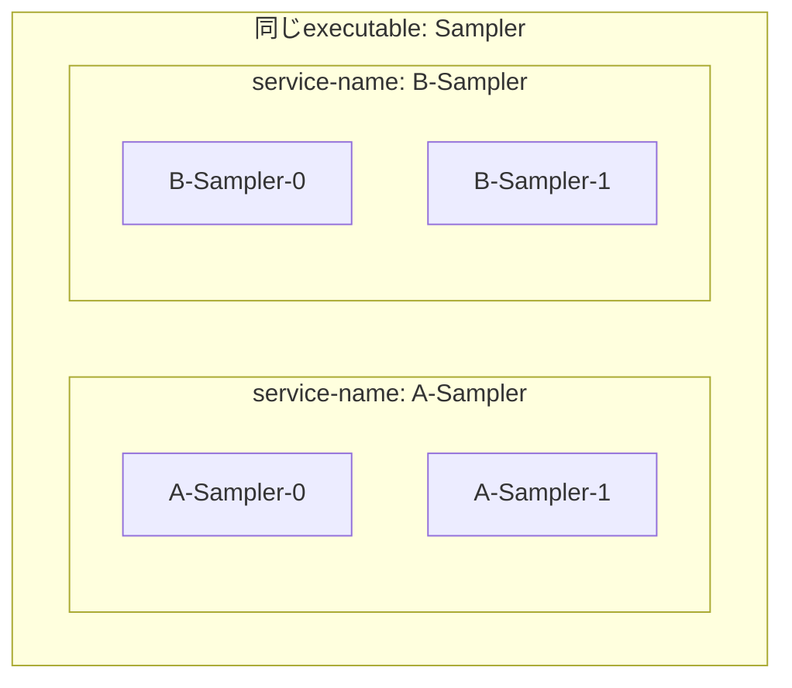
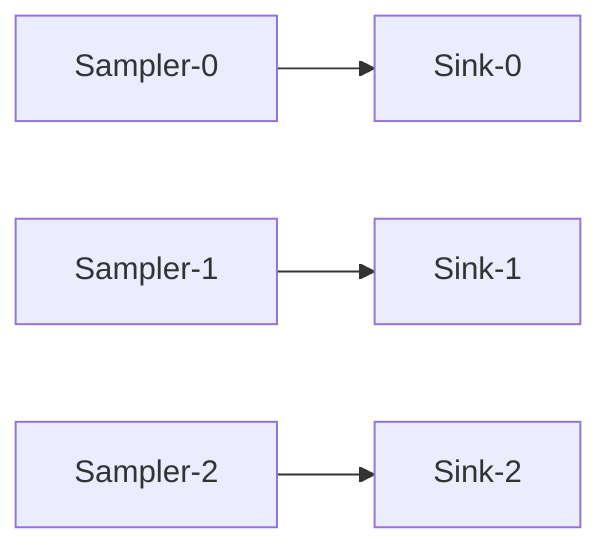
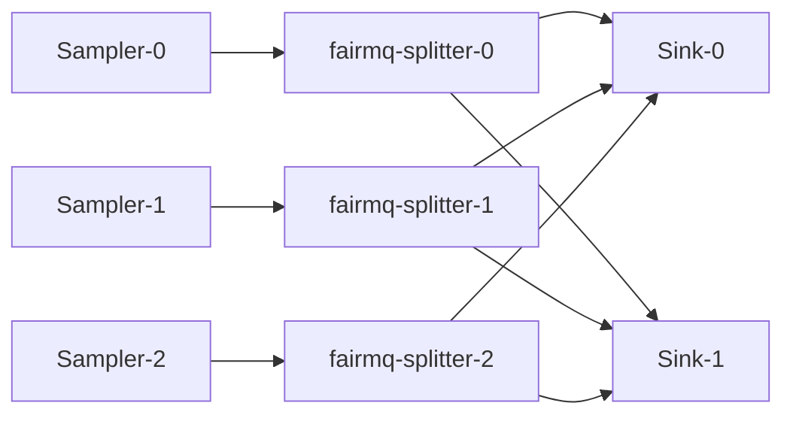
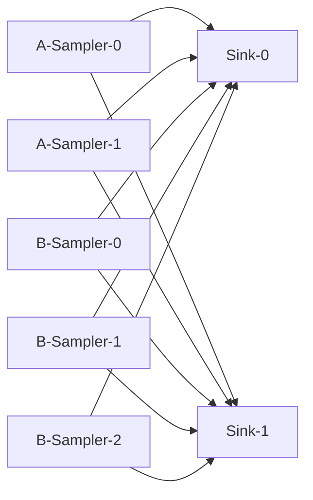

# スクリプト

[English](README.md) | [日本語](README.ja.md)

[トップ: NestDAQ](../README.ja.md) | [前へ: サンプル](../examples/README.ja.md) | [次へ: プラグイン](../plugins/README.ja.md)

このディレクトリには、NestDAQプラグインの使用方法を示すスクリプトがあります。
スクリプトは別の作業ディレクトリへコピーできます。
Redisへ設定を登録したり、Redisから設定を読み取ったりするスクリプトを実行する前に、
Redisサーバーを起動してください。

<a id="1-helper-script-to-launch-a-data-acquisition-daq-process"></a>
## 1. データ収集 (DAQ) プロセス起動用ヘルパースクリプト

<a id="11-start_devicesh"></a>
### 1.1. start_device.sh

<a id="111-basic-invocation"></a>
#### 1.1.1. 基本的な起動方法

このスクリプトはNestDAQプラグインを使用してFairMQデバイスを起動します。
CMakeは`scripts/start_device.sh.in`から`start_device.sh`を生成し、
`<install-prefix>/scripts/`へインストールします。
このリポジトリが提供するデバイス、またはFairMQが提供する`fairmq-`を含む実行ファイルを指定してください。
デバイス名以降の引数はデバイスおよびFairMQへ渡されるため、`--service-name`などのプラグインオプションと`--max-iterations`などのデバイス固有オプションを同じコマンドラインで指定できます。

このREADMEのシェル実行例では、`#`で始まる行はシェルのコメントであり、実行されません。

```bash
  # install済みSamplerをdefault optionで起動する。
  # ./start_device.sh [device-name] [options ...]
  ./start_device.sh Sampler
```

```bash
  # executable pathを指定してFairMQ deviceを起動する。
  ./start_device.sh /your-fairmq-install-path/bin/fairmq-splitter
```

<a id="112-startup-sequence"></a>
#### 1.1.2. 起動シーケンス

NestDAQのサンプルをローカル環境で実行する場合は、`start_device.sh`でデバイスを
起動する前に外部サービスを起動し、必要な設定を登録します。

- テレメトリーのエクスポートが必要な場合は、最初にOpenTelemetry Collector、OpenSearch、
  OpenSearch Dashboardsを起動します。`share/otel-collector-compose/opensearch/`の
  Compose構成を`docker compose`または`podman compose`で起動します。
- Redisサーバーを起動します。
- ブラウザユーザーインターフェースからデバイスを制御する場合は`daq-webctl`を起動します。
- `topology-*.sh`スクリプトでトポロジー設定をRedisへ登録します。
- サンプルが`parameter_config`プラグインからパラメーターを読み取る場合は、`mq-param.sh`でパラメーター設定をRedisへ登録します。

ローカル環境での完全な起動手順は[`examples/README.ja.md`](../examples/README.ja.md)を参照してください。

<a id="113-redis-server-and-plugin-configuration"></a>
#### 1.1.3. Redisサーバーとプラグインの設定

`start_device.sh`が固定しない設定は、デバイスまたはプラグインのコマンドラインオプションで変更できます。
スクリプトが生成する既定値は、以下に示す対応済みの環境変数を使用するか、スクリプト自体を編集して変更します。
スクリプトが生成するオプションはユーザー引数の後へ追加されるため、同名のコマンドラインオプションでは上書きできません。

`start_device.sh`は、すべてのNestDAQ Redis connectionに`NESTDAQ_REDIS_SERVER`を使用します。
既定値は`127.0.0.1:6379`です。
スクリプトはDAQサービスレジストリをRedisデータベース (DB) `0`、メトリクスをDB `1`、パラメーター設定をDB `2`へ割り当てます。

スクリプトの該当部分は次のとおりです。

```bash
NESTDAQ_REDIS_SERVER=${NESTDAQ_REDIS_SERVER:-127.0.0.1:6379}

DAQSERVICE_URI=" --registry-uri tcp://${NESTDAQ_REDIS_SERVER}/0"
METRICS_URI=" --metrics-uri tcp://${NESTDAQ_REDIS_SERVER}/1"
CONFIG_URI=" --parameter-config-uri tcp://${NESTDAQ_REDIS_SERVER}/2"
```

`daq_service`はサービスレジストリ、DAQコマンド、トポロジーメタデータにDB `0`を使用します。
`metrics`プラグインはDB `1`を使用します。
`parameter_config`プラグインはDB `2`からデバイスオプションの値を読み取ります。

スクリプトはプラグイン検索パスとプラグイン読み込み順も設定します。

```bash
PLUGIN_SEARCH_PATH=" -S '<$PLUGIN_LIBDIR'"
DAQSERVICE_PLUGIN=" -P daq_service"
METRICS_PLUGIN=" -P metrics"
CONFIG_PLUGIN=" -P parameter_config"

var+=$PLUGIN_SEARCH_PATH
var+=$DAQSERVICE_PLUGIN
var+=$METRICS_PLUGIN
var+=$CONFIG_PLUGIN
```

`-S`はFairMQプラグイン検索パスへディレクトリを追加します。
このスクリプトの`-S '<$PLUGIN_LIBDIR'`は、インストール済みNestDAQプラグインディレクトリを検索パスの先頭へ追加します。
このオプションはプラグインライブラリを検索する場所だけを制御します。

`-P`は読み込むプラグインを選択します。
FairMQは最終コマンドライン上の`-P`オプションの順序に従ってプラグインを読み込みます。
`start_device.sh`は`daq_service`、`metrics`、`parameter_config`の順で渡します。
`-S`でディレクトリを追加すると検索優先度は変わりますが、読み込むプラグインや読み込み順は変わりません。
読み込むプラグインとその順序は`-P`エントリーで制御されます。

<a id="114-opentelemetry-options"></a>
#### 1.1.4. OpenTelemetryオプション

`start_device.sh`はOpenTelemetry (OTel) ログをOpenTelemetry Protocol (OTLP) gRPCでローカルOpenTelemetry Collectorへ送信します。
既定のエンドポイントは`localhost:4317`です。
別のエンドポイントを使用するには`NESTDAQ_OTLP_GRPC_ENDPOINT`を設定します。

スクリプトはOTelログオプションを次のように構築します。

```bash
NESTDAQ_OTLP_GRPC_ENDPOINT=${NESTDAQ_OTLP_GRPC_ENDPOINT:-localhost:4317}
NESTDAQ_START_DEVICE_OTEL_LOG_SEVERITY=${NESTDAQ_START_DEVICE_OTEL_LOG_SEVERITY:-info}

var+=" --otel-log-protocol=otlp-grpc"
var+=" --otel-log-endpoint-grpc=${NESTDAQ_OTLP_GRPC_ENDPOINT}"
var+=" --otel-log-severity=${NESTDAQ_START_DEVICE_OTEL_LOG_SEVERITY}"
```

プロセスの実行場所に応じてエンドポイントを選択します。

- ホストプロセスからComposeが公開したCollectorポートへ接続：`localhost:4317`。
- OpenSearch Composeネットワーク内のNestDAQデバイスコンテナまたは`daq-webctl`コンテナ：`otel-collector:4317`。
- Composeネットワーク外のコンテナからホストで公開したコレクターポートへ接続：Dockerでは通常`host.docker.internal:4317`、Podmanでは通常`host.containers.internal:4317`。

```bash
# Podmanのhost alias経由でcollectorへ接続する。
NESTDAQ_OTLP_GRPC_ENDPOINT=host.containers.internal:4317 ./start_device.sh Sampler
```

`--otel-log-protocol`、`--otel-metric-protocol`、`--otel-trace-protocol`では、
`console`、`otlp-grpc`、`otlp-http`、空文字列 (`""`) の4種類を指定できます。
空文字列を指定すると、対象シグナルのエクスポートは無効になります。
複数のエクスポーターを有効にする場合は、プロトコルをコンマ区切りで指定します。
`start_device.sh`を使用する場合、既定のログプロトコルを変更するには、スクリプトが生成する
`--otel-log-protocol`オプションを編集します。

OTelメトリクスとOTelトレースは既定で無効です。
OTLP gRPCまたはOTLP HTTPでエクスポートする場合、デバッグ用コンソールエクスポーターへ出力する場合、
または空文字列のままエクスポートを無効にする場合は、`start_device.sh`内のメトリクス/トレースの例を
uncommentまたは編集します。

FairLoggerのコンソール出力は`--severity nolog`によって既定で無効です。
有効にするには`NESTDAQ_FAIRLOGGER_CONSOLE_SEVERITY`を変更します。
OTelログのエクスポートは別の`NESTDAQ_START_DEVICE_OTEL_LOG_SEVERITY`しきい値を使用するため、FairLoggerのコンソール出力が無効でもCollectorへログを送信します。

```bash
NESTDAQ_FAIRLOGGER_CONSOLE_SEVERITY=${NESTDAQ_FAIRLOGGER_CONSOLE_SEVERITY:-nolog}

var+=" --severity ${NESTDAQ_FAIRLOGGER_CONSOLE_SEVERITY}"
```

```bash
# FairLoggerとOTel exportの両方でdebug levelのmessageを出力する。
NESTDAQ_FAIRLOGGER_CONSOLE_SEVERITY=debug4 NESTDAQ_START_DEVICE_OTEL_LOG_SEVERITY=debug4 ./start_device.sh Sampler
```

<a id="115-starting-devices-with-a-service-name"></a>
#### 1.1.5. サービス名を指定した起動方法

次の例は、`Sampler`をサービス名`A-Sampler`で起動し、`ConditionalRun()`の実行頻度を1秒に1回へ制限します。

```bash
# rateを制限したSamplerを固有のservice nameで起動する。
./start_device.sh Sampler --service-name A-Sampler --rate 1
```

`start_device.sh`自身は`--service-name`を設定しません。
デバイス名以降のオプションはFairMQおよびNestDAQプラグインへそのまま渡されます。
`--service-name`または`--id`が空の場合に使用する`daq_service`の既定値については、[`plugins/README.ja.md#22-daq-service-identity-defaults`](../plugins/README.ja.md#22-daq-service-identity-defaults)を参照してください。

```bash
# 2つのSampler processを別々のservice groupとして登録する。
./start_device.sh Sampler --service-name A-Sampler
./start_device.sh Sampler --service-name B-Sampler
```

このグループ化を[図1](#figure-service-name-groups-ja)に示します。
例えば同じ`Sampler` programを、Redis、`daq-webctl`、telemetry attribute上で`A-Sampler-*`と`B-Sampler-*`として表示できます。



<a id="figure-service-name-groups-ja"></a>
**図1：同じ実行ファイルのインスタンスを分けるサービス名グループ。**

<a id="2-topology-configuration"></a>
## 2. トポロジー設定

[表1](#table-default-endpoint-parameters-ja)にエンドポイントパラメーターの既定値を示します。

<a id="table-default-endpoint-parameters-ja"></a>
**表1：エンドポイントパラメーターの既定値。**

| フィールド | 既定値 |
| -- | -- |
| 名前 | |
| type | |
| method | |
| address | |
| transport | zeromq |
| sndBufSize | 1000 |
| rcvBufSize | 1000 |
| sndKernelSize | 0 |
| linger | 500 |
| rateLogging | 1 |
| portRangeMin | 22000 |
| portRangeMax | 32000 |
| autoBind | true |
| numSockets | 0 (プラグインが自動計算) |
| autoSubChannel | false |
| bound | (userは設定しない) |
| waitForPeerConnection | true |

最後の3 parameterはNestDAQ固有で、その他はFairMQで定義されています。

`topology-1-1.sh`のような固定1:1 connectionには`autoSubChannel false`を使用します。
`topology-n-n-m.sh`や`topology-2samplers-n-m.sh`のようなn:mファンアウト/ファンイントポロジーでは`autoSubChannel true`を使用し、プラグインが相手側のサブチャネルを検出して`numSockets`を更新します。
チャネルの表現、`--connect-config`の接続相手記法、プラグインの詳細な動作については、
[`plugins/README.ja.md#251-autosubchannel`](../plugins/README.ja.md#251-autosubchannel)を参照してください。

トポロジースクリプトはエンドポイントとリンク定義をRedis DB `0`へ書き込みます。
ヘルパー関数は次の形式です。

```bash
server=redis://127.0.0.1:6379/0

function endpoint () {
  redis-cli -u $server hset daq_service:topology:endpoint:$1:$2 ${@:3}
}

function link () {
  redis-cli -u $server set daq_service:topology:link:$1:$2,$3:$4 none
}
```

`endpoint SERVICE CHANNEL ...`はRedisハッシュキー
`daq_service:topology:endpoint:SERVICE:CHANNEL`へフィールドを書き込みます。
フィールドには`type push`、`method bind`、`autoSubChannel false`などFairMQソケットの設定を記述します。

Redisデータベースをフラッシュするとは、選択したデータベース内のすべてのキーと値を削除し、内容を空にする操作です。
データベース番号自体を削除する操作ではありません。

`endpoint()`ヘルパーはRedisの`HSET`を使用するため、トポロジースクリプトを再実行しても、そのスクリプトが書き込むフィールドだけを更新します。
新しいスクリプトの内容で省略したフィールドは削除されません。
例えば`autoSubChannel true`をRedisへ書き込んだ後、スクリプトから`autoSubChannel`を削除して再実行しても、Redisフィールドは`true`のままです。
`false`へ戻すには、`autoSubChannel false`を明示してトポロジースクリプトを再実行します。
トポロジーを最初から再構築する場合は、新しいトポロジーを登録する前に`daq_service` / `TopologyConfig`が使用するRedisデータベースをフラッシュします。
同じ`HSET`規則は、`mq-param.sh`などのヘルパーが書き込むパラメーターハッシュにも適用されます。
スクリプトでフィールドを省略しても、既存のRedisハッシュフィールドは削除されません。

ユーザーが実装したデバイスのチャネル接続設定を変更した場合や、そのデバイスが正常終了しなかった場合は、`daq_service`がRedisへ保存した古いトポロジー情報やチャネル情報が残ることがあります。
古い情報が残っていると、次にデバイスを起動したときに、意図しないソケットアドレスへ接続することがあります。
ローカル環境で動作を確認するときは、新しいトポロジーを登録する前に`daq_service` / `TopologyConfig`が使用するRedisデータベースの内容を消去します。

```sh
# ローカルRedis DB 0から古いtopology情報とservice情報を削除する。
redis-cli -u redis://127.0.0.1:6379/0 FLUSHDB
```

`FLUSHDB`は選択したRedisデータベース内のすべてのキーを削除します。
ローカルRedis instance全体の内容を消去する場合は`FLUSHALL`を使用します。

```sh
# ローカルRedis instanceのすべてのdatabaseを消去する。
redis-cli -u redis://127.0.0.1:6379 FLUSHALL
```

`FLUSHALL`はそのRedisインスタンスのすべてのデータベースにある全キーを削除します。
保存内容の削除を意図している場合を除き、本番環境または共有Redisサーバーで`FLUSHDB`や`FLUSHALL`を使用しないでください。
例に示したRedisアドレスとデータベース番号はローカル環境の既定値です。
実際に操作するRedisインスタンスとデータベースのアドレスおよびデータベース番号へ置き換えてください。

<a id="21-bind-and-connect-endpoints"></a>
### 2.1. bindエンドポイントとconnectエンドポイント

トポロジーのエンドポイント設定にある`method bind`と`method connect`は、ローカルソケットが設定されたエンドポイントに対して実行する操作を示します。
ここでアドレスとは、FairMQの接続に必要なエンドポイント情報、つまりIPアドレスまたはホスト名とポート番号です。
バインド側のソケットは設定されたエンドポイントへバインドし、接続を待ちます。
接続側のソケットはそのエンドポイントへの接続を開始するため、接続前にバインド側のアドレスを知る必要があります。
そのアドレスはRedis内のNestDAQサービス検出情報やトポロジー情報から解決するか、固定した構成ではパラメーターで直接設定できます。

`link SERVICE CHANNEL PEER_SERVICE PEER_CHANNEL`は2つのエンドポイント定義間の論理接続を書き込みます。
各デバイスの起動時にトポロジープラグインが定義を読み、具体的なFairMQチャネルプロパティーへ変換します。

<a id="211-connection-cardinality-recipes"></a>
#### 2.1.1. 接続数ごとの設定

[表2](#table-topology-cardinality-ja)は、producerとconsumerのプロセス数およびbind/connectの向きに対応する両endpointの`autoSubChannel`設定を示します。
ここで _N_ と _M_ は、2つのサービスで実行するインスタンス数です。
通常はプラグインが`numSockets`を導出するため、次の設定では指定しません。

現在のトポロジーpluginでは、connect endpointが複数のpeerすべてのbind addressを解決して接続する場合、`autoSubChannel=true`が必要です。
ユーザーコードが準備できた任意のsubchannelから受信し、indexでpeerを区別しない場合も、この条件は変わりません。
bind endpointで`autoSubChannel=true`が必要なのは、peerごとに異なるローカルsubchannelとaddressを設ける場合です。
`autoSubChannel=false`の1つのbind socketでは、複数peerからの接続を受けられます。

PUSHとPULLのendpointには`autoSubChannel`を独立して設定するため、組合せは32通りです。
内訳は、4つの接続形態、2つのbind/connectの向き、4つの`(PUSH, PULL)`真偽値の組です。
[表2A](#table-topology-cardinality-push-bind-ja)と[表2B](#table-topology-cardinality-push-connect-ja)では、`F`を`false`、`T`を`true`と表記します。
socket数の列はpeer検出後の実効ローカルPUSH/PULL socket数であり、`numSockets=0`から作られる既定の1 socketも`1`と表記します。
N対Mの行では、 _N_ と _M_ はともに2以上です。

<a id="table-topology-cardinality-ja"></a>
<a id="table-topology-cardinality-push-bind-ja"></a>
**表2A：PUSH=`bind`、PULL=`connect`での全`autoSubChannel`組合せ。**

| 接続形態 | Auto (PUSH/PULL) | Socket数 (PUSH/PULL) | 実際の接続 | peerの選択または識別 |
|----------|------------------|------------------------|------------|-----------------------|
| 並列1対1 | F/F | 1/1 | 文字列順の同じindex同士を接続し、意図した並列1対1になります。 | どちら側もindexでpeerを選択しません。 |
| 並列1対1 | T/F | _N_/1 | 全PULLが文字列順で最後のPUSHにある自身専用socketだけへ接続し、それ以前のPUSHは未接続になります。 | 最後のPUSHだけがPULLを選択できます。 |
| 並列1対1 | F/T | 1/_N_ | 各PULLが全PUSHへ接続するため、並列1対1ではなくall-to-allになります。 | PULLはPUSHを識別・選択でき、PUSHの送信先はZeroMQが選択します。 |
| 並列1対1 | T/T | _N_/_N_ | 各PULLが全PUSHへ接続するため、並列1対1ではなくall-to-allになります。 | 両側にpeerごとのローカルsubchannelがあります。 |
| 1対N | F/F | 1/1 | 全PULLが1つのPUSH socketへ接続し、意図した1対Nになります。 | PUSHの送信先はZeroMQが選択し、PUSHからindexで選択できません。 |
| 1対N | T/F | _N_/1 | 各PULLが自身専用のPUSH socketへ接続し、意図した1対Nになります。 | PUSHはindexでPULLを選択できます。 |
| 1対N | F/T | 1/1 | 各PULLが検出するPUSHは1つだけなので、F/Fと同じです。 | PUSHの送信先はZeroMQが選択します。 |
| 1対N | T/T | _N_/1 | 各PULLが検出するPUSHは1つだけなので、T/Fと同じです。 | PUSHはindexでPULLを選択できます。 |
| N対1 | F/F | 1/1 | PULLは文字列順で最初のPUSHだけへ接続し、残りのPUSHは未接続になります。 | peerを選択できません。 |
| N対1 | T/F | 1/1 | 各PUSHが検出するPULLは1つだけなのでF/Fと同じです。 | peerを選択できません。 |
| N対1 | F/T | 1/_N_ | PULLが全PUSHへ接続し、意図したN対1になります。 | PULLはindexでPUSHを識別・選択できます。 |
| N対1 | T/T | 1/_N_ | 各PUSHが検出するPULLは1つだけなのでF/Tと同じです。 | PULLはindexでPUSHを識別・選択できます。 |
| N対M | F/F | 1/1 | 文字列順の同じindexにある`min(N,M)`組だけが接続し、余ったprocessは未接続になります。 | どちら側もindexでpeerを選択しません。 |
| N対M | T/F | _M_/1 | 全PULLが文字列順で最後のPUSHにある自身専用socketだけへ接続し、それ以前のPUSHは未接続になります。 | 最後のPUSHだけがPULLを選択できます。 |
| N対M | F/T | 1/_N_ | 各PULLが全PUSHへ接続し、意図したall-to-allのN対Mになります。 | PULLはPUSHを識別・選択でき、PUSHの送信先はZeroMQが選択します。 |
| N対M | T/T | _M_/_N_ | 各PULLが全PUSHへ接続し、意図したall-to-allのN対Mになります。 | 両側にpeerごとのローカルsubchannelがあります。 |

<a id="table-topology-cardinality-push-connect-ja"></a>
**表2B：PUSH=`connect`、PULL=`bind`での全`autoSubChannel`組合せ。**

| 接続形態 | Auto (PUSH/PULL) | Socket数 (PUSH/PULL) | 実際の接続 | peerの選択または識別 |
|----------|------------------|------------------------|------------|-----------------------|
| 並列1対1 | F/F | 1/1 | 文字列順の同じindex同士を接続し、意図した並列1対1になります。 | どちら側もindexでpeerを選択しません。 |
| 並列1対1 | T/F | _N_/1 | 各PUSHが全PULLへ接続するため、並列1対1ではなくall-to-allになります。 | PUSHはPULLを選択でき、PULLは1 socketですべてのPUSHから受信します。 |
| 並列1対1 | F/T | 1/_N_ | 全PUSHが文字列順で最後のPULLにある自身専用socketだけへ接続し、それ以前のPULLは未接続になります。 | 最後のPULLだけがPUSHを識別・選択できます。 |
| 並列1対1 | T/T | _N_/_N_ | 各PUSHが全PULLへ接続するため、並列1対1ではなくall-to-allになります。 | 両側にpeerごとのローカルsubchannelがあります。 |
| 1対N | F/F | 1/1 | PUSHは文字列順で最初のPULLだけへ接続し、残りのPULLは未接続になります。 | peerを選択できません。 |
| 1対N | T/F | _N_/1 | PUSHが全PULLへ接続し、意図した1対Nになります。 | PUSHはindexでPULLを選択できます。 |
| 1対N | F/T | 1/1 | 各PULLが検出するPUSHは1つだけなのでF/Fと同じです。 | peerを選択できません。 |
| 1対N | T/T | _N_/1 | 各PULLが検出するPUSHは1つだけなのでT/Fと同じです。 | PUSHはindexでPULLを選択できます。 |
| N対1 | F/F | 1/1 | 全PUSHが1つのPULL bind socketへ接続し、意図したN対1になります。 | PULLはsubchannel indexでPUSHを識別できません。 |
| N対1 | T/F | 1/1 | 各PUSHが検出するPULLは1つだけなのでF/Fと同じです。 | PULLはsubchannel indexでPUSHを識別できません。 |
| N対1 | F/T | 1/_N_ | 各PUSHが自身専用のPULL socketへ接続し、意図したN対1になります。 | PULLはindexでPUSHを識別・選択できます。 |
| N対1 | T/T | 1/_N_ | 各PUSHが検出するPULLは1つだけなのでF/Tと同じです。 | PULLはindexでPUSHを識別・選択できます。 |
| N対M | F/F | 1/1 | 文字列順の同じindexにある`min(N,M)`組だけが接続し、余ったprocessは未接続になります。 | どちら側もindexでpeerを選択しません。 |
| N対M | T/F | _M_/1 | 各PUSHが全PULLへ接続し、意図したall-to-allのN対Mになります。 | PUSHはPULLを選択でき、各PULLは1 socketですべてのPUSHから受信します。 |
| N対M | F/T | 1/_N_ | 全PUSHが文字列順で最後のPULLにある自身専用socketだけへ接続し、それ以前のPULLは未接続になります。 | 最後のPULLだけがPUSHを識別・選択できます。 |
| N対M | T/T | _M_/_N_ | 各PUSHが全PULLへ接続し、意図したall-to-allのN対Mになります。 | 両側にpeerごとのローカルsubchannelがあります。 |

ここで「最初」と「最後」は、現在のRedis peer keyの`std::string`文字列ソート順を表します。
processが未接続になる組合せと、並列1対1がall-to-allになる組合せは、要求した接続形態を実現しないため、通常は使用しないでください。

次の例では、最初に`PUSH=bind`、`PULL=connect`を使用します。

```bash
# 並列1対1: ProducerとConsumerをそれぞれNプロセス起動する。
endpoint Producer out type push method bind    autoSubChannel false
endpoint Consumer in  type pull method connect autoSubChannel false
link Producer out Consumer in

# 1対N、ZeroMQが送信先を選択: Producerを1プロセス、ConsumerをNプロセス起動する。
endpoint Producer out type push method bind    autoSubChannel false
endpoint Consumer in  type pull method connect autoSubChannel false
link Producer out Consumer in

# 1対N、Producerが送信先を明示的に選択する。
endpoint Producer out type push method bind    autoSubChannel true
endpoint Consumer in  type pull method connect autoSubChannel false
link Producer out Consumer in

# N対1: ProducerをNプロセス、Consumerを1プロセス起動する。
endpoint Producer out type push method bind    autoSubChannel false
endpoint Consumer in  type pull method connect autoSubChannel true
link Producer out Consumer in

# N対M: ProducerをNプロセス、ConsumerをMプロセス起動する。
endpoint Producer out type push method bind    autoSubChannel true
endpoint Consumer in  type pull method connect autoSubChannel true
link Producer out Consumer in
```

consumerがproducerごとのローカルsubchannelを必要としない場合は、N対Mのbind/connectを逆にします。
各consumerは、1つのbind socketですべてのproducerからの接続を受けます。

```bash
endpoint Producer out type push method connect autoSubChannel true
endpoint Consumer in  type pull method bind    autoSubChannel false
link Producer out Consumer in
```

これらの設定はPUSH/PULL接続を作成しますが、ユーザーコードがメッセージをローカルsubchannelへどのように振り分けるかは定義しません。
PUSH/PULLは、すべてのconsumerへ各メッセージを複製する方式ではありません。
ユーザーコードでローカルsubchannelを明示的に選択するか、`fairmq-splitter`のようなコンポーネントでラウンドロビンを実装できます。

1つのpublisherからすべてのsubscriberへ各メッセージをbroadcastする場合は、別のPUB/SUB設定を使用します。
publisherには1つのPUB subchannel、各subscriberには1つのSUB subchannelを維持し、すべてのsubscriberを同じPUB socketへ接続します。
ここで使用するFairMQ channel設定には、SUB購読filterを指定する項目はありません。
ZeroMQ transportでは、FairMQが`sub` socketの生成時に空の購読条件を設定するため、すべてのtopicを受信します。

```bash
# 1対N broadcast: Publisherを1プロセス、SubscriberをNプロセス起動する。
endpoint Publisher  out type pub method bind    autoSubChannel false
endpoint Subscriber in  type sub method connect autoSubChannel false
link Publisher out Subscriber in
```

このbroadcast設定は、[表2](#table-topology-cardinality-ja)の1対N行についてソケット型だけを変更したものではありません。
publisherにsubscriberごとのPUB subchannelを作成した場合、1回の`Send(..., index)`が送信するのは、選択したローカルPUBソケットだけです。

並列1対1では、検出したインスタンスとチャネルのキーをソートし、同じ順番にあるプロセス同士を接続します。
小規模で固定された集合では、末尾が`-0`、`-1`のような名前は通常期待どおりに対応しますが、トポロジーコードはsuffixを数値IDとして解析しません。
自動割り当てされたsubchannel indexを永続的なpeer IDとして扱わないでください。
ユーザーコードからの選択方法とindexの安定性については、
[`plugins/README.ja.md#selecting-local-subchannels-ja`](../plugins/README.ja.md#selecting-local-subchannels-ja)を参照してください。

<a id="22-topology-1-1sh"></a>
### 2.2. topology-1-1.sh

このスクリプトは、 **Sampler** と **Sink** を接続する単純な **PUSH-PULL** トポロジーを定義します。
_N_ 個のSamplerと _N_ 個のSinkを起動すると、 _N_ 組のSampler/Sinkペアを形成します。
各Samplerは、ソート後の順番が同じ1つのSinkへデータを送信します。

```bash
  # 1対1のSampler/Sink topologyをRedisへ登録する。
  ./topology-1-1.sh
```

主要部分は次のとおりです。

```bash
endpoint Sampler data type push method bind autoSubChannel false
endpoint Sink    in   type pull method connect autoSubChannel false

link Sampler data Sink in
```

`Sampler:data`はPUSHソケットをバインドし、`Sink:in`はPULLソケットへ接続します。
リンクは[図2](#figure-one-to-one-topology-ja)に示すように、小規模で固定された集合では`Sampler-0`と`Sink-0`のような、ソート後の順番が同じデバイスをペアにします。



<a id="figure-one-to-one-topology-ja"></a>
**図2：SamplerからSinkへの1対1トポロジー。**

<a id="23-topology-n-n-msh"></a>
### 2.3. topology-n-n-m.sh

このスクリプトは、 _N_ 個のSampler、 _N_ 個のfairmq-splitter、 _M_ 個のSinkを接続する単純な **PUSH-PULL** トポロジーを定義します。
各Samplerはソート後の順番が同じfairmq-splitterへデータを送り、fairmq-splitterがSinkへデータを送ります。
`autoSubChannel true`フラグは、各サブソケットに異なる`address:port`を設定し、インデックスで区別できるようにします。
fairmq-splitterは送信済みメッセージ数を用いたラウンドロビンで送信先を決定します。

```bash
  # sampler/splitter/sinkのfan-out topologyをRedisへ登録する。
  ./topology-n-n-m.sh
```

スプリッタートポロジーは`fairmq-splitter`上で2つのチャネルを使用します。

```bash
endpoint Sampler          data     type push method bind    autoSubChannel false
endpoint fairmq-splitter  data-in  type pull method connect autoSubChannel false
endpoint fairmq-splitter  data-out type push method bind    autoSubChannel true
endpoint Sink             in       type pull method connect autoSubChannel true

link Sampler         data     fairmq-splitter data-in
link fairmq-splitter data-out Sink            in
```

最初のリンクは各Samplerをソート後の順番が同じスプリッターインスタンスとペアにします。
2番目のリンクは`autoSubChannel true`を使用し、[図3](#figure-splitter-fan-out-topology-ja)に示すようにスプリッターの出力サブチャネルから複数のSinkインスタンスへファンアウトできるようにします。



<a id="figure-splitter-fan-out-topology-ja"></a>
**図3：Samplerからスプリッターを経由してSinkインスタンスへファンアウトするトポロジー。**

<a id="24-topology-2samplers-n-msh"></a>
### 2.4. topology-2samplers-n-m.sh

2つのSamplerサービスから1つのSinkサービスへデータを送信します。
このスクリプトは[図4](#figure-two-sampler-group-topology-ja)に示すサービス名によるグループ化を使用します。
一部の`Sampler`プロセスを`A-Sampler`、その他を`B-Sampler`として起動することを想定します。

```bash
endpoint A-Sampler data type push method bind autoSubChannel true
endpoint B-Sampler data type push method bind autoSubChannel true
endpoint Sink      in   type pull method connect autoSubChannel true

link A-Sampler data Sink in
link B-Sampler data Sink in
```



<a id="figure-two-sampler-group-topology-ja"></a>
**図4：2つのSamplerサービスグループからSinkインスタンスへのファンアウト。**

<a id="3-parameter-configuration"></a>
## 3. パラメーター設定

<a id="31-mq-paramsh"></a>
### 3.1. mq-param.sh

Redisを通じてデバイスパラメーターを設定する例です。
デバイスパラメーターは、NestDAQデバイスプロセスが`parameter_config`プラグインを通じて
取得し、使用するparameterです。

```bash
  # NestDAQデバイスプロセスの例が使用するパラメーターをRedis DB 2へ登録する。
  ./mq-param.sh
```

`mq-param.sh`は、`parameter_config`プラグインが使用するRedis DB `2`へパラメーターハッシュを書き込みます。

```bash
server=redis://127.0.0.1:6379/2

function param () {
  redis-cli -u $server hset parameters:$1 ${@:2}
}
```

第1引数はパラメーターグループまたはインスタンスIDです。
残りはFairMQまたはデバイスのオプションとなるフィールドと値の組です。

```bash
param Sampler rate 2 max-iterations 0
param Sampler-0 text Hello
param Sampler-1 text world

param Sink multipart true
```

例えば`param Sampler rate 2 max-iterations 0`は`parameters:Sampler`というハッシュへ`Sampler-0`、`Sampler-1`などの共通既定値を書き込みます。
`param Sampler-0 text Hello`はインスタンス固有のハッシュ`parameters:Sampler-0`を書き込みます。

`parameter_config`プラグインが`Sampler-0`用に起動すると、インスタンスID末尾の数値`-N`接尾辞を削除してグループキーを生成します。
`parameters:Sampler`、`parameters:Sampler-0`の順に読み取るため、インスタンス固有値がグループの既定値を上書きします。
この例では`Sampler-0`は`rate=2`、`max-iterations=0`、`text=Hello`を受け取り、`Sampler-1`は同じ共通値と`text=world`を受け取ります。

構造化されたグループおよびインスタンスのパラメーターキーを含む全Redisキーパターンは、[`plugins/README.ja.md#42-redis-keys-read-or-subscribed`](../plugins/README.ja.md#42-redis-keys-read-or-subscribed)を参照してください。

<a id="4-device-skeleton-generation"></a>
## 4. デバイススケルトン生成

`generate-device-skeleton.py`はスクリプトに組み込まれたテンプレートから最小構成のNestDAQ FairMQデバイスプロジェクトを作成します。
既定では入力、出力、Data Quality Monitoring (DQM、データ品質監視) チャネル
コードを生成し、各チャネル名に`in`、`out`、`dqm`を使用します。

```bash
# MyDeviceプロジェクトを専用の出力ディレクトリへ生成する。
./generate-device-skeleton.py MyDevice --output ./MyDevice
```

オプションで補助ファイルを除外しない限り、生成プロジェクトには`MyDevice.hpp`、`MyDevice.cpp`、`CMakeLists.txt`、`README.md`が含まれます。
`--force`未指定時は既存ファイルを上書きしません。
ファイルを書き込まず出力パスを確認するには`--dry-run`を使用します。
既存ビルドシステムへデバイスを追加し`CMakeLists.txt`を生成しない場合は`--no-cmake`、生成デバイス固有の`README.md`が不要な場合は`--no-readme`を使用します。

ジェネレーターオプションには2つのコマンドライン形式があります。

- `--output DIR`、`--processing-mode MODE`、`--no-poll LIST`のようにプレースホルダーを表示するオプションは、`--key value`形式で値が必要です。
- `--force`、`--single-output`、`--no-dqm-channel`のようにプレースホルダーのないオプションは、指定の有無だけを表すフラグです。
  [表3](#table-generator-options-ja)の動作を適用するにはフラグだけを指定し、既定値を維持するには省略します。

指定の有無だけを表すフラグはブール値を受け取りません。
例えば`--no-dqm-channel true`ではなく`--no-dqm-channel`を使用し、`--no-dqm-channel false`と書く代わりにフラグを省略します。
フラグを繰り返しても状態は再度切り替わりません。
[表3](#table-generator-options-ja)では、これらのフラグを`false`（フラグ未指定）と表記します。
`--no-*`フラグが未指定の場合、対象機能は既定で有効です。

```bash
# DQMチャネルを持たず単一メッセージ出力を持つconditional-runデバイスを生成する。
./generate-device-skeleton.py MyDevice \
  --output ./MyDevice \
  --processing-mode conditional-run \
  --no-dqm-channel \
  --single-output
```

ジェネレーターオプションを[表3](#table-generator-options-ja)に示します。

<a id="table-generator-options-ja"></a>
**表3：デバイススケルトンジェネレーターのオプション。**

| オプション | デフォルト | 説明 |
| :-- | :-- | :-- |
| `--output DIR`, `-o DIR` | `./CLASS_NAME/` | 生成ファイルを`DIR`配下へ書き込み。 |
| `--force` | `false`（フラグ未指定） | 既存の生成ファイルを上書き。 |
| `--dry-run` | `false`（フラグ未指定） | 書き込まず生成予定ファイルを表示。 |
| `--interactive` | `false`（フラグ未指定） | コマンドラインですべて指定する代わりに生成内容を対話入力。 |
| `--no-cmake` | `false`（フラグ未指定） | `CMakeLists.txt`を生成しない。既存ビルドシステムへ統合するときに使用。 |
| `--no-readme` | `false`（フラグ未指定） | `README.md`を生成しない。生成デバイスを別の場所で文書化するときに使用。 |
| `--no-namespace` | `false`（フラグ未指定） | デバイスクラスを`namespace nestdaq`ではなくグローバル名前空間へ生成。 |
| `--processing-mode MODE` | `conditional-run` | 生成する処理エントリーポイントを`conditional-run`、`run`、`on-data`から選択。 |
| `--input-channel SPEC` | `in-chan-name:in` | 生成する入力チャネルを上書き。`SPEC`は`KEY:DEFAULT_NAME`、`:DEFAULT_NAME`、`DEFAULT_NAME`。 |
| `--no-input-channel` | `false`（フラグ未指定） | 入力チャネルのコードを生成しない。 |
| `--output-channel SPEC` | `out-chan-name:out` | 生成する出力チャネルを上書き。`SPEC`は`--input-channel`と同形式。 |
| `--no-output-channel` | `false`（フラグ未指定） | 出力チャネルのコードを生成しない。 |
| `--dqm-channel SPEC` | `dqm-chan-name:dqm` | 生成するDQMチャネルを上書き。`SPEC`は`--input-channel`と同形式。 |
| `--no-dqm-channel` | `false`（フラグ未指定） | DQMチャネルのコードを生成しない。 |
| `--multipart-input` | `false`（フラグ未指定） | 入力チャネル用のマルチパート受信/`OnData()`の例を生成。`--no-input-channel`と同時指定不可。 |
| `--single-output` | `false`（フラグ未指定） | 単一メッセージ出力の例を生成。既定の出力はマルチパート。 |
| `--single-dqm` | `false`（フラグ未指定） | 単一メッセージDQMの例を生成。既定のDQMはマルチパート。 |
| `--no-drain-input` | `false`（フラグ未指定） | `PostRun()`の入力排出コードを生成しない。 |
| `--no-poll LIST` | `""`（除外チャネルなし） | FairMQのポーリングから除外するチャネル種別のコンマ区切り一覧：`input`、`output`、`dqm`。 |

処理モードを[表4](#table-processing-modes-ja)に示します。

<a id="table-processing-modes-ja"></a>
**表4：デバイススケルトンジェネレーターが生成する処理モード。**

| モード | 生成される動作 |
| :-- | :-- |
| `conditional-run` | 単純なポーリング/受信/送信の例を持つ`ConditionalRun()`を生成。 |
| `run` | 空の`Run()`を生成。 |
| `on-data` | `InitTask()`へ`OnData()`コールバック登録を生成。入力チャネルのコードが必要。 |

`OnData()`、`ConditionalRun()`、`Run()`の選び方は[`examples/README.ja.md#44-choosing-ondata-conditionalrun-or-run`](../examples/README.ja.md#44-choosing-ondata-conditionalrun-or-run)を参照してください。

ジェネレーターへ渡すチャネルオプションは、生成デバイスのコマンドラインオプションではありません。
ジェネレーターは既定で3つのチャネルをすべて作成し、これらのオプションに従って、対応するデバイスのコマンドラインオプションをC++へ生成します。

```bash
# 入力、出力、DQMチャネルオプションを明示したプロセッサーを生成する。
./generate-device-skeleton.py MyProcessor \
  --input-channel in-chan-name:in \
  --output-channel out-chan-name:out \
  --dqm-channel dqm-chan-name:dqm
```

例えば`--input-channel in-chan-name:in`を指定すると、生成C++は既定値が`in`の`in-chan-name`コマンドラインオプションを追加し、`InitTask()`でそのオプションを`fInputChannelName`へ読み取ります。
短縮形の`--input-channel :in`と`--input-channel in`はいずれも既定のオプションキー`in-chan-name`を使用します。
出力とDQMも同様に`out-chan-name`と`dqm-chan-name`を使用します。
既定のチャネル名がなくなるため、`KEY:`と`:`は拒否されます。

チャネルが不要なデバイスでは`--no-input-channel`、`--no-output-channel`、`--no-dqm-channel`を使用します。
生成後に対応するオプション、メンバー、初期化、ポーリング、処理コードを削除しても同じ結果になりますが、生成時に除外する方がエラーを避けやすくなります。
`--*-channel`と対応する`--no-*-channel`は相互排他です。
対話モードでは各チャネルのプロンプトの既定値は`yes`で、除外するには`no`と回答します。

生成したデバイスクラスは既定で`namespace nestdaq`に置かれます。
グローバル名前空間へ生成するには`--no-namespace`を使用します。

便利な派生例：

```bash
# output channelだけを持つsourceを生成する。
./generate-device-skeleton.py MySource \
  --no-input-channel \
  --no-dqm-channel

# 短縮チャネル指定と既定のオプションキーを使用する。
./generate-device-skeleton.py MyShortFormProcessor \
  --input-channel :in \
  --output-channel data \
  --dqm-channel dqm

# single-message output/DQM helperを生成する。
./generate-device-skeleton.py MySingleMessageProcessor \
  --input-channel :in \
  --output-channel data \
  --dqm-channel dqm \
  --single-output \
  --single-dqm

# output/DQM channelを持たないOnData sinkを生成する。
./generate-device-skeleton.py MySink \
  --processing-mode on-data \
  --no-output-channel \
  --no-dqm-channel

# multipart input処理を持つsinkを生成する。
./generate-device-skeleton.py MyMultipartSink \
  --processing-mode on-data \
  --no-output-channel \
  --no-dqm-channel \
  --multipart-input

# output/DQM channelをpoll対象から外し、input drainを省略する。
./generate-device-skeleton.py MyDevice \
  --input-channel in-chan-name:in \
  --output-channel out-chan-name:out \
  --no-poll output,dqm \
  --no-drain-input

# 生成classをglobal namespaceへ配置する。
./generate-device-skeleton.py MyGlobalDevice \
  --no-namespace

# 既存buildへ統合するためCMake fileを省略する。
./generate-device-skeleton.py MyIntegratedDevice \
  --no-cmake

# 生成projectのREADMEを省略する。
./generate-device-skeleton.py MyNoReadmeDevice \
  --no-readme

# generation settingを対話形式で選択する。
./generate-device-skeleton.py --interactive
```

入力のポーリングを生成する場合、スケルトンは`Receive()`前にFairMQポーラーを使用します。
出力/DQMのポーリングを生成する場合は`Send()`前に`fair::mq::Poller::CheckOutput()`を使用します。
出力は送信可能になるか状態遷移が保留になるまでポーリングタイムアウト単位で待ちます。
DQMは即時送信できない場合にサンプルを破棄します。
出力/DQMの例は既定でマルチパートメッセージとして生成されます。
単一メッセージの例にはジェネレーターオプション`--single-output`または`--single-dqm`を使用します。
`SendOutputMessage()`と`SendDQMMessage()`は、生成された`fair::mq::Parts&`または`fair::mq::MessagePtr&`ペイロードを受け取り、チャネルの準備状態、`Send()`、成功/失敗確認だけを処理します。

[表3](#table-generator-options-ja)のオプションはジェネレーターを制御するものであり、生成したデバイスのコマンドラインオプションではありません。
生成C++コードはカスタムオプションを文字列として登録します。
`InitTask()`は文字列を変換してから数値メンバーへ代入します。

生成デバイスのオプションを[表5](#table-generated-device-options-ja)に示します。

<a id="table-generated-device-options-ja"></a>
**表5：生成デバイスが登録するコマンドラインオプション。**

| 生成されるデバイスのコマンドラインオプション | デフォルト | 説明 |
| :-- | :-- | :-- |
| `poll-timeout-ms` | `100` | FairMQのポーリングタイムアウト (ミリ秒)。 |
| `drain-timeout-ms` | `100` | 入力排出で使用する受信タイムアウト。負値は`0`として扱う。 |
| `drain-max-timeout-count` | `20` | 最後に排出したメッセージ以降、この回数だけ連続で受信タイムアウトになったら入力排出を停止。正値必須。 |

入力チャネルがある場合、既定で`PostRun()`へ入力排出コードを生成します。
無効化には`--no-drain-input`を使用します。

ジェネレーターは[表6](#table-device-skeleton-templates-ja)の組み込みテンプレートを読み、デバイス固有のプレースホルダーを置換し、生成ファイルを出力ディレクトリへ書き込みます。
主要な置換には`@CLASS_NAME@`、`@HEADER_FILE@`、`@SOURCE_FILE@`と、メンバー、オプション、処理メソッド、送信ヘルパー、排出コード用の生成C++ブロックがあります。

<a id="table-device-skeleton-templates-ja"></a>
**表6：組み込みテンプレートと生成ファイル。**

| テンプレート | `MyDevice`用生成ファイル |
| :-- | :-- |
| `Device.hpp.in` | `MyDevice.hpp` |
| `Device.cpp.in` | `MyDevice.cpp` |
| `CMakeLists.txt.in` | `CMakeLists.txt` |
| `README.md.in` | `README.md` |

`--no-cmake`指定時は`CMakeLists.txt`、`--no-readme`指定時は`README.md`を省略します。

`CMakeLists.txt`を生成した場合、生成したデバイスを単独のCMakeプロジェクトとしてビルドします。
`CMAKE_PREFIX_PATH`をNestDAQのインストールプレフィックス、`CMAKE_INSTALL_PREFIX`を生成デバイスのインストールプレフィックスへ設定します。
両プレフィックスは同じディレクトリでも構いません。
生成したCMakeプロジェクトは既定でC++17を使用し、C++17未満を拒否します。

```bash
# NestDAQのインストールを参照するソース外ビルドを構成する。
cmake -S ./MyDevice -B ./build-MyDevice \
  -DCMAKE_PREFIX_PATH=<nestdaq-install-prefix> \
  -DCMAKE_INSTALL_PREFIX=<device-install-prefix>
# 生成deviceをparallel buildする。
cmake --build ./build-MyDevice --parallel
# 選択したprefixへ生成deviceをinstallする。
cmake --install ./build-MyDevice
```

インストール済みの実行ファイルは`<device-install-prefix>/bin/MyDevice`へ配置されます。

スケルトンは意図的に最小限の構成にしています。
データチャネル処理とテレメトリー計装については、`Sampler`と`Sink`の例を参照してください。
