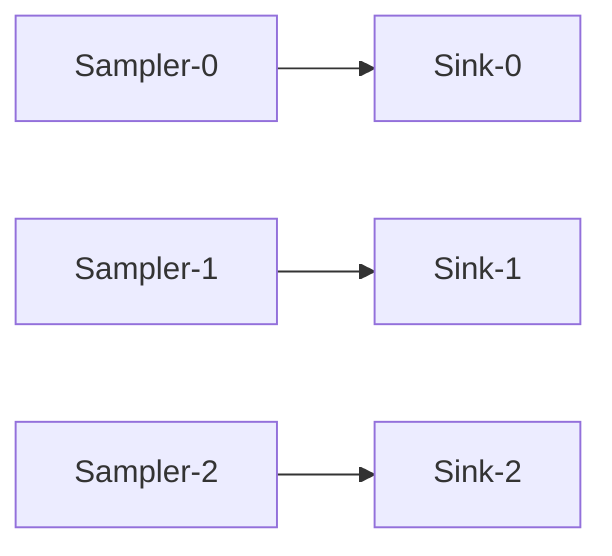
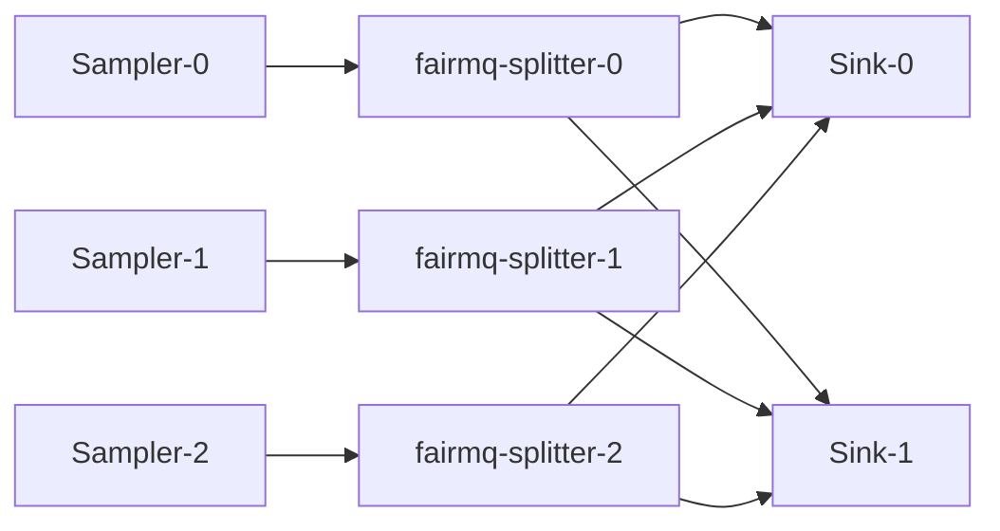
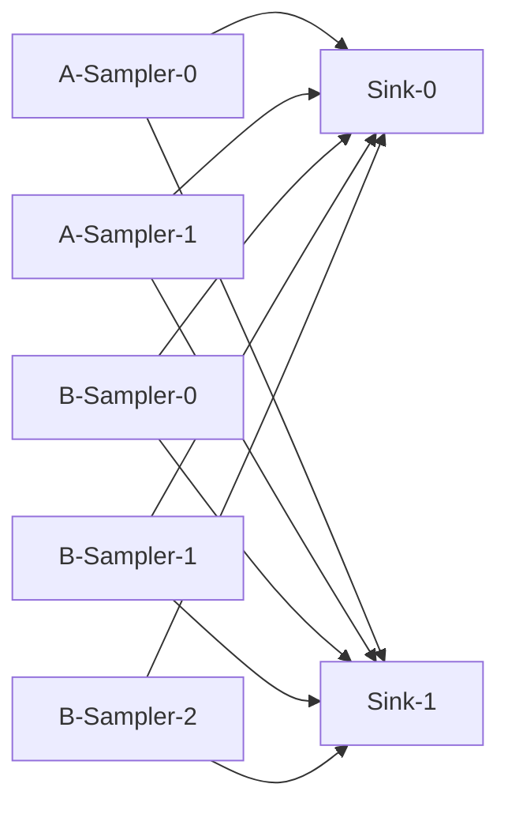

# Scripts

Set of examples of how to use the plugins.
The scripts can be copied to your favorite directory. 
Redis server must be started before executing the scripts. 

## Helper script to launch a DAQ process

### start_device.sh 
This example shows how to start FairMQDevice with the custom plugins. 
The device must be those provided by the present repository or those which contains `fairmq-` in the path. 

```bash
  # ./start_device.sh [device-name] [options ...]
  ./start_device.sh Sampler
```

```bash
  ./start_device.sh /your-fairmq-install-path/bin/fairmq-splitter
```

An example of launching a `Sampler` with a different service name (`A-Sampler`) and limiting the execution rate of `ConditionalRun()` to once per second. 
```bash
./start_device.sh Sampler --service-name A-Sampler --rate 1
```
## Topology configuration

Default value for endpoint paremeter

| field                 | default value                              | 
| --                    | --                                         | 
| name                  |                                            | 
| type                  |                                            | 
| method                |                                            | 
| address               |                                            | 
| transprot             | zeromq                                     | 
| sndBufSize            | 1000                                       | 
| rcvBufSize            | 1000                                       | 
| sndKernelSize         | 0                                          |
| linger                | 500                                        |
| rateLogging           | 1                                          |
| portRangeMin          | 22000                                      |
| portRangeMax          | 32000                                      |
| autoBind              | true                                       |
| numSockets            | 0 (Automatically calculated by the plugin) |
| autoSubChannel        | false                                      |
| bound                 | (Do not set by the user)                   |
| waitForPeerConnection | true                                       | 

The last three paremeters are specific to nestdaq. 
The rest are defined in FairMQ.


### topology-1-1.sh
A simple topology of **Sampler** and **Sink** with the **PUSH-PULL** pattern. 
If _N_ Sasmplers and _N_ Sinks are started, they forms _N_ pairs of Sampler and Sink.  
Each Sampler sends data to one Sink with the same instance index. 

```bash
  ./topology-1-1.sh
```



### topology-n-n-m.sh
A simple topology of _N_-**Sampler**s, _N_-**fairmq-splitter**s, and _M_-**Sink**s with the **PUSH-PULL** pattern. 
Each Sampler sends data to one fairmq-splitter with the same instance index. 
Then, the fairmq-splitter sends the data to Sinks. 
The `autoSubChannel true` flag is used to give each sub-socket a different `address:port` and to distinguish them by index.
The fairmq-splitter determines the destination by the number of messages sent in a round-robin fashion.

```bash
  ./topology-n-n-m.sh
```



### topology-2samplers-n-m.sh
Two sampler services send data to one sink service. 



## Parameter configuration

### mq-param.sh
This example shows how to configure parameters via Redis. 

```bash
  ./mq-param.sh
```
